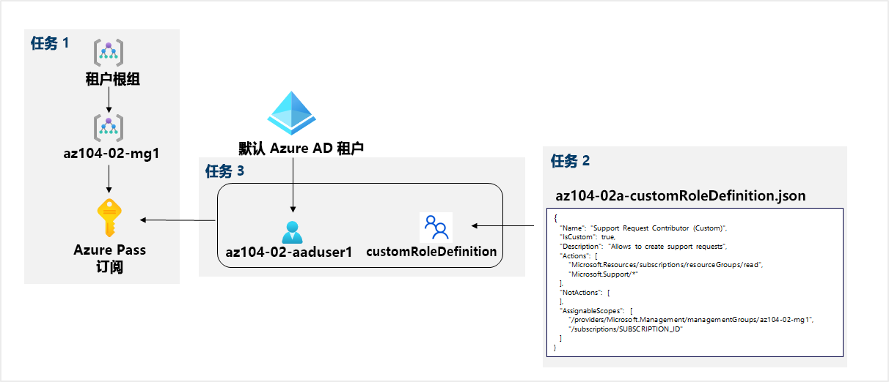

---
lab:
  title: 02a - 管理订阅和 RBAC
  module: Administer Governance and Compliance
---

# <a name="lab-02a---manage-subscriptions-and-rbac"></a>实验室 02a - 管理订阅和 RBAC
# <a name="student-lab-manual"></a>学生实验室手册

## <a name="lab-requirements"></a>实验室要求

This lab requires permissions to create Azure Active Directory (Azure AD) users, create custom Azure Role Based Access Control (RBAC) roles, and assign these roles to Azure AD users. Not all lab hosters may provide this capability. Ask your instructor for the availability of this lab.

## <a name="lab-scenario"></a>实验室场景

为了改善 Contoso 中 Azure 资源的管理，你的任务是实现以下功能：

- 创建一个将包括所有 Contoso Azure 订阅的管理组

- granting permissions to submit support requests for all subscriptions in the management group to a designated Azure Active Directory user. That user's permissions should be limited only to: 

    - 创建支持请求票证
    - 查看资源组 

## <a name="objectives"></a>目标

在此实验中，将执行以下操作：

+ 任务 1：实现管理组
+ 任务 2：创建自定义 RBAC 角色 
+ 任务 3：分配 RBAC 角色


## <a name="estimated-timing-30-minutes"></a>预计用时：30 分钟

## <a name="architecture-diagram"></a>体系结构关系图




## <a name="instructions"></a>说明

### <a name="exercise-1"></a>练习 1

#### <a name="task-1-implement-management-groups"></a>任务 1：实现管理组

在此任务中，你将需要创建和配置管理组。 

1. 登录到 [**Azure 门户**](http://portal.azure.com)。

1. 搜索并选择“管理组”，导航到“管理组”边栏选项卡 。

1. Review the messages at the top of the <bpt id="p1">**</bpt>Management groups<ept id="p1">**</ept> blade. If you are seeing the message stating <bpt id="p1">**</bpt>You are registered as a directory admin but do not have the necessary permissions to access the root management group<ept id="p1">**</ept>, perfom the following sequence of steps:

    1. 在 Azure 门户中，搜索并选择“Azure Active Directory”。
    
    1.  在显示 Azure Active Directory 租户的属性的边栏选项卡上，在左侧垂直菜单的“管理”部分中，选择“属性” 。
    
    1.  在 Azure Active Directory 租户的“属性”边栏选项卡上，“Azure 资源的访问管理”部分中，选择“是”，然后选择“保存”   。
    
    1.  导航回“管理组”边栏选项卡，并选择“刷新” 。

1. 在“管理组”边栏选项卡上，单击“+ 创建” 。

    >**注意**：如果此前尚未创建管理组，请选择“开始使用管理组”

1. 使用以下设置创建一个新的管理组：

    | 设置 | 值 |
    | --- | --- |
    | 管理组 ID | **az104-02-mg1** |
    | 管理组显示名称 | **az104-02-mg1** |

1. 在管理组列表中，单击表示新建管理组的条目。

1. 在“az104-02-mg1”边栏选项卡上，单击“订阅” 。 

1. 在“az104-02-mg1 \| 订阅”边栏选项卡上，单击“+ 添加”，在“添加订阅”边栏选项卡上的“订阅”下拉列表中，选择你在此实验室中使用的订阅，然后单击“保存”    。

    ><bpt id="p1">**</bpt>Note<ept id="p1">**</ept>: On the <bpt id="p2">**</bpt>az104-02-mg1 <ph id="ph1">\|</ph> Subscriptions<ept id="p2">**</ept> blade, copy the ID of your Azure subscription into Clipboard. You will need it in the next task.

#### <a name="task-2-create-custom-rbac-roles"></a>任务 2：创建自定义 RBAC 角色

在此任务中，你创建自定义 RBAC 角色的定义。

1. 在实验室计算机上，在笔记本中打开名为“\\Allfiles\\Labs\\02\\az104-02a-customRoleDefinition.json”的文件并查看其内容：

   ```json
   {
      "Name": "Support Request Contributor (Custom)",
      "IsCustom": true,
      "Description": "Allows to create support requests",
      "Actions": [
          "Microsoft.Resources/subscriptions/resourceGroups/read",
          "Microsoft.Support/*"
      ],
      "NotActions": [
      ],
      "AssignableScopes": [
          "/providers/Microsoft.Management/managementGroups/az104-02-mg1",
          "/subscriptions/SUBSCRIPTION_ID"
      ]
   }
   ```
    > **注意**：如果你不确定文件在实验环境中的本地存储位置，请询问你的讲师。

1. 用你复制到剪贴板中的订阅 ID 替换 JSON 文件中的 `SUBSCRIPTION_ID` 占位符，然后保存更改。

1. 在 Azure 门户中，单击搜索文本框右侧的工具栏图标，打开 Cloud Shell 窗格。

1. 如果系统提示选择“Bash”或“PowerShell”，请选择“PowerShell”  。 

    >**注意**：如果这是你第一次启动 Cloud Shell，并看到消息“未装载任何存储”，请选择你将在本实验室中使用的订阅，然后选择“创建存储”  。 

1. 在 Cloud Shell 窗格的工具栏中，单击“上传/下载文件”图标，在下拉菜单中单击“上传”，然后将文件 \\Allfiles\\Labs\\02\\az104-02a-customRoleDefinition.json 上传到 Cloud Shell 主目录中  。

1. 在 Cloud Shell 窗格中，运行下列命令以创建自定义角色定义：

   ```powershell
   New-AzRoleDefinition -InputFile $HOME/az104-02a-customRoleDefinition.json
   ```

1. 关闭 Cloud Shell 窗格。

#### <a name="task-3-assign-rbac-roles"></a>任务 3：分配 RBAC 角色

在此任务中，你将创建一个 Azure Active Dicrectory 用户，将在上一个任务中创建的 RBAC 角色分配给该用户，并验证该用户可以执行 RBAC 角色定义中指定的任务。

1. 在 Azure 门户中，搜索并选择“Azure Active Directory”，在“Azure Active Directory”边栏选项卡上，单击“用户”，然后单击“+ 新建用户”。

1. 使用以下设置创建新用户（将其他设置保留为默认值）：

    | 设置 | 值 |
    | --- | --- |
    | 用户名 | **az104-02-aaduser1**|
    | 名称 | **az104-02-aaduser1**|
    | 让我创建密码 | enabled |
    | 初始密码 | **提供安全密码** |

    ><bpt id="p1">**</bpt>Note<ept id="p1">**</ept>: <bpt id="p2">**</bpt>Copy to clipboard<ept id="p2">**</ept> the full <bpt id="p3">**</bpt>User name<ept id="p3">**</ept>. You will need it later in this lab.

1. 在 Azure 门户中，浏览到“az104-02-mg1”管理组并显示其“详细信息”。

1. 本实验室需要具有创建 Azure Active Directory (Azure AD) 用户、创建自定义 Azure 基于角色的访问控制 (RBAC) 角色，以及将这些角色分配给 Azure AD 用户的权限。 

    >注意：如果自定义角色不可见，那么自定义角色创建后可能需要 10 分钟才能出现。

1. 并非所有实验室主机托管服务提供商都提供此功能。

1. 请询问讲师是否可以使用本实验室。

    >**注意**：可以粘贴剪贴板的内容，而不必键入用户名。

1. 在 InPrivate 浏览器窗口中，在 Azure 门户中搜索并选择“资源组”，验证 az104-02-aaduser1 用户可以看到所有资源组。

1. 在 InPrivate 浏览器窗口中，在 Azure 门户中搜索并选择“全部资源”，验证 az104-02-aaduser1 用户看不到任何资源。

1. 在 InPrivate 浏览器窗口中，在 Azure 门户中搜索并选择“帮助 + 支持”，然后单击“+ 创建支持请求”  。 

1. In the <bpt id="p1">**</bpt>InPrivate<ept id="p1">**</ept> browser window, on the <bpt id="p2">**</bpt>Problem Desription/Summary<ept id="p2">**</ept> tab of the <bpt id="p3">**</bpt>Help + support - New support request<ept id="p3">**</ept> blade, type <bpt id="p4">**</bpt>Service and subscription limits<ept id="p4">**</ept> in the Summary field and select the <bpt id="p5">**</bpt>Service and subscription limits (quotas)<ept id="p5">**</ept> issue type. Note that the subscription you are using in this lab is listed in the <bpt id="p1">**</bpt>Subscription<ept id="p1">**</ept> drop-down list.

    >**注意**：你在本实验室中使用的订阅显示在“订阅”下拉列表中，表示你使用的帐户具有适当权限，可以创建特定于订阅的支持请求。

    >**注意**：如果没有看到“服务与订阅限制(配额)”选项，请从 Azure 门户注销并重新登录。

1. Do not continue with creating the support request. Instead, sign out as the az104-02-aaduser1 user from the Azure portal and close the InPrivate browser window.

#### <a name="task-4-clean-up-resources"></a>任务 4：清理资源

   ><bpt id="p1">**</bpt>Note<ept id="p1">**</ept>: Remember to remove any newly created Azure resources that you no longer use. Removing unused resources ensures you will not see unexpected charges, although, resources created in this lab do not incur extra cost.

   ><bpt id="p1">**</bpt>Note<ept id="p1">**</ept>: Don't worry if the lab resources cannot be immediately removed. Sometimes resources have dependencies and take a longer time to delete. It is a common Administrator task to monitor resource usage, so just periodically review your resources in the Portal to see how the cleanup is going.

1. 在 Azure 门户中，搜索并选择“Azure Active Directory”，在“Azure Active Directory”边栏选项卡上，单击“用户”。

1. 在“用户-所有用户”边栏选项卡中，单击 “az104-02-aaduser1”。

1. 在“az104-02-aaduser1 - Profile”边栏选项卡中，复制“对象 ID”属性值。

1. 在 Azure 门户中，启动 Cloud Shell 中的“PowerShell”会话 。

1. 在 Cloud Shell 窗格中，运行以下命令以删除自定义角色定义的分配（将 `[object_ID]` 占位符替换为你在此任务的前面部分复制的 az104-02-aaduser1 Azure Active Directory 用户帐户的“对象 ID”属性的值） ：

   ```powershell
   
   $scope = (Get-AzRoleDefinition -Name 'Support Request Contributor (Custom)').AssignableScopes[0]

   Remove-AzRoleAssignment -ObjectId '[object_ID]' -RoleDefinitionName 'Support Request Contributor (Custom)' -Scope $scope
   ```

1. 在 Cloud Shell 窗格中，运行下列命令以删除自定义角色定义：

   ```powershell
   Remove-AzRoleDefinition -Name 'Support Request Contributor (Custom)' -Force
   ```

1. 在Azure 门户中，返回“Azure Active Directory”的“用户 - 所有用户”边栏选项卡，然后删除“az104-02-aaduser1”用户帐户。

1. 在 Azure 门户中，导航回“管理组”边栏选项卡。 

1. 在“管理组”边栏选项卡上，选择“az104-02-mg1”管理组下的订阅旁边的省略号图标，然后选择“移动”，将订阅移动到“租户根管理组”    。

   >**注意**：目标管理组很有可能就是“租户根管理组”，除非你在运行此实验室之前创建了自定义管理组层次结构。
   
1. 选择“刷新”，验证订阅是否已成功移动到“租户根管理组” 。

1. 导航回“管理组”边栏选项卡，单击“az104-02-mg1”管理组右侧的省略号图标，然后单击“删除”   。
  >向指定 Azure Active Directory 用户授予为管理组中所有订阅提交支持请求的权限。

#### <a name="review"></a>审阅

在此实验室中，你执行了以下操作：

- 实现管理组
- 创建自定义 RBAC 角色 
- 分配 Azure RBAC 角色
