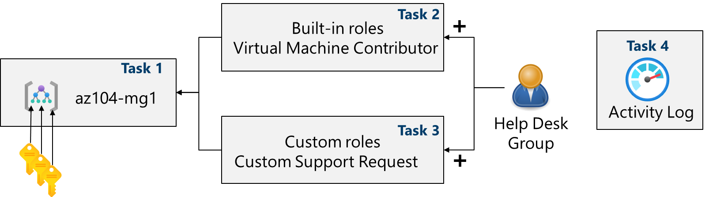

---
lab:
  title: 实验室 02a：管理订阅和 RBAC
  module: Administer Governance and Compliance
---

# 实验室 02a - 管理订阅和 RBAC

## 实验室简介

在本实验室中，了解基于角色的访问控制。 了解如何使用权限和范围来控制标识可执行和不可执行的操作。 还将了解如何使用管理组简化订阅管理。 

本实验室需要 Azure 订阅。 订阅类型可能会影响此实验室中功能的可用性。 你可更改区域，但这些步骤是使用“美国东部”编写的****。 

## 预计用时：30 分钟

## 实验室方案

为了简化组织中 Azure 资源的管理，你的任务是实现以下功能：

- 创建一个包含所有 Azure 订阅的管理组。

- 授予为管理组中的所有订阅提交支持请求的权限。 这些权限应仅限于： 

    - 创建和管理虚拟机
    - 创建支持请求票证（不包括添加 Azure 提供程序）

## 交互式实验室模拟

你可能会发现一些交互式实验室模拟对本主题很有用。 通过模拟，可按照自己的节奏点击浏览类似的应用场景。 交互式模拟与本实验室之间存在差异，但许多核心概念是相同的。 不需要 Azure 订阅。 

+ [使用 RBAC 管理访问权限](https://mslearn.cloudguides.com/en-us/guides/AZ-900%20Exam%20Guide%20-%20Azure%20Fundamentals%20Exercise%2014)。 向用户分配内置角色并监视活动日志。 

+ [管理订阅和 RBAC](https://mslabs.cloudguides.com/guides/AZ-104%20Exam%20Guide%20-%20Microsoft%20Azure%20Administrator%20Exercise%202)。 实现管理组并创建和分配自定义 RBAC 角色。

+ [打开支持请求](https://mslearn.cloudguides.com/en-us/guides/AZ-900%20Exam%20Guide%20-%20Azure%20Fundamentals%20Exercise%2022)。 查看支持计划选项，然后创建和监视支持请求、技术或计费。

## 体系结构关系图

## 工作技能

+ 任务 1：实现管理组。
+ 任务 2：查看并分配内置 Azure 角色。
+ 任务 3：创建自定义 RBAC 角色。
+ 任务 4：使用活动日志监视角色分配。

## 任务 1：实现管理组

在此任务中，你将需要创建和配置管理组。 管理组用于从逻辑上组织和细分订阅。 它们允许将 RBAC 和 Azure Policy 分配和继承给其他管理组和订阅。 例如，如果组织有一个专门的欧洲支持团队，你可将欧洲订阅组织到一个管理组中，以向支持人员提供对这些订阅的访问权限（而不提供对所有订阅的单独访问权限）。 在我们的场景中，支持人员中的每个人都需要创建一个跨所有订阅的支持请求。 

1. 登录 **Azure 门户** - `https://portal.azure.com`。

1. 搜索并选择 `Microsoft Entra ID`。

1. 在“管理”边栏选项卡中，选择“属性”********。

1. 查看“Azure 资源的访问管理”区域****。 确保你可管理对该租户中所有 Azure 订阅和管理组的访问。
   
1. 搜索并选择 `Management groups`。

1. 在“管理组”边栏选项卡上，单击“+ 创建” 。

1. 使用以下设置创建一个管理组。 完成后，选择“提交”****。 

    | 设置 | 值 |
    | --- | --- |
    | 管理组 ID | `az104-mg1`（必须在目录中是唯一的） |
    | 管理组显示名称 | `az104-mg1` |

1. 刷新管理组页以确保显示新的管理组****。 这可能需要一点时间。 

   >**注意：** 是否注意到根管理组？ 此根管理组内置在层次结构中，包含其所有下级管理组和订阅。 此根管理组允许在目录级别应用全局策略和 Azure 角色分配。 创建管理组后，可添加应包含在该组中的任何订阅。 

## 任务 2：查看并分配内置 Azure 角色

在此任务中，查看内置角色，并将 VM 参与者角色分配给支持人员的成员。 Azure 提供了大量[内置角色](https://learn.microsoft.com/azure/role-based-access-control/built-in-roles)。 

1. 选择 az104-mg1**** 管理组。

1. 选择“访问控制(IAM)”边栏选项卡，然后选择“角色”选项卡********。

1. 滚动浏览可用的内置角色定义。 查看一个角色，以获取有关“权限”、“JSON”和“分配”的详细信息****************。 通常使用“所有者”、“参与者”和“读者”******。 

1. 选择“+ 添加”，从下拉菜单中选择“添加角色分配”********。 

1. 在“添加角色分配”边栏选项卡上，搜索并选择“虚拟机参与者”********。 通过虚拟机参与者角色，你可以管理虚拟机，但不能访问它们的操作系统，也不能管理它们所连接的虚拟网络和存储帐户。 对于支持人员来说，这是一个很好的角色。 选择**下一步**。

    >你知道吗？**** Azure 最初只提供经典部署模型****。 这已被 Azure 资源管理器部署模型所取代****。 最佳做法是不要使用经典资源。 

1. 在“成员”选项卡上，选择“选择成员”********。

    >**注意：** 下一步将角色分配给“helpdesk”组****。 如果没有“支持人员”组，请花些时间创建它。

1. 搜索并选择 `helpdesk` 组。 单击“选择”。 

1. 单击“查看 + 分配”两次以创建角色分配。

1. 在“访问控制(IAM)”边栏选项卡上继续操作****。 在“角色分配”选项卡上，确认“helpdesk”组具有“虚拟机参与者”角色************。 

    >**注意：** 最佳做法是始终将角色分配给组而非个人。 

    >你知道吗？**** 此分配实际上可能不会向你授予任何其他特权。 如果你已有“所有者”角色，该角色包括与“VM 参与者”角色关联的所有权限。
    
## 任务 3：创建自定义 RBAC 角色

在此任务中，创建一个自定义 RBAC 角色。 自定义角色是对环境实现最小特权原则的核心部分。 对于你的场景，内置角色可能有太多权限。 我们还将创建新的角色并删除不必要的权限。 是否有管理重叠权限的计划？

1. 继续处理管理组。 导航到“**访问控制(IAM)**”边栏选项卡。

1. 选择“**+ 添加**”，从下拉菜单中选择“**添加自定义角色**”。

1. 在“基本信息”选项卡上，完成配置。

    | 设置 | “值” |
    | --- | --- |
    | 自定义角色名称 | `Custom Support Request` |
    | 说明 | `A custom contributor role for support requests.` |

1. 对于“基线权限”，请选择“克隆角色”********。 在“要克隆的角色”下拉菜单中，选择“支持请求参与者”********。

    

1. 选择“下一步”以移至“权限”选项卡，然后选择“+ 排除权限”************。

1. 在资源提供程序搜索字段中，输入 `.Support` 并选择“Microsoft.Support”****。

1. 在权限列表中，选中“其他:**** 注册支持资源提供程序”旁的复选框，然后选择“添加”****。 角色应更新以将此权限作为“NotAction”包含在内**。

    >**注意：** Azure 资源提供程序是一组 REST 操作，用于启用特定 Azure 服务的功能。 我们不希望支持人员能够拥有此功能，因此它将从克隆的角色中删除。 

1. 在“可分配范围”选项卡上，确保管理组列出，然后单击“下一步”********。

1. 查看在角色中自定义的“Actions”、“NotActions”和“AssignableScopes”的 JSON******。 

1. 选择“查看 + 创建”，然后选择“创建”。

    >**注意：** 此时，你已创建自定义角色并将其分配给管理组。  

## 任务 4：使用活动日志监视角色分配

在此任务中，查看活动日志以确定是否有人创建了新角色。 

1. 在门户中找到“az104-mg1”资源并选择“活动日志”********。 活动日志提供关于订阅级事件的见解。 

1. 查看角色分配的活动。 可针对特定操作筛选活动日志。 

    

## 清理资源

如果使用自己的订阅，需要一点时间删除实验室资源****。 这将确保资源得到释放，并将成本降至最低。 删除实验室资源的最简单方法是删除实验室资源组。 

+ 在 Azure 门户中，选择资源组，选择“删除资源组”，输入资源组名称，然后单击“删除”************。
+ `Remove-AzResourceGroup -Name resourceGroupName`（使用 Azure PowerShell）。
+ `az group delete --name resourceGroupName`（使用 CLI）。
  
## 使用 Copilot 扩展学习

Copilot 可帮助你了解如何使用 Azure 脚本工具。 Copilot 还可以帮助了解实验室中未涵盖的领域或需要更多信息的领域。 打开 Edge 浏览器并选择“Copilot”（右上角）或导航到*copilot.microsoft.com*。 花几分钟时间尝试这些提示。
+ 创建两个突出显示重要 PowerShell 和 CLI 命令（以获取有关 Azure 上的组织订阅的信息）的表，并在“解释”列中解释每个命令。 
+ Azure RBAC JSON 文件的格式是什么？
+ 创建自定义 Azure RBAC 角色的基本步骤是什么？
+ Azure RBAC 角色与 Microsoft Entra ID 角色有何区别？

## 通过自定进度的培训了解详细信息

+ [使用 Azure 基于角色的访问控制 (Azure RBAC) 保护 Azure 资源](https://learn.microsoft.com/training/modules/secure-azure-resources-with-rbac/)。 使用 Azure RBAC 管理对 Azure 中资源的访问。
+ [使用基于角色的访问控制 (RBAC) 为 Azure 资源创建自定义角色](https://learn.microsoft.com/training/modules/create-custom-azure-roles-with-rbac/)。 了解访问控制的角色定义结构。 确定用于定义自定义角色权限的角色属性。 创建 Azure 自定义角色并将其分配给用户。

## 关键结论

恭喜你完成本实验室的内容。 下面是本实验室的主要内容。 

+ 管理组用于从逻辑上组织订阅。
+ 内置根管理组包括所有管理组和订阅。
+ Azure 具有许多内置角色。 可分配这些角色以控制对资源的访问。
+ 可创建新角色或自定义现有角色。
+ 角色以 JSON 格式的文件定义，并包括“Actions”、“NotActions”和“AssignableScopes”******。
+ 可使用活动日志以监视角色分配。

