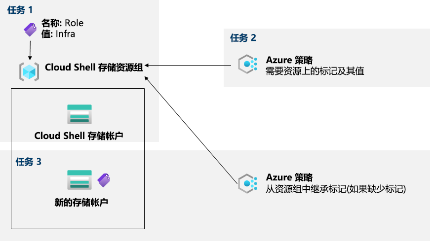

---
lab:
  title: 02b - 通过 Azure Policy 管理治理
  module: Administer Governance and Compliance
---

# <a name="lab-02b---manage-governance-via-azure-policy"></a>实验室 02b - 通过 Azure Policy 管理治理
# <a name="student-lab-manual"></a>学生实验室手册

## <a name="lab-scenario"></a>实验室方案

为了改善 Contoso 中 Azure 资源的管理，你的任务是实现以下功能：

- 标记仅包含基础结构资源的资源组（例如 Cloud Shell 存储帐户）

- 确保只有标记正确的基础结构资源能被添加到基础结构资源组

- 补救任何不合规的资源

若要以交互式指南格式预览此实验室，请[单击此处](https://mslabs.cloudguides.com/en-us/guides/AZ-104%20Exam%20Guide%20-%20Microsoft%20Azure%20Administrator%20Exercise%203)。

## <a name="objectives"></a>目标

在本实验室中，我们将：

+ 任务 1：通过 Azure 门户创建和分配标记
+ 任务 2：通过 Azure Policy 强制标记
+ 任务 3：通过 Azure Policy 应用标记

## <a name="estimated-timing-30-minutes"></a>预计用时：30 分钟

## <a name="architecture-diagram"></a>体系结构关系图



## <a name="instructions"></a>说明

### <a name="exercise-1"></a>练习 1

#### <a name="task-1-assign-tags-via-the-azure-portal"></a>任务 1：通过 Azure 门户分配标记

在此任务中，你将通过 Azure 门户创建标记并将标记分配给 Azure 资源组。

1. 在 Azure 门户中，启动 Cloud Shell 中的“PowerShell”会话 。

    >**注意**：如果这是你第一次启动 Cloud Shell，并看到消息“未装载任何存储”，请选择你将在本实验室中使用的订阅，然后选择“创建存储”  。 

1. 在 Cloud Shell 窗格中，运行以下命令以标识 Cloud Shell 使用的存储帐户的名称：

   ```powershell
   df
   ```

1. 在命令输出中，记下指定 Cloud Shell 主驱动器装载的完全限定路径的第一部分（在此处标记为 `xxxxxxxxxxxxxx`：

   ```
   //xxxxxxxxxxxxxx.file.core.windows.net/cloudshell   (..)  /usr/csuser/clouddrive
   ```

1. 在 Azure 门户中，搜索并选择“储存帐户”，然后在存储帐户列表中，单击表示上一步中标识的存储帐户的条目。

1. 在“存储帐户”边栏选项卡中，单击表示包含该存储帐户的资源组名称的链接。

    **备注**：请注意存储帐户所在的资源组，稍后将在本实验室中用到它。

1. 在资源组边栏选项卡上，单击“标记”旁边的“编辑”来创建新的标记 。

1. 使用以下设置创建标记，并应用更改：

    | 设置 | 值 |
    | --- | --- |
    | 名称 | **角色** |
    | 值 | **基础结构** |

1. Navigate back to the storage account blade. Review the <bpt id="p1">**</bpt>Overview<ept id="p1">**</ept> information and note that the new tag was not automatically assigned to the storage account. 

#### <a name="task-2-enforce-tagging-via-an-azure-policy"></a>任务 2：通过 Azure Policy 强制标记

在此任务中，你将向资源组分配内置的*要求资源采用标记及其值*策略并评估结果。 

1. 在 Azure 门户中，搜索并选择“策略”。 

1. In the <bpt id="p1">**</bpt>Authoring<ept id="p1">**</ept> section, click <bpt id="p2">**</bpt>Definitions<ept id="p2">**</ept>. Take a moment to browse through the list of built-in policy definitions that are available for you to use. List all built-in policies that involve the use of tags by selecting the <bpt id="p1">**</bpt>Tags<ept id="p1">**</ept> entry (and de-selecting all other entries) in the <bpt id="p2">**</bpt>Category<ept id="p2">**</ept> drop-down list. 

1. 单击表示“要求资源采用标记及其值”内置策略的条目并查看其定义。

1. 在“要求资源采用标记及其值”内置策略定义边栏选项卡中，单击“分配”。

1. 通过单击省略号按钮指定“范围”并选择以下值：

    | 设置 | “值” |
    | --- | --- |
    | 订阅 | 你在此实验室中使用的 Azure 订阅的名称 |
    | 资源组 | 资源组的名称，其中包含你在上一个任务中标识的 Cloud Shell 帐户 |

    ><bpt id="p1">**</bpt>Note<ept id="p1">**</ept>: A scope determines the resources or resource groups where the policy assignment takes effect. You could assign policies on the management group, subscription, or resource group level. You also have the option of specifying exclusions, such as individual subscriptions, resource groups, or resources (depending on the assignment scope). 

1. 通过指定以下设置（其他设置保留默认值）来配置分配的基本属性：

    | 设置 | 值 |
    | --- | --- |
    | 分配名称 | **要求采用值为 Infra 的角色标记**|
    | 说明 | **要求 Cloud Shell 资源组中所有资源都采用值为 Infra 的角色标记**|
    | 策略强制执行 | 已启用 |

    ><bpt id="p1">**</bpt>Note<ept id="p1">**</ept>: The <bpt id="p2">**</bpt>Assignment name<ept id="p2">**</ept> is automatically populated with the policy name you selected, but you can change it. You can also add an optional <bpt id="p1">**</bpt>Description<ept id="p1">**</ept>. <bpt id="p1">**</bpt>Assigned by<ept id="p1">**</ept> is automatically populated based on the user name creating the assignment. 

1. 单击“下一步”，将“参数”设为以下值：

    | 设置 | 值 |
    | --- | --- |
    | 标记名称 | **角色** |
    | 标记值 | **基础结构** |

1. 单击“下一步”，查看“修正”选项卡。保持“创建一个托管标识”复选框为未选中状态。 

    >**注意**：当策略或方案包括“不存在时部署”或“修改” 效果时，便可以使用此设置。

1. 单击“查看 + 创建”，然后单击“创建”。

    >**注意**：现在，你将尝试在资源组中创建另一个 Azure 存储帐户，但不显式添加所需标记，从而验证新策略分配是否有效。 
    
    >**注意**：策略生效可能需要 5 到 15 分钟。

1. 导航回“资源组”边栏选项卡，该资源组托管用于 Cloud Shell 主驱动器的存储帐户，你在上一个任务中已确定该帐户。

1. 在资源组边栏选项卡上，单击“+ 创建”，然后搜索存储帐户，并单击“+ 创建”  。 

1. 在“创建存储帐户”边栏选项卡的“基本信息”选项卡上，验证所用资源组是否已应用策略，并指定以下设置（其他设置保留默认值），单击“查看 + 创建”，然后单击“创建”   ：

    | 设置 | 值 |
    | --- | --- |
    | 存储帐户名称 | 3 到 24 个小写字母和数字的全局唯一组合，以字母开头 |

1. Once you create the deployment, you should see the <bpt id="p1">**</bpt>Deployment failed<ept id="p1">**</ept> message in the <bpt id="p2">**</bpt>Notifications<ept id="p2">**</ept> list of the portal. From the <bpt id="p1">**</bpt>Notifications<ept id="p1">**</ept> list, navigate to the deployment overview and click the <bpt id="p2">**</bpt>Deployment failed. Click here for details<ept id="p2">**</ept> message to identify the reason for the failure. 

    >**注意**：验证错误消息是否表明策略禁止资源部署。 

    ><bpt id="p1">**</bpt>Note<ept id="p1">**</ept>: By clicking the <bpt id="p2">**</bpt>Raw Error<ept id="p2">**</ept> tab, you can find more details about the error, including the name of the role definition <bpt id="p3">**</bpt>Require Role tag with Infra value<ept id="p3">**</ept>. The deployment failed because the storage account you attempted to create did not have a tag named <bpt id="p1">**</bpt>Role<ept id="p1">**</ept> with its value set to <bpt id="p2">**</bpt>Infra<ept id="p2">**</ept>.

#### <a name="task-3-apply-tagging-via-an-azure-policy"></a>任务 3：通过 Azure Policy 应用标记

在此任务中，我们将使用其他策略定义来修正所有不符合要求的资源。 

1. 在 Azure 门户中，搜索并选择“策略”。 

1. 在“创作”部分中，单击“分配”。 

1. 在分配列表中，单击表示“要求采用值为 Infra 的角色标记”策略分配的行中的省略号图标，然后使用“删除分配”菜单项删除分配 。

1. 单击“分配策略”，通过单击省略号按钮并选择以下值指定“范围”：

    | 设置 | “值” |
    | --- | --- |
    | 订阅 | 你在此实验室中使用的 Azure 订阅的名称 |
    | 资源组 | 资源组的名称，其中包含你在第一个任务中标识的 Cloud Shell 帐户 |

1. 要指定“策略定义”，请单击省略号按钮，然后搜索并选择“如果标记丢失，则从资源组继承一个标记”。

1. 通过指定以下设置来配置分配的剩余基本属性（其他设置保留默认值）：

    | 设置 | 值 |
    | --- | --- |
    | 分配名称 | **如果缺失，则从 Cloud Shell 资源组继承角色标记及其 Infra 值**|
    | 说明 | **如果缺失，则从 Cloud Shell 资源组继承角色标记及其 Infra 值**|
    | 策略强制执行 | 已启用 |

1. 单击“下一步”，将“参数”设为以下值：

    | 设置 | 值 |
    | --- | --- |
    | 标记名称 | **角色** |

1. 单击“下一步”，然后在“修正”选项卡上配置以下设置（其他设置保留默认值）：

    | 设置 | 值 |
    | --- | --- |
    | 创建修正任务 | enabled |
    | 待修正的策略 | **从订阅继承标记（如果缺少）** |

    >**注意**：此策略定义包括“修改”效果。

1. 单击“查看 + 创建”，然后单击“创建”。

    >**注意**：若要验证新策略分配是否有效，你将在同一资源组中创建另一个 Azure 存储帐户，但不显式添加所需的标记。 
    
    >**注意**：策略生效可能需要 5 到 15 分钟。

1. 导航回“资源组”边栏选项卡，该资源组托管用于 Cloud Shell 主驱动器的存储帐户，你在第一个任务中已确定该帐户。

1. 在资源组边栏选项卡上，单击“+ 创建”，然后搜索存储帐户，并单击“+ 创建”  。 

1. 在“创建存储帐户”边栏选项卡的“基本信息”选项卡上，验证所用资源组是否已应用策略，指定以下设置（将其他设置保留为默认值），并单击“查看 + 创建”  ：

    | 设置 | 值 |
    | --- | --- |
    | 存储帐户名称 | 3 到 24 个小写字母和数字的全局唯一组合，以字母开头 |

1. 验证这次验证是否通过，然后单击“创建”。

1. 新存储帐户预配完成后，单击“前往资源”按钮，然后在新创建的存储帐户“概述”边栏选项卡中，注意值为“Infra”的角色标记已自动分配到资源。

#### <a name="task-4-clean-up-resources"></a>任务 4：清理资源

   ><bpt id="p1">**</bpt>Note<ept id="p1">**</ept>: Remember to remove any newly created Azure resources that you no longer use. Removing unused resources ensures you will not see unexpected charges, although keep in mind that Azure policies do not incur extra cost.
   
   ><bpt id="p1">**</bpt>Note<ept id="p1">**</ept>:  Don't worry if the lab resources cannot be immediately removed. Sometimes resources have dependencies and take a longer time to delete. It is a common Administrator task to monitor resource usage, so just periodically review your resources in the Portal to see how the cleanup is going. 

1. 在门户中，搜索并选择“策略”。

1. 在“创作”部分，单击“分配”，单击你在上一个任务中创建的分配右侧的省略号图标，然后单击“删除分配”。 

1. 在门户中，搜索并选择“存储帐户”。

1. In the list of storage accounts, select the resource group corresponding to the storage account you created in the last task of this lab. Select <bpt id="p1">**</bpt>Tags<ept id="p1">**</ept> and click <bpt id="p2">**</bpt>Delete<ept id="p2">**</ept> (Trash can to the right) to the <bpt id="p3">**</bpt>Role:Infra<ept id="p3">**</ept> tag and press <bpt id="p4">**</bpt>Apply<ept id="p4">**</ept>. 

1. Click <bpt id="p1">**</bpt>Overview<ept id="p1">**</ept> and click <bpt id="p2">**</bpt>Delete<ept id="p2">**</ept> on the top of the storage account blade. When prompted for the confirmation, in the <bpt id="p1">**</bpt>Delete storage account<ept id="p1">**</ept> blade, type the name of the storage account to confirm and click <bpt id="p2">**</bpt>Delete<ept id="p2">**</ept>. 

#### <a name="review"></a>审阅

在此实验室中，你执行了以下操作：

- 通过 Azure 门户创建和分配标记
- 通过 Azure Policy 强制标记
- 通过 Azure Policy 应用标记
