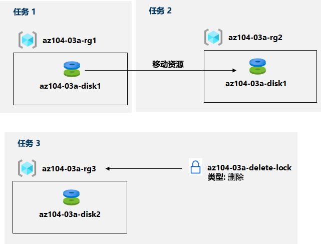

---
lab:
  title: 03a - 使用 Azure 门户管理 Azure 资源
  module: Administer Azure Resources
---

# 实验室 03a - 使用 Azure 门户管理 Azure 资源
# 学生实验室手册

## 实验室方案

你需要探索与预配资源并根据资源组整理资源相关的基本 Azure 管理功能，包括在资源组之间移动资源。 你还需要探索可保护磁盘资源不意外遭到删除，同时仍允许修改其性能特征和大小的方案选项。

                **注意：** 我们提供 **[交互式实验室模拟](https://mslabs.cloudguides.com/guides/AZ-104%20Exam%20Guide%20-%20Microsoft%20Azure%20Administrator%20Exercise%204)** ，让你能以自己的节奏点击浏览实验室。 你可能会发现交互式模拟与托管实验室之间存在细微差异，但演示的核心概念和思想是相同的。 

## 目标

在本实验室中，我们将：

+ 任务 1：创建资源组并将资源部署到资源组
+ 任务 2：在资源组之间移动资源
+ 任务 3：实现和测试资源锁

## 预计用时：20 分钟

## 体系结构关系图

## 说明

### 练习 1

#### 任务 1：创建资源组并将资源部署到资源组

在此任务中，你将使用 Azure 门户创建资源组，并在资源组中创建一个磁盘。

1. 登录到 [**Azure 门户**](http://portal.azure.com)。

1. 在 Azure 门户中，搜索并选择“磁盘”，单击“+ 创建”，然后指定以下设置 ：

    |设置|值|
    |---|---|
    |订阅| 创建的资源组所在的 Azure 订阅的名称 |
    |资源组| 新建资源组的名称 az104-03a-rg1 |
    |磁盘名称| **az104-03a-disk1** |
    |区域| **（美国）美国东部** |
    |可用性区域| **无** |
    |源类型| 无  |

    >**注意**：在创建资源时，你可以选择创建新资源组，也可以使用现有资源组。

1. 将磁盘类型和大小分别更改为“标准 HDD”和“32 GiB”。

1. 单击“查看 + 创建”，然后单击“创建”。

    >**注意**：等待磁盘创建完成。 这应该可以在一分钟内完成。

#### 任务 2：在资源组之间移动资源 

在此任务中，我们会将你在上一个任务中创建的磁盘资源移至新的资源组。 

1. 搜索并选择“资源组”。 

1. 在“资源组”边栏选项卡中，单击表示你在上一任务中创建的“az104-03a-rg1”资源组的条目。

1. 在资源组“概述”边栏选项卡的资源组资源列表中，选择表示新建磁盘的条目，然后单击工具栏中的“移动”，然后在下拉列表中选择“移动到另一个资源组”。

    >**注意**：此方法可以让你同时移动多个资源。 

1. 在“资源组”文本框下，单击“新建”，然后在文本框中键入“az104-03a-rg2”  。 在“查看”选项卡上，选中复选框“我了解与已移动资源关联的工具和脚本在更新为使用新资源 ID 之前将不可用”，然后单击“移动” 。

    >**注意**：请勿等待移动完成，而是继续执行下一个任务。 该移动可能需要约 10 分钟。 你可以通过监视源或目标资源组的活动日志条目来确定操作已完成。 完成下一个任务后，请重新查看此步骤。

#### 任务 3：实现资源锁

在此任务中，你将把资源锁应用于包含磁盘资源的 Azure 资源组。

1. 在 Azure 门户中，搜索并选择“磁盘”，单击“+ 创建”，然后指定以下设置 ：

    |设置|值|
    |---|---|
    |订阅| 本实验室所用订阅的名称 |
    |资源组| 单击“新建”资源组，并将其命名为 az104-03a-rg3  |
    |磁盘名称| **az104-03a-disk2** |
    |区域| 本实验室中创建的其他资源组所在 Azure 区域的名称 |
    |可用性区域| **无** |
    |源类型| **无** |

1. 将磁盘类型和大小分别设置为“标准 HDD”和“32 GiB”。

1. 单击“查看 + 创建”，然后单击“创建”。

1. 单击“转到资源”。

1. 在磁盘的“概述”页上，单击资源组的名称 az104-03a-rg3。

1. 在“az104-03a-rg3”资源组边栏选项卡中，依次单击“锁”和“+ 添加”，然后指定如下设置  ：

    |设置|值|
    |---|---|
    |锁名称| **az104-03a-delete-lock** |
    |锁类型| **删除** |
    
1. 单击 **“确定”**    

1. 在“az104-03a-rg3”资源组边栏选项卡中，单击“概述”，在资源组资源列表中，选择表示你先前在此任务中创建的磁盘的条目，然后在工具栏中单击“删除”。 

1. 当提示“是否要删除所有选择的资源?”时，在“确认删除”文本框中键入“是”，然后单击“删除”。

1. 你应该会看到一条错误消息，通知删除操作失败。 

    >**注意**：正如错误消息所述，由于在资源组级别上应用了删除锁，所以会出现这种现象。

1. 导航回到“az104-03a-rg3”资源组的资源列表，然后单击表示“az104-03a-disk2”资源的条目。 

1. 在“az104-03a-disk2”边栏选项卡的“设置”部分，单击“大小 + 性能”，将磁盘类型和大小分别设置为“高级 SSD”和“64 GiB”，然后单击“重设大小”应用更改     。 验证更改是否成功。

    >**注意**：这很正常，因为资源组级别的锁定仅适用于删除操作。 

#### 清理资源

   >**注意**：不要删除你在本实验室中部署的资源。 在本模块的下一次实验室中，你需要使用他们。 仅移除你在本实验室中创建的资源锁。

1. 导航到“az104-03a-rg3”资源组边栏选项卡，显示“锁”边栏选项卡，然后通过单击“删除”锁定条目右侧的“删除”链接移除“az104-03a-delete-lock”锁。

#### 审阅

在此实验室中，你执行了以下操作：

- 创建资源组并将资源部署到资源组
- 在资源组之间移动资源
- 实现和测试资源锁
