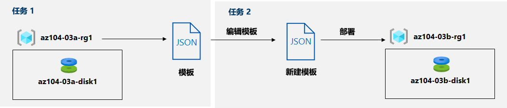

---
lab:
  title: 03b - 使用 ARM 模板管理 Azure 资源
  module: Administer Azure Resources
---

# <a name="lab-03b---manage-azure-resources-by-using-arm-templates"></a>实验室 03b - 使用 ARM 模板管理 Azure 资源
# <a name="student-lab-manual"></a>学生实验室手册

## <a name="lab-scenario"></a>实验室方案
你已探索了与使用 Azure 门户预配资源并根据资源组整理资源相关的基本 Azure 管理功能，现在你需要使用 Azure 资源管理器模板来执行等效的任务。

                注意：我们提供[交互式实验室模拟](https://mslabs.cloudguides.com/guides/AZ-104%20Exam%20Guide%20-%20Microsoft%20Azure%20Administrator%20Exercise%205)，让你能以自己的节奏点击浏览实验室。 你可能会发现交互式模拟与托管实验室之间存在细微差异，但演示的核心概念和思想是相同的。 

## <a name="objectives"></a>目标

在此实验中，将执行以下操作：

+ 任务 1：查看用于部署 Azure 托管磁盘的 ARM 模板
+ 任务 2：使用 ARM 模板创建 Azure 托管磁盘
+ 任务 3：查看基于 ARM 模板的托管磁盘部署

## <a name="estimated-timing-20-minutes"></a>预计用时：20 分钟

## <a name="architecture-diagram"></a>体系结构关系图



## <a name="instructions"></a>说明

### <a name="exercise-1"></a>练习 1

#### <a name="task-1-review-an-arm-template-for-deployment-of-an-azure-managed-disk"></a>任务 1：查看用于部署 Azure 托管磁盘的 ARM 模板

1. 登录到 [**Azure 门户**](http://portal.azure.com)。

1. 在 Azure 门户中，搜索并选择“资源组”。 

1. 在资源组列表中，单击“az104-03a-rg1”。

1. 在“az104-03a-rg1”资源组边栏选项卡中的“设置”部分，单击“部署”。

1. 在“az104-03a-rg1 - 部署”边栏选项卡上，单击部署列表中的第一个条目。

1. 在“Microsoft.ManagedDisk-XXXXXXXXX \| 概述”边栏选项卡上，单击“模板”。

    >**注意**：查看模板内容，请注意，你可以选择将其下载到本地计算机、添加到库中，或重新部署  。

1. 单击“下载”并将包含模板和参数文件的压缩文件保存到实验室计算机上的“下载”文件夹。

1. 在“Microsoft.ManagedDisk-XXXXXXXXX \| 模板”边栏选项卡上，单击“输入”。

1. 请记下“位置”参数的值。 稍后在下一个任务中将用到它。

1. 将下载文件的内容提取到实验室计算机上的“下载”文件夹。

    >**注意**：这些文件也可以是 \\Allfiles\\Labs\\03\\az104-03b-md-template.json 和 \\Allfiles\\Labs\\03\\az104-03b-md-parameters.json 
    
1. 关闭所有“文件资源管理器”窗口。

#### <a name="task-2-create-an-azure-managed-disk-by-using-an-arm-template"></a>任务 2：使用 ARM 模板创建 Azure 托管磁盘

1. 在 Azure 门户中搜索并选择“部署自定义模板”。

1. 在“自定义部署”边栏选项卡上，单击“在编辑器中构建自己的模板”。

1. 在“编辑模版”边栏选项卡上，单击“加载文件”并上传你在上一个任务中下载的 template.json 文件。

1. 在编辑器窗格中，移除以下行：

   ```json
   "sourceResourceId": {
       "type": "String"
   },
   ```

   ```json
   "hyperVGeneration": {
       "defaultValue": "V1",
       "type": "String"
   },      
   ```

    >**注意**：由于这些参数不适用于当前部署，因此已将其移除。 sourceResourceId、sourceUri、osType 和 hyperVGeneration 参数尤其适用于根据现有 VHD 文件创建 Azure 磁盘。

1. 保存更改。

1. 返回“自定义部署”边栏选项卡，单击“编辑参数”。 

1. 在“编辑模版”边栏选项卡上，单击“加载文件”并上传你在上一个任务中下载的 parameters.json 文件，然后保存更改。

1. 返回“自定义部署”边栏选项卡，指定以下设置：

    | 设置 | 值 |
    | --- |--- |
    | 订阅 | *你在此实验室中使用的 Azure 订阅的名称* |
    | 资源组 | 新建资源组的名称 **az104-03b-rg1** |
    | 区域 | 本实验室所用订阅中可用的任何 Azure 区域的名称 |
    | 磁盘名称 | **az104-03b-disk1** |
    | 位置 | 在上一任务中记下的位置参数值 |
    | SKU | **Standard_LRS** |
    | 磁盘大小 (Gb) | **32** |
    | 创建选项 | **empty** |
    | 磁盘加密集类型 | **EncryptionAtRestWithPlatformKey** |
    | 网络访问策略 | **AllowAll** |

1. 选择“查看 + 创建”，然后选择“创建”。 

1. 验证部署是否已成功完成。

#### <a name="task-3-review-the-arm-template-based-deployment-of-the-managed-disk"></a>任务 3：查看基于 ARM 模板的托管磁盘部署

1. 在 Azure 门户中，搜索并选择“资源组”。 

1. 在资源组列表中，单击“az104-03b-rg1”。

1. 在“az104-03b-rg1”资源组边栏选项卡的“设置”部分，单击“部署”。

1. 在“az104-03b-rg1 - 部署”边栏选项卡上，单击部署列表中的第一个条目，然后查看“输入”和“模板”边栏选项卡的内容。

#### <a name="clean-up-resources"></a>清理资源

   >**注意**：不要删除你在本实验室中部署的资源。 在本模块的下一个实验室中，你将引用它们。

#### <a name="review"></a>审阅

在此实验室中，你执行了以下操作：

- 查看用于部署 Azure 托管磁盘的 ARM 模板
- 使用 ARM 模板创建一个 Azure 托管磁盘
- 查看基于 ARM 模板的托管磁盘部署
