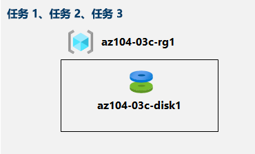

---
lab:
    title: '03c - 使用 Azure PowerShell 管理 Azure 资源'
    module: '模块 03 - Azure 管理'
---

# 实验室 03c - 使用 Azure PowerShell 管理 Azure 资源
# 学生实验室手册

## 实验室场景

你已经探索了与使用 Azure 门户和 Azure 资源管理器模板预配资源并根据资源组整理资源相关的基本 Azure 管理功能，现在你需要使用 Azure PowerShell 执行相应的任务。为避免安装 Azure PowerShell 模块，你将利用 Azure Cloud Shell 中提供的 PowerShell 环境。

## 目标

在本实验室中，你将：

+ 任务 1： 在 Azure Cloud Shell 中启动 PowerShell 会话
+ 任务 2： 使用 Azure PowerShell 创建资源组和 Azure 托管磁盘
+ 任务 3： 使用 Azure PowerShell 配置托管磁盘

## 预计用时：20 分钟

## 体系结构图



## 说明

### 练习 1

#### 任务 1： 在 Azure Cloud Shell 中启动 PowerShell 会话

在此任务中，你将在 Cloud Shell 中打开一个 PowerShell 会话。 

1. 单击 Azure 门户右上方的图标，在门户中打开 **Azure Cloud Shell**。

1. 提示选择 **Bash** 或 **PowerShell** 时，选择 **PowerShell**。 

    >**备注**：如果这是第一次启动 **Cloud Shell**，并看到 **“未装载任何存储”** 消息，请选择在本实验室中使用的订阅，然后选择 **“创建存储”**。 

1. 如果出现提示，请单击 **“创建存储”**，然后等到出现“Azure Cloud Shell”窗格。 

1. 确保 **“PowerShell”** 出现在 Cloud Shell 窗格左上角的下拉菜单中。

#### 任务 2：使用 Azure PowerShell 创建资源组和 Azure 托管磁盘

在此任务中，你将在 Cloud Shell 中使用 Azure PowerShell 会话来创建资源组和 Azure 托管磁盘

1. 要通过 Cloud Shell 中的 PowerShell 会话创建一个资源组，并且使该资源组与上一个实验室中创建的资源组 **az104-03b-rg1** 位于同一 Azure 区域，请运行以下命令：

   ```powershell
   $location = (Get-AzResourceGroup -Name az104-03b-rg1).Location

   $rgName = 'az104-03c-rg1'

   New-AzResourceGroup -Name $rgName -Location $location
   ```
1. 要检索新创建资源组的属性，请运行以下命令：

   ```powershell
   Get-AzResourceGroup -Name $rgName
   ```
1. 要创建一个新的托管磁盘，并使该托管磁盘与你在本模块先前的实验室中创建的托管磁盘具有相同特征，请运行以下命令：

   ```powershell
   $diskConfig = New-AzDiskConfig `
    -Location $location `
    -CreateOption Empty `
    -DiskSizeGB 32 `
    -Sku Standard_LRS

   $diskName = 'az104-03c-disk1'

   New-AzDisk `
    -ResourceGroupName $rgName `
    -DiskName $diskName `
    -Disk $diskConfig
   ```

1. 要检索新建磁盘的属性，请运行以下命令：

   ```powershell
   Get-AzDisk -ResourceGroupName $rgName -Name $diskName
   ```

#### 任务 3：使用 Azure PowerShell 配置托管磁盘

在此任务中，你将使用 Cloud Shell 中的 Azure PowerShell 会话来管理 Azure 托管磁盘的配置。 

1. 要通过 Cloud Shell 中的 PowerShell 会话将 Azure 托管磁盘的大小增加到 **64 GB**，请运行以下命令：

   ```powershell
   New-AzDiskUpdateConfig -DiskSizeGB 64 | Update-AzDisk -ResourceGroupName $rgName -DiskName $diskName
   ```

1. 要验证更改是否生效，请运行以下命令：

   ```powershell
   Get-AzDisk -ResourceGroupName $rgName -Name $diskName
   ```

1. 要验证当前 SKU 是否为 **Standard_LRS**，请运行以下命令：

   ```powershell
   (Get-AzDisk -ResourceGroupName $rgName -Name $diskName).Sku
   ```

1. 要通过 Cloud Shell 中的 PowerShell 会话将磁盘性能 SKU 更改为 **“Premium_LRS”**，请运行以下命令：

   ```powershell
   New-AzDiskUpdateConfig -Sku Premium_LRS | Update-AzDisk -ResourceGroupName $rgName -DiskName $diskName
   ```

1. 要验证更改是否生效，请运行以下命令：

   ```powershell
   (Get-AzDisk -ResourceGroupName $rgName -Name $diskName).Sku
   ```

#### 清理资源

   >**备注**：不要删除你在本实验室中部署的资源。在本模块的下一个实验室中，你将引用它们。

#### 回顾

在本实验室中，你已：

- 在 Azure Cloud Shell 中开启 PowerShell 会话
- 使用 Azure PowerShell 创建一个资源组和一个 Azure 托管磁盘
- 使用 Azure PowerShell 配置托管磁盘
