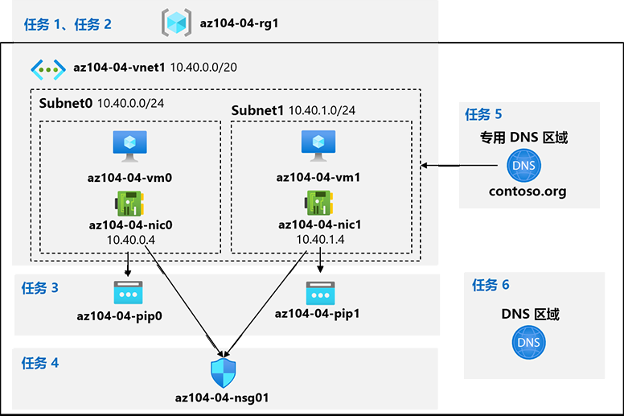

---
lab:
  title: 04 - 实现虚拟网络
  module: Administer Virtual Networking
---

# <a name="lab-04---implement-virtual-networking"></a>实验室 04 - 实现虚拟网络

# <a name="student-lab-manual"></a>学生实验室手册

## <a name="lab-scenario"></a>实验室方案

你需要探索 Azure 虚拟网络功能。 首先，你计划在 Azure 中创建一个将托管几个 Azure 虚拟机的虚拟网络。 由于你打算实现基于网络的分段，因此会将这些虚拟机部署到虚拟网络的不同子网中。 你还希望确保其专用 IP 地址和公共 IP 地址不会随着时间的推移而发生变化。 为了符合 Contoso 的安全要求，你需要保护可从 Internet 访问的 Azure 虚拟机公共终结点。 最后，你需要为虚拟网络和 Internet 内的 Azure 虚拟机实现 DNS 名称解析。

                **注意：** 我们提供 **[交互式实验室模拟](https://mslabs.cloudguides.com/guides/AZ-104%20Exam%20Guide%20-%20Microsoft%20Azure%20Administrator%20Exercise%208)** ，让你能以自己的节奏点击浏览实验室。 你可能会发现交互式模拟与托管实验室之间存在细微差异，但演示的核心概念和思想是相同的。 

## <a name="objectives"></a>目标

在此实验中，将执行以下操作：

+ 任务 1：创建和配置虚拟网络
+ 任务 2：将虚拟机部署到虚拟网络中
+ 任务 3：配置 Azure VM 的专用 IP 地址和公共 IP 地址
+ 任务 4：配置网络安全组
+ 任务 5：配置 Azure DNS 以进行内部名称解析
+ 任务 6：配置 Azure DNS 以进行外部名称解析

## <a name="estimated-timing-40-minutes"></a>预计用时：40 分钟

## <a name="architecture-diagram"></a>体系结构关系图



## <a name="instructions"></a>Instructions

### <a name="exercise-1"></a>练习 1

#### <a name="task-1-create-and-configure-a-virtual-network"></a>任务 1：创建和配置虚拟网络

在此任务中，你将使用 Azure 门户创建一个包含多个子网的虚拟网络

1. 登录到 [Azure 门户](https://portal.azure.com)。

1. 在 Azure 门户中，搜索并选择“虚拟网络”，然后在“虚拟网络”边栏选项卡中单击“+ 创建”  。

1. 创建一个虚拟网络，设置如下（其他设置保留默认值）：

    | 设置 | “值” |
    | --- | --- |
    | 订阅 | 将在此实验室中使用的 Azure 订阅的名称 |
    | 资源组 | 新资源组名称 az104-04-rg1 |
    | 名称 | **az104-04-vnet1** |
    | 区域 | 本实验室将使用的订阅中可用的任何 Azure 区域的名称 |

1. 单击“下一页: IP 地址”，并删除现有 IPv4 地址空间 。 在“IPv4 地址空间”文本框中，键入 10.40.0.0/20 。

1. 单击“+ 添加子网”，输入以下值，然后单击“添加” 。

    | 设置 | 值 |
    | --- | --- |
    | 子网名称 | **subnet0** |
    | 子网地址范围 | **10.40.0.0/24** |

1. 接受默认值，并单击“查看和创建”。 允许进行验证，然后再次单击“创建”以提交部署。

    >**注意：** 请等待预配虚拟网络。 这应该可以在一分钟内完成。

1. 单击“前往资源”

1. 在“az104-04-vnet1”虚拟网络边栏选项卡中，单击“子网”，然后单击“+ 子网”。

1. 创建一个子网，设置如下（其他则保留其默认值）：

    | 设置 | 值 |
    | --- | --- |
    | 名称 | **subnet1** |
    | 地址范围（CIDR 块） | **10.40.1.0/24** |
    | 网络安全组 | **无** |
    | 路由表 | **无** |

1. 单击“保存” 

#### <a name="task-2-deploy-virtual-machines-into-the-virtual-network"></a>任务 2：将虚拟机部署到虚拟网络中

在此任务中，你将使用 ARM 模板将 Azure 虚拟机部署到虚拟网络的不同子网中

1. 在 Azure 门户中，单击 Azure 门户右上方的图标，打开 Azure Cloud Shell。

1. 如果系统提示选择“Bash”或“PowerShell”，请选择“PowerShell”  。

    >**注意**：如果这是你第一次启动 Cloud Shell，并看到消息“未装载任何存储”，请选择你将在本实验室中使用的订阅，然后选择“创建存储”  。

1. 在“Cloud Shell”窗格的工具栏中，单击“上传/下载文件”图标，然后在下拉菜单中单击“上传” 。 将 \\Allfiles\\Labs\\04\\az104-04-vms-loop-template.json 和 \\Allfiles\\Labs\\04\\az104-04-vms-loop-parameters.json 上传到 Cloud Shell 主目录中 。

    >注意：必须分别上传各个文件。 上传后，使用 dir 确保已成功上传这两个文件。

1. 编辑 Parameters 文件并更改密码。 如果需要在 Shell 中编辑文件的帮助，请向讲师寻求帮助。 最佳做法是，机密（如密码）应存储在 Key Vault 中，这样更安全。 

1. 在 Cloud Shell 窗格中，使用模板和参数文件运行以下命令，以部署两台虚拟机：

   ```powershell
   $rgName = 'az104-04-rg1'

   New-AzResourceGroupDeployment `
      -ResourceGroupName $rgName `
      -TemplateFile $HOME/az104-04-vms-loop-template.json `
      -TemplateParameterFile $HOME/az104-04-vms-loop-parameters.json
   ```

    >**注意**：这种部署 ARM 模板的方法使用了 Azure PowerShell。 你可以通过运行等效的 Azure CLI 命令 az deployment create 来执行相同的任务（有关详细信息，请参阅[使用资源管理器模板和 Azure CLI 部署资源](https://docs.microsoft.com/en-us/azure/azure-resource-manager/templates/deploy-cli)。

    >**注意**：请等待部署完成后再继续下一个任务。 这大约需要 2 分钟。

    >**注意**：如果遇到提示 VM 大小不可用的错误，请向讲师寻求帮助并尝试以下步骤：
    > 1. 单击 CloudShell 中的 `{}` 按钮，从左侧栏中选择“az104-04-vms-loop-parameters.json”，并记下 `vmSize` 参数值。
    > 1. 检查部署“az104-04-rg1”资源组的位置。 你可以在 CloudShell 中运行 `az group show -n az104-04-rg1 --query location` 以获取它。
    > 1. 在 CloudShell 中运行 `az vm list-skus --location <Replace with your location> -o table --query "[? contains(name,'Standard_D2s')].name"`。 如果没有列出 SKU（即没有结果），则不能在该区域中部署任何 D2S 虚拟机。 需要找到允许部署 D2S 虚拟机的区域。 选择合适的位置后，请删除 AZ104-04-rg1 资源组并重启实验室。
    > 1. 将 `vmSize` 参数的值替换为刚运行的命令返回的一个值。
    > 1. 现在再次运行 `New-AzResourceGroupDeployment` 命令以重新部署模板。 可以按几次向上按钮，这样就会显示最后执行的命令。

1. 关闭 Cloud Shell 窗格。

#### <a name="task-3-configure-private-and-public-ip-addresses-of-azure-vms"></a>任务 3：配置 Azure VM 的专用 IP 地址和公共 IP 地址

在此任务中，你将配置分配到 Azure 虚拟机网络接口的公共 IP 地址和专用 IP 地址的静态分配。

   >**注意**：专用 IP 地址和公共 IP 地址实际上分配到网络接口，而这些接口又附加到 Azure 虚拟机，但是，改为引用分配给 Azure VM 的 IP 地址相当普遍。

1. 在 Azure 门户中，搜索并选择“资源组”，然后在“资源组”边栏选项卡中单击“az104-04-rg1”。

1. 在“az104-04-rg1”资源组边栏选项卡的资源列表中，单击“az104-04-vnet1”。

1. 在“az104-04-vnet1”虚拟网络边栏选项卡中，查看“已连接设备”部分，并验证“az104-04-nic0”和“az104-04-nic1”这两个网络接口是否已连接到虚拟网络。

1. 单击“az104-04-nic0”，然后在“az104-04-nic0”边栏选项卡中单击“IP 配置”。

    >**注意**：请验证当前是否将“ipconfig1”设置为动态专用 IP 地址。

1. 在 IP 配置列表中，单击“ipconfig1”。

1. 在“ipconfig1”边栏选项卡上的“公共 IP 地址设置”部分，选择“关联”，单击“+ 新建”，指定以下设置，然后单击“确定”    ：

    | 设置 | 值 |
    | --- | --- |
    | 名称 | **az104-04-pip0** |
    | SKU | **标准** |

1. 在“ipconfig1”边栏选项卡中，将“分配”设置为“静态”，将“IP 地址”的默认值设置为“10.40.0.4”    。

1. 返回“ipconfig1”边栏选项卡，保存更改。 在继续下一步骤之前，请确保等待保存操作完成。

1. 导航回“az104-04-vnet1”边栏选项卡

1. 单击“az104-04-nic1”，然后在“az104-04-nic1”边栏选项卡中单击“IP 配置”  。

    >**注意**：请验证当前是否将“ipconfig1”设置为动态专用 IP 地址。

1. 在 IP 配置列表中，单击“ipconfig1”。

1. 在“ipconfig1”边栏选项卡上的“公共 IP 地址设置”部分，选择“关联”，单击“+ 新建”，指定以下设置，然后单击“确定”    ：

    | 设置 | 值 |
    | --- | --- |
    | 名称 | **az104-04-pip1** |
    | SKU | **标准** |

1. 在“ipconfig1”边栏选项卡中，将“分配”设置为“静态”，将“IP 地址”的默认值设置为“10.40.1.4”    。

1. 返回“ipconfig1”边栏选项卡，保存更改。

1. 导航回“az104-04-rg1”资源组边栏选项卡，在资源列表中单击“az104-04-vm0”，并记下“az104-04-vm0”虚拟机边栏选项卡中的公共 IP 地址条目。

1. 导航回“az104-04-rg1”资源组边栏选项卡，在资源列表中单击“az104-04-vm1”，并记下“az104-04-vm1”虚拟机边栏选项卡中的公共 IP 地址条目  。

    >**注意**：本实验室的最后一个任务中需要这两个 IP 地址。

#### <a name="task-4-configure-network-security-groups"></a>任务 4：配置网络安全组

在此任务中，你将配置网络安全组，以允许对 Azure 虚拟机的受限连接。

1. 在 Azure 门户中，导航回“az104-04-rg1”资源组边栏选项卡，然后在资源列表中单击“az104-04-vm0”。

1. 在“az104-04-vm0”概述边栏选项卡上单击“连接”，在下拉菜单中单击“RDP”，在“使用 RDP 连接”边栏选项卡上单击“使用公共 IP 地址下载 RDP 文件”，然后按照提示启动远程桌面会话    。

1. 请注意，连接尝试失败。

    >**注意**：这很正常，因为在默认情况下，标准 SKU 的公共 IP 地址会要求其分配到的网络接口受网络安全组的保护。 为了允许远程桌面连接，你将创建一个网络安全组，明确允许来自 Internet 的入站 RDP 流量，并将这些流量分配到两台虚拟机的网络接口。

1. 停止 az104-04-vm0 和 az104-04-vm1 虚拟机 。

    >**注意**：这样做只是暂时用于实验室。 如果在将网络安全组附加到其网络接口时虚拟机正在运行，则附件可能需要 30 分钟以上才能生效。 创建并附加网络安全组后，虚拟机将重新启动，附件将立即生效。

1. 在 Azure 门户中，搜索并选择“网络安全组”，然后在“网络安全组”边栏选项卡中单击“+ 创建”  。

1. 创建一个网络安全组，设置如下（其他设置保留默认值）：

    | 设置 | “值” |
    | --- | --- |
    | 订阅 | 你在此实验室中使用的 Azure 订阅的名称 |
    | 资源组 | **az104-04-rg1** |
    | 名称 | **az104-04-nsg01** |
    | 区域 | 本实验室中用于部署所有其他资源的 Azure 区域的名称 |

1. 单击“查看并创建”。 允许进行验证，然后单击“创建”以提交部署。

    >备注：请等待部署完成。 这大约需要 2 分钟。

1. 在“部署”边栏选项卡上，单击“前往资源”以打开“az104-04-nsg01”网络安全组边栏选项卡 。

1. 在“az104-04-nsg01”网络安全组边栏选项卡中的“设置”部分，单击“入站安全规则”。

1. 添加一个入站规则，设置如下（其他设置保留默认值）：

    | 设置 | 值 |
    | --- | --- |
    | 源 | **任意** |
    | 源端口范围 | * |
    | 目标 | **任意** |
    | 服务 | **RDP** |
    | 操作 | **允许** |
    | 优先级 | **300** |
    | 名称 | **AllowRDPInBound** |

1. 在“az104-04-nsg01”网络安全组边栏选项卡的“设置”部分，单击“网络接口”，然后单击“+ 关联”。

1. 将“az104-04-nsg01”网络安全组与“az104-04-nic0”和“az104-04-nic1”网络接口关联。

    >**注意**：新创建的网络安全组中的规则可能需要最多 5 分钟才能应用到网络接口卡。

1. 启动 az104-04-vm0 和 az104-04-vm1 虚拟机 。

1. 导航回“az104-04-vm0”虚拟机边栏选项卡。

    >**注意**：在后续步骤中，你将验证你能成功连接到目标虚拟机。

1. 在“az104-04-vm0”边栏选项卡上依次单击“连接”和“RDP”，在“使用 RDP 连接”边栏选项卡上单击“使用公共 IP 地址下载 RDP 文件”，然后按照提示启动远程桌面会话    。

    >**注意**：此步骤是指在 Windows 计算机中通过远程桌面进行连接。 在 Mac 上，可以使用 Mac App Store 中的远程桌面客户端，而在 Linux 计算机上，可以使用开源 RDP 客户端软件。

    >**注意**：连接到目标虚拟机时，可以忽略任何警告提示。

1. 出现提示时，请使用参数文件中的用户和密码登录。

    >**注意**：使远程桌面会话保持开启状态。 稍后在下一个任务中将用到它。

#### <a name="task-5-configure-azure-dns-for-internal-name-resolution"></a>任务 5：配置 Azure DNS 以进行内部名称解析

在此任务中，你将使用 Azure 专用 DNS 区域在虚拟网络中配置 DNS 名称解析。

1. 在 Azure 门户中，搜索并选择“专用 DNS 区域”，然后在“专用 DNS 区域”边栏选项卡中单击“+ 创建”  。

1. 创建一个专用 DNS 区域，设置如下（其他设置保留默认值）：

    | 设置 | “值” |
    | --- | --- |
    | 订阅 | 你在此实验室中使用的 Azure 订阅的名称 |
    | 资源组 | **az104-04-rg1** |
    | 名称 | **contoso.org** |

1. 单击“查看并创建”。 允许进行验证，然后再次单击“创建”以提交部署。

    >**注意**：请等到专用 DNS 区域创建完成。 这大约需要 2 分钟。

1. 单击“前往资源”以打开“contoso.org DNS”专用区域边栏选项卡 。

1. 在“contoso.org”专用 DNS 区域边栏选项卡的“设置”部分，单击“虚拟网络链接”

1. 单击“+ 添加”，使用以下设置创建虚拟网络链接（其他设置保留默认值）：：

    | 设置 | “值” |
    | --- | --- |
    | 链接名称 | **az104-04-vnet1-link** |
    | 订阅 | 你在此实验室中使用的 Azure 订阅的名称 |
    | 虚拟网络 | **az104-04-vnet1** |
    | 启用自动注册 | enabled |

1. 单击" **确定**"。

    >**注意：** 请等到虚拟网络链接创建完成。 此过程应会在 1 分钟内完成。

1. 在 contoso.org 专用 DNS 区域边栏选项卡上，在边栏中，单击“概述”

1. 验证“az104-04-vm0”和“az104-04-vm1”的DNS 记录是否在记录集列表中显示为“自动注册”。

    >**注意：** 如果未列出记录集，你可能需要等待几分钟并刷新页面。

1. 将远程桌面会话切换到 az104-04-vm0，右键单击“开始”按钮，然后在右键菜单中单击“Windows PowerShell (管理员)”。

1. 在 Windows PowerShell 控制台窗口中，运行以下命令以测试新创建的专用 DNS 区域中的内部名称解析：

   ```powershell
   nslookup az104-04-vm0.contoso.org
   nslookup az104-04-vm1.contoso.org
   ```

1. 验证命令的输出是否包含 az104-04-vm1 的专用 IP 地址 (10.40.1.4) 。

#### <a name="task-6-configure-azure-dns-for-external-name-resolution"></a>任务 6：配置 Azure DNS 以进行外部名称解析

此任务将使用 Azure 公用 DNS 区域配置外部 DNS 名称解析。

1. 在 Web 浏览器中，打开一个新选项卡并导航到 <https://www.godaddy.com/domains/domain-name-search>。

1. 使用域名搜索来标识未使用的域名。

1. 在 Azure 门户中，搜索并选择“DNS 区域”，然后在“DNS 区域”边栏选项卡中单击“+ 创建”  。

1. 使用以下设置（将其他设置保留为默认值）创建 DNS 区域：

    | 设置 | “值” |
    | --- | --- |
    | 订阅 | 你在此实验室中使用的 Azure 订阅的名称 |
    | 资源组 | **az104-04-rg1** |
    | 名称 | 之前在此任务中标识的 DNS 域名 |

1. 单击“查看并创建”。 允许进行验证，然后再次单击“创建”以提交部署。

    >**注意**：请等到 DNS 区域创建完成。 这大约需要 2 分钟。

1. 单击“前往资源”，打开新创建的 DNS 区域的边栏选项卡。

1. 在“DNS 区域”边栏选项卡中，单击“+ 记录集”。

1. 添加具有以下设置的记录集（保留其他设置为默认值）：

    | 设置 | 值 |
    | --- | --- |
    | 名称 | **az104-04-vm0** |
    | 类型 | **A** |
    | 别名记录集 | **是** |
    | TTL | **1** |
    | TTL 单位 | **小时数** |
    | IP 地址 | 在本实验室的第三个练习中标识的 az104-04-vm0 的公用 IP 地址 |

1. 单击 **“确定”**

1. 在“DNS 区域”边栏选项卡中，单击“+ 记录集”。

1. 添加具有以下设置的记录集（保留其他设置为默认值）：

    | 设置 | 值 |
    | --- | --- |
    | 名称 | **az104-04-vm1** |
    | 类型 | **A** |
    | 别名记录集 | **是** |
    | TTL | **1** |
    | TTL 单位 | **小时数** |
    | IP 地址 | 在本实验室的第三个练习中标识的 az104-04-vm1 的公共 IP 地址 |

1. 单击 **“确定”**

1. 在“DNS 区域”边栏选项卡中，请记下“名称服务器 1”条目的名称。

1. 在 Azure 门户中，通过单击 Azure 门户右上方的图标，在 Cloud Shell 中打开“PowerShell”会话 。

1. 在 Cloud Shell 窗格中，运行以下命令以测试新创建的 DNS 区域中“az104-04-vm0”DNS 记录集的外部名称解析（将占位符 `[Name server 1]` 替换为你之前在本任务中记下的“名称服务器 1”的名称，将占位符 `[domain name]` 替换为你之前在本任务中创建的 DNS 域的名称） ：

   ```powershell
   nslookup az104-04-vm0.[domain name] [Name server 1]
   ```

1. 验证命令输出是否包含 az104-04-vm0 的公共 IP 地址。

1. 在 Cloud Shell 窗格中，运行以下命令以测试新创建的 DNS 区域中“az104-04-vm1”DNS 记录集的外部名称解析（将占位符 `[Name server 1]` 替换为你之前在本任务中记下的“名称服务器 1”的名称，将占位符 `[domain name]` 替换为你之前在本任务中创建的 DNS 域的名称） ：

   ```powershell
   nslookup az104-04-vm1.[domain name] [Name server 1]
   ```

1. 验证命令输出是否包含 az104-04-vm1 的公共 IP 地址。

#### <a name="clean-up-resources"></a>清理资源

 > **注意**：记得删除所有不再使用的新建 Azure 资源。 删除未使用的资源可确保不会出现意外费用。

 > **注意**：如果不能立即删除实验室资源，也不要担心。 有时资源具有依赖项，需要更长的时间才能删除。 这是监视资源使用情况的常见管理员任务，因此，只需定期查看门户中的资源即可查看清理方式。 

1. 在 Azure 门户的“Cloud Shell”窗格中打开“PowerShell”会话。

1. 运行以下命令，列出在本模块各实验室中创建的所有资源组：

   ```powershell
   Get-AzResourceGroup -Name 'az104-04*'
   ```

1. 通过运行以下命令，删除在此模块的实验室中创建的所有资源组：

   ```powershell
   Get-AzResourceGroup -Name 'az104-04*' | Remove-AzResourceGroup -Force -AsJob
   ```

    >**注意**：该命令以异步方式执行（由 -AsJob 参数决定），因此，虽然你可以随后立即在同一个 PowerShell 会话中运行另一个 PowerShell 命令，但需要几分钟才能实际删除资源组。

#### <a name="review"></a>审阅

在此实验室中，你执行了以下操作：

+ 创建和配置虚拟网络
+ 将虚拟机部署到虚拟网络中
+ 配置 Azure VM 的专用 IP 地址和公共 IP 地址
+ 配置网络安全组
+ 配置 Azure DNS 以进行内部名称解析
+ 配置 Azure DNS 以进行外部名称解析
