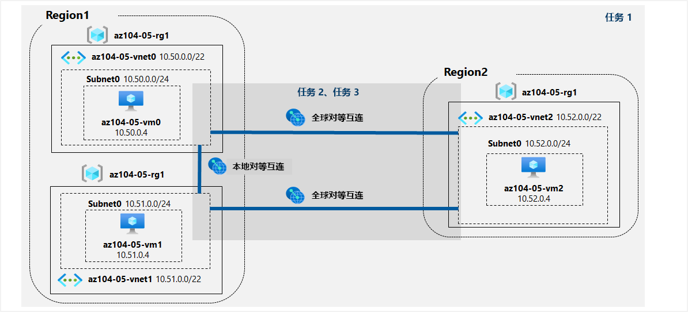

---
lab:
  title: 05 - 实现站点间连接
  module: Administer Intersite Connectivity
---

# <a name="lab-05---implement-intersite-connectivity"></a>实验室 05 - 实现站点间连接
# <a name="student-lab-manual"></a>学生实验室手册

## <a name="lab-scenario"></a>实验室方案

Contoso has its datacenters in Boston, New York, and Seattle offices connected via a mesh wide-area network links, with full connectivity between them. You need to implement a lab environment that will reflect the topology of the Contoso's on-premises networks and verify its functionality.

<bpt id="p1">**</bpt>Note:<ept id="p1">**</ept> An <bpt id="p2">**</bpt><bpt id="p3">[</bpt>interactive lab simulation<ept id="p3">](https://mslabs.cloudguides.com/guides/AZ-104%20Exam%20Guide%20-%20Microsoft%20Azure%20Administrator%20Exercise%209)</ept><ept id="p2">**</ept> is available that allows you to click through this lab at your own pace. You may find slight differences between the interactive simulation and the hosted lab, but the core concepts and ideas being demonstrated are the same. 

## <a name="objectives"></a>目标

在此实验中，将执行以下操作：

+ 任务 1：预配实验室环境
+ 任务 2：配置本地和全局虚拟网络对等互连
+ 任务 3：测试站点间连接

## <a name="estimated-timing-30-minutes"></a>预计用时：30 分钟

## <a name="architecture-diagram"></a>体系结构关系图



### <a name="instructions"></a>说明

#### <a name="task-1-provision-the-lab-environment"></a>任务 1：预配实验室环境

在此任务中，你将部署三个虚拟机，每个虚拟机都部署到一个独立的虚拟网络中。其中两个在同一个 Azure 区域中，第三个在另一个 Azure 区域中。

1. 登录 [Azure 门户](https://portal.azure.com)。

1. 在 Azure 门户中，单击 Azure 门户右上方的图标，打开 Azure Cloud Shell。

1. 如果系统提示选择“Bash”或“PowerShell”，请选择“PowerShell”  。

    >**注意**：如果这是你第一次启动 Cloud Shell，并看到消息“未装载任何存储”，请选择你将在本实验室中使用的订阅，然后选择“创建存储”  。

1. 在 Cloud Shell 窗格的工具栏中，单击“上传/下载文件”图标，在下拉菜单中单击“上传”，然后将文件 \\Allfiles\\Labs\\05\\az104-05-vnetvm-loop-template.json 和 \\Allfiles\\Labs\\05\\az104-05-vnetvm-loop-parameters.json 上传到 Cloud Shell 主目录中   。

1. Edit the <bpt id="p1">**</bpt>Parameters<ept id="p1">**</ept> file you just uploaded and change the password. If you need help editing the file in the Shell please ask your instructor for assistance. As a best practice, secrets, like passwords, should be more securely stored in the Key Vault. 

1. From the Cloud Shell pane, run the following to create the resource group that will be hosting the lab environment. The first two virtual networks and a pair of virtual machines will be deployed in [Azure_region_1]. The third virtual network and the third virtual machine will be deployed in the same resource group but another [Azure_region_2]. (replace the [Azure_region_1] and [Azure_region_2] placeholder, including the square brackets, with the names of two different Azure regions where you intend to deploy these Azure virtual machines. An example is $location1 = 'eastus'. You can use Get-AzLocation to list all locations.):

   ```powershell
   $location1 = 'eastus'

   $location2 = 'westus'

   $rgName = 'az104-05-rg1'

   New-AzResourceGroup -Name $rgName -Location $location1
   ```

   ><bpt id="p1">**</bpt>Note<ept id="p1">**</ept>: The regions used above were tested and known to work when this lab was last officially reviewed. If you would prefer to use different locations, or they no longer work, you will need to identify two different regions that Standard D2Sv3 virtual machines can be deployed into.
   >
   >为了识别 Azure 区域，请从 Cloud Shell 中的“PowerShell”会话中运行 (Get-AzLocation).Location
   >
   >确定要使用的两个区域后，请在每个区域的 Cloud Shell 中运行以下命令，确认是否可以部署标准 D2Sv3 虚拟机
   >
   >```az vm list-skus --location <Replace with your location> -o table --query "[? contains(name,'Standard_D2s')].name" ```
   >
   >Contoso 在波士顿、纽约和西雅图办公室的数据中心通过网状广域网链接进行连接，彼此之间完全相连。

1. 在 Cloud Shell 窗格中，运行以下命令创建三个虚拟网络，并使用上传的模板和参数文件将虚拟机部署到其中：

   ```powershell
   New-AzResourceGroupDeployment `
      -ResourceGroupName $rgName `
      -TemplateFile $HOME/az104-05-vnetvm-loop-template.json `
      -TemplateParameterFile $HOME/az104-05-vnetvm-loop-parameters.json `
      -location1 $location1 `
      -location2 $location2
   ```

    >需要实现一个能够反映 Contoso 本地网络拓扑并验证其功能的实验室环境

1. 关闭 Cloud Shell 窗格。

#### <a name="task-2-configure-local-and-global-virtual-network-peering"></a>任务 2：配置本地和全局虚拟网络对等互连

在此任务中，你需要在之前的任务中部署的虚拟网络之间配置本地和全局对等互连。

1. 在 Azure 门户中，搜索并选择“虚拟网络”。

1. 查看你在上一个任务中创建的虚拟网络，并验证是否前两个位于相同的 Azure 区域、第三个位于不同的 Azure 区域。

    >**注意**：用于部署三个虚拟网络的模板可确保三个虚拟网络的 IP 地址范围不重叠。

1. 在虚拟网络列表中，单击“az104-05-vnet0”。

1. 在“az104-05-vnet0”虚拟网络边栏选项卡的“设置”部分，单击“对等互连”，然后单击“+ 添加”。

1. 添加一个对等互连，设置如下（其他设置保留默认值），然后单击“添加”：

    | 设置 | 值|
    | --- | --- |
    | 本虚拟网络: 对等互连链接名称 | az104-05-vnet0_to_az104-05-vnet1 |
    | 此虚拟网络：流向远程虚拟网络的流量 | **允许（默认）** |
    | 此虚拟网络：从远程虚拟网络转发的流量 | **阻止来自此虚拟网络外部的流量** |
    | 虚拟网络网关 | **无** |
    | 远程虚拟网络: 对等互连链接名称 | az104-05-vnet1_to_az104-05-vnet0 |
    | 虚拟网络部署模型 | **资源管理器** |
    | 我知道我的资源 ID | 未选定 |
    | 订阅 | 你在此实验室中使用的 Azure 订阅的名称 |
    | 虚拟网络 | az104-05-vnet1 |
    | 到远程虚拟网络的流量 | **允许（默认）** |
    | 从远程虚拟网络转接的流量 | **阻止来自此虚拟网络外部的流量** |
    | 虚拟网络网关 | **无** |

    >**注意**：此步骤将建立两个本地对等互连 - 一个从 az104-05-vnet0 到 az104-05-vnet1，另一个从 az104-05-vnet1 到 az104-05-vnet0。

    >**注意**：如果 Azure 门户界面未显示上一任务中创建的虚拟网络，可以在 Cloud Shell 中运行以下 PowerShell 命令来配置对等互连：
    
   ```powershell
   $rgName = 'az104-05-rg1'

   $vnet0 = Get-AzVirtualNetwork -Name 'az104-05-vnet0' -ResourceGroupName $rgname

   $vnet1 = Get-AzVirtualNetwork -Name 'az104-05-vnet1' -ResourceGroupName $rgname

   Add-AzVirtualNetworkPeering -Name 'az104-05-vnet0_to_az104-05-vnet1' -VirtualNetwork $vnet0 -RemoteVirtualNetworkId $vnet1.Id

   Add-AzVirtualNetworkPeering -Name 'az104-05-vnet1_to_az104-05-vnet0' -VirtualNetwork $vnet1 -RemoteVirtualNetworkId $vnet0.Id
   ``` 

1. 在“az104-05-vnet0”虚拟网络边栏选项卡的“设置”部分，单击“对等互连”，然后单击“+ 添加”。

1. 添加一个对等互连，设置如下（其他设置保留默认值），然后单击“添加”：

    | 设置 | 值|
    | --- | --- |
    | 本虚拟网络: 对等互连链接名称 | az104-05-vnet0_to_az104-05-vnet2 |
    | 此虚拟网络：流向远程虚拟网络的流量 | **允许（默认）** |
    | 此虚拟网络：从远程虚拟网络转发的流量 | **阻止来自此虚拟网络外部的流量** |
    | 虚拟网络网关 | **无** |
    | 远程虚拟网络: 对等互连链接名称 | az104-05-vnet2_to_az104-05-vnet0 |
    | 虚拟网络部署模型 | **资源管理器** |
    | 我知道我的资源 ID | 未选定 |
    | 订阅 | 你在此实验室中使用的 Azure 订阅的名称 |
    | 虚拟网络 | az104-05-vnet2 |
    | 到远程虚拟网络的流量 | **允许（默认）** |
    | 从远程虚拟网络转接的流量 | **阻止来自此虚拟网络外部的流量** |
    | 虚拟网络网关 | **无** |

    >**注意**：此步骤建立两个全局对等互连：一个从 az104-05-vnet0 到 az104-05-vnet2，另一个从 az104-05-vnet2 到 az104-05-vnet0。

    >**注意**：如果 Azure 门户界面未显示上一任务中创建的虚拟网络，可以在 Cloud Shell 中运行以下 PowerShell 命令来配置对等互连：
    
   ```powershell
   $rgName = 'az104-05-rg1'

   $vnet0 = Get-AzVirtualNetwork -Name 'az104-05-vnet0' -ResourceGroupName $rgname

   $vnet2 = Get-AzVirtualNetwork -Name 'az104-05-vnet2' -ResourceGroupName $rgname

   Add-AzVirtualNetworkPeering -Name 'az104-05-vnet0_to_az104-05-vnet2' -VirtualNetwork $vnet0 -RemoteVirtualNetworkId $vnet2.Id

   Add-AzVirtualNetworkPeering -Name 'az104-05-vnet2_to_az104-05-vnet0' -VirtualNetwork $vnet2 -RemoteVirtualNetworkId $vnet0.Id
   ``` 

1. 导航回“虚拟网络”边栏选项卡，然后在虚拟网络列表中单击“az104-05-vnet1”。

1. 在 az104-05-vnet1 虚拟网络边栏选项卡的“设置”部分，单击“对等互连”，然后单击“+ 添加”   。

1. 添加一个对等互连，设置如下（其他设置保留默认值），然后单击“添加”：

    | 设置 | 值|
    | --- | --- |
    | 本虚拟网络: 对等互连链接名称 | az104-05-vnet1_to_az104-05-vnet2 |
    | 此虚拟网络：流向远程虚拟网络的流量 | **允许（默认）** |
    | 此虚拟网络：从远程虚拟网络转发的流量 | **阻止来自此虚拟网络外部的流量** |
    | 虚拟网络网关 | **无** |
    | 远程虚拟网络: 对等互连链接名称 | az104-05-vnet2_to_az104-05-vnet1 |
    | 虚拟网络部署模型 | **资源管理器** |
    | 我知道我的资源 ID | 未选定 |
    | 订阅 | 你在此实验室中使用的 Azure 订阅的名称 |
    | 虚拟网络 | az104-05-vnet2 |
    | 到远程虚拟网络的流量 | **允许（默认）** |
    | 从远程虚拟网络转接的流量 | **阻止来自此虚拟网络外部的流量** |
    | 虚拟网络网关 | **无** |

    >**注意**：此步骤建立两个全局对等互连 - 一个从 az104-05-vnet1 到 az104-05-vnet2，另一个从 az104-05-vnet2 到 az104-05-vnet1。

    >**注意**：如果 Azure 门户界面未显示上一任务中创建的虚拟网络，可以在 Cloud Shell 中运行以下 PowerShell 命令来配置对等互连：
    
   ```powershell
   $rgName = 'az104-05-rg1'

   $vnet1 = Get-AzVirtualNetwork -Name 'az104-05-vnet1' -ResourceGroupName $rgname

   $vnet2 = Get-AzVirtualNetwork -Name 'az104-05-vnet2' -ResourceGroupName $rgname

   Add-AzVirtualNetworkPeering -Name 'az104-05-vnet1_to_az104-05-vnet2' -VirtualNetwork $vnet1 -RemoteVirtualNetworkId $vnet2.Id

   Add-AzVirtualNetworkPeering -Name 'az104-05-vnet2_to_az104-05-vnet1' -VirtualNetwork $vnet2 -RemoteVirtualNetworkId $vnet1.Id
   ``` 

#### <a name="task-3-test-intersite-connectivity"></a>任务 3：测试站点间连接

在此任务中，将测试在上一个任务中通过本地和全局对等互连连接的三个虚拟网络上的虚拟机之间的连接性。

1. 在 Azure 门户中，搜索并选择“虚拟机”。

1. 在虚拟机列表中，单击“az104-05-vm0”。

1. 在“az104-05-vm0”边栏选项卡中，单击“连接”，在下拉菜单中，单击“RDP”，在“连接到 RDP”边栏选项卡中，单击“下载 RDP 文件”，并按照提示启动远程桌面会话。

    ><bpt id="p1">**</bpt>Note<ept id="p1">**</ept>: This step refers to connecting via Remote Desktop from a Windows computer. On a Mac, you can use Remote Desktop Client from the Mac App Store and on Linux computers you can use an open source RDP client software.

    >**注意**：连接到目标虚拟机时，可以忽略任何警告提示。

1. 出现提示时，请使用用户名“Student”和密码从参数文件登录。 

1. 在与 az104-05-vm0 的远程桌面会话中，右键单击“开始”按钮，然后在右键菜单中单击“Windows PowerShell (管理员)”。

1. 在 Windows PowerShell 控制台窗口，运行以下命令以测试通过 TCP 端口 3389 与 az104-05-vm1（其专用 IP 地址为 10.51.0.4）的连接性 ：

   ```powershell
   Test-NetConnection -ComputerName 10.51.0.4 -Port 3389 -InformationLevel 'Detailed'
   ```

    >**注意**：该测试使用 TCP 3389，因为这是操作系统防火墙默认允许使用的端口。

1. 检查命令输出并验证连接是否成功。

1. 在 Windows PowerShell 控制台窗口，运行以下命令以测试与 az104-05-vm2（其专用 IP 地址为 10.52.0.4）的连接性 ：

   ```powershell
   Test-NetConnection -ComputerName 10.52.0.4 -Port 3389 -InformationLevel 'Detailed'
   ```

1. 在实验室计算机上切换回 Azure 门户，然后返回“虚拟机”边栏选项卡。

1. 在虚拟机列表中，单击“az104-05-vm1”。

1. 在“az104-05-vm1”边栏选项卡上，单击“连接”，在下拉菜单中，单击“RDP”，然后在“使用 RDP 连接”边栏选项卡上，单击“下载 RDP 文件”并按照提示启动远程桌面会话    。

    >                **注意：** 我们提供 **[交互式实验室模拟](https://mslabs.cloudguides.com/guides/AZ-104%20Exam%20Guide%20-%20Microsoft%20Azure%20Administrator%20Exercise%209)** ，让你能以自己的节奏点击浏览实验室。

    >**注意**：连接到目标虚拟机时，可以忽略任何警告提示。

1. 出现提示时，请使用用户名“Student”和密码从参数文件登录。 

1. 在与 az104-05-vm1 的远程桌面会话中，右键单击“开始”按钮，然后在右键菜单中单击“Windows PowerShell (管理员)”  。

1. 在 Windows PowerShell 控制台窗口，运行以下命令以测试通过 TCP 端口 3389 与 az104-05-vm2（其专用 IP 地址为 10.52.0.4）的连接性 ：

   ```powershell
   Test-NetConnection -ComputerName 10.52.0.4 -Port 3389 -InformationLevel 'Detailed'
   ```

    >**注意**：该测试使用 TCP 3389，因为这是操作系统防火墙默认允许使用的端口。

1. 检查命令输出并验证连接是否成功。

#### <a name="clean-up-resources"></a>清理资源

>你可能会发现交互式模拟与托管实验室之间存在细微差异，但演示的核心概念和思想是相同的。

><bpt id="p1">**</bpt>Note<ept id="p1">**</ept>:  Don't worry if the lab resources cannot be immediately removed. Sometimes resources have dependencies and take a longer time to delete. It is a common Administrator task to monitor resource usage, so just periodically review your resources in the Portal to see how the cleanup is going. 

1. 在 Azure 门户的“Cloud Shell”窗格中打开“PowerShell”会话。

1. 运行以下命令，列出在本模块各实验室中创建的所有资源组：

   ```powershell
   Get-AzResourceGroup -Name 'az104-05*'
   ```

1. 通过运行以下命令，删除在此模块的实验室中创建的所有资源组：

   ```powershell
   Get-AzResourceGroup -Name 'az104-05*' | Remove-AzResourceGroup -Force -AsJob
   ```

    >**注意**：该命令以异步方式执行（由 -AsJob 参数决定），因此，虽然你可以随后立即在同一个 PowerShell 会话中运行另一个 PowerShell 命令，但需要几分钟才能实际删除资源组。

#### <a name="review"></a>审阅

在此实验室中，你执行了以下操作：

+ 预配实验室环境
+ 配置本地和全局虚拟网络互连
+ 测试站点间连接性
