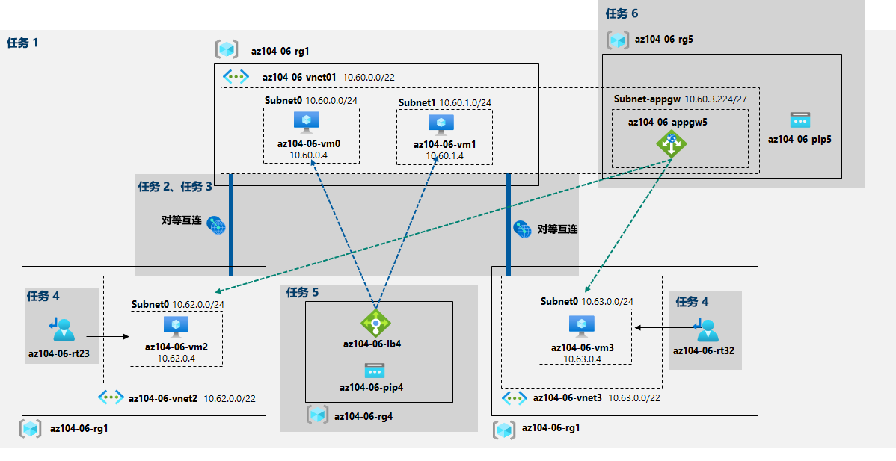

---
lab:
  title: 06 - 实现流量管理
  module: Administer Network Traffic Management
---

# 实验室 06 - 实现流量管理
# 学生实验室手册

## 实验室方案

你的任务是测试管理以中心辐射型网络拓扑中的 Azure 虚拟机为目标的网络流量，因为 Contoso 考虑在其 Azure 环境中实现该网络拓扑（而不是创建你在上一个实验室中测试的网状拓扑）。 此测试需要包括：依靠用户定义的路由迫使流量流经中心，从而实现辐条之间的连接；使用第 4 层和第 7 层负载均衡器，在虚拟机之间分配流量。 为此，你打算使用 Azure 负载均衡器（第 4 层）和 Azure 应用程序网关（第 7 层）。

                **注意：** 我们提供 **[交互式实验室模拟](https://mslabs.cloudguides.com/guides/AZ-104%20Exam%20Guide%20-%20Microsoft%20Azure%20Administrator%20Exercise%2010)** ，让你能以自己的节奏点击浏览实验室。 你可能会发现交互式模拟与托管实验室之间存在细微差异，但演示的核心概念和思想是相同的。 

>**注意**：默认情况下，此实验室要求在选择部署的区域中，Standard_Dsv3 系列中总共有 8 个 vCPU 可用，因为它涉及部署 Standard_D2s_v3 SKU 的四个 Azure VM。 如果学生使用的是试用版帐户（最多 4 个 vCPU），则可以使用仅需要一个 vCPU 的 VM 大小（例如 Standard_B1s）。

## 目标

在此实验中，将执行以下操作：

+ 任务 1：预配实验室环境
+ 任务 2：配置中心辐射型网络拓扑
+ 任务 3：测试虚拟网络对等互连的传递性
+ 任务 4：在中心辐射型拓扑中配置路由
+ 任务 5：实现 Azure 负载均衡器
+ 任务 6：实现 Azure 应用程序网关

## 预计用时：60 分钟

## 体系结构关系图




### 说明

## 练习 1

## 任务 1：预配实验室环境

在此任务中，你将会把四台虚拟机部署到同一 Azure 区域中。 前两个将驻留在中心虚拟网络中，后两个将各自驻留在单独的辐射虚拟网络中。

1. 登录 [Azure 门户](https://portal.azure.com)。

1. 在 Azure 门户中，单击 Azure 门户右上方的图标，打开 Azure Cloud Shell。

1. 如果系统提示选择“Bash”或“PowerShell”，请选择“PowerShell”  。

    >**注意**：如果这是你第一次启动 Cloud Shell，并看到消息“未装载任何存储”，请选择你将在本实验室中使用的订阅，然后选择“创建存储”  。

1. 在 Cloud Shell 窗格的工具栏中，单击“上传/下载文件”图标，在下拉菜单中，单击“上传”，然后将文件 \\Allfiles\\Labs\\06\\az104-06-vms-loop-template.json 和 \\Allfiles\\Labs\\06\\az104-06-vms-loop-parameters.json 上传到 Cloud Shell 主目录中   。

1. 在 Cloud Shell 窗格中，运行以下命令以创建第一个资源组，该资源组将托管实验室环境（将占位符 [Azure_region] 替换为你打算在其中部署 Azure 虚拟机的 Azure 区域的名称）（可以使用“(Get-AzLocation).Location”cmdlet 获取区域列表）：

    ```powershell 
    $location = '[Azure_region]'
    ```
    
    当前资源组名称为：
    ```powershell
    $rgName = 'az104-06-rg1'
    ```
    
    最后，在所需位置创建资源组：
    ```powershell
    New-AzResourceGroup -Name $rgName -Location $location
    ```


1. 在 Cloud Shell 窗格中，运行以下命令创建三个虚拟网络，并使用上传的模板和参数文件将四个 Azure VM 部署到其中：

    >注意：系统会提示你提供管理员密码。

   ```powershell
   New-AzResourceGroupDeployment `
      -ResourceGroupName $rgName `
      -TemplateFile $HOME/az104-06-vms-loop-template.json `
      -TemplateParameterFile $HOME/az104-06-vms-loop-parameters.json
   ```

    >**注意**：在继续下一步之前，请等待部署完成。 这大约需要 5 分钟。

    >**注意**：如果遇到提示 VM 大小不可用的错误，请向讲师寻求帮助并尝试以下步骤。
    > 1. 单击 CloudShell 中的 `{}` 按钮，从左侧栏中选择“az104-06-vms-loop-parameters.json”，并记下 `vmSize` 参数值。
    > 1. 检查部署“az104-06-rg1”资源组的位置。 你可以在 CloudShell 中运行 `az group show -n az104-06-rg1 --query location` 以获取它。
    > 1. 在 CloudShell 中运行 `az vm list-skus --location <Replace with your location> -o table --query "[? contains(name,'Standard_D2s')].name"`。
    > 1. 将 `vmSize` 参数的值替换为刚运行的命令返回的一个值。 如果没有返回值，可能需要选择要部署到的其他区域。 还可以选择其他系列名称，例如“Standard_B1s”。
    > 1. 现在再次运行 `New-AzResourceGroupDeployment` 命令以重新部署模板。 可以按几次向上按钮，这样就会显示最后执行的命令。

1. 在“Cloud Shell”窗格中运行以下命令，在上一步中部署的 Azure VM 上安装网络观察程序扩展：

   ```powershell
   $rgName = 'az104-06-rg1'
   $location = (Get-AzResourceGroup -ResourceGroupName $rgName).location
   $vmNames = (Get-AzVM -ResourceGroupName $rgName).Name

   foreach ($vmName in $vmNames) {
     Set-AzVMExtension `
     -ResourceGroupName $rgName `
     -Location $location `
     -VMName $vmName `
     -Name 'networkWatcherAgent' `
     -Publisher 'Microsoft.Azure.NetworkWatcher' `
     -Type 'NetworkWatcherAgentWindows' `
     -TypeHandlerVersion '1.4'
   }
   ```

    >**注意**：在继续下一步之前，请等待部署完成。 这大约需要 5 分钟。


1. 关闭 Cloud Shell 窗格。

## 任务 2：配置中心辐射型网络拓扑

在此任务中，你将在上一个任务中部署的虚拟网络之间配置本地互连，以创建中心辐射型网络拓扑。

1. 在 Azure 门户中，搜索并选择“虚拟网络”。

1. 查看你在上一个任务中创建的虚拟网络。

    >**注意**：用于部署三个虚拟网络的模板可确保三个虚拟网络的 IP 地址范围不重叠。

1. 在虚拟网络列表中，选择“az104-06-vnet2”。

1. 在“az104-06-vnet2”边栏选项卡中，选择“属性” 。 

1. 记下“az104-06-vnet2 \| 属性”边栏选项卡中“资源 ID”属性的值 。

1. 导航回虚拟网络列表，然后选择“az104-06-vnet3”。

1. 在“az104-06-vnet3”边栏选项卡中，选择“属性” 。 

1. 记下“az104-06-vnet3 \| 属性”边栏选项卡中“资源 ID”属性的值 。

    >**注意**：在本任务的稍后部分，你将需要这两个虚拟网络的 ResourceID 属性值。

    >**注意**：此解决方法可解决以下问题：在创建虚拟网络对等互连时，Azure 门户偶尔不显示新预配的虚拟网络。

1. 在虚拟网络列表中，单击“az104-06-vnet01”。

1. 在“az104-06-vnet01”虚拟网络边栏选项卡的“设置”部分，单击“对等互连”，然后单击“+ 添加”   。

1. 添加一个对等互连，设置如下（其他设置保留默认值），然后单击“添加”：

    | 设置 | 值 |
    | --- | --- |
    | 本虚拟网络: 对等互连链接名称 | az104-06-vnet01_to_az104-06-vnet2 |
    | 到远程虚拟网络的流量 | **允许（默认）** |
    | 从远程虚拟网络转接的流量 | **阻止来自此虚拟网络外部的流量** |
    | 虚拟网络网关 | **“无”（默认）** |
    | 远程虚拟网络: 对等互连链接名称 | az104-06-vnet2_to_az104-06-vnet01 |
    | 虚拟网络部署模型 | **资源管理器** |
    | 我知道我的资源 ID | enabled |
    | 资源 ID | 在本任务前面部分记下的 az104-06-vnet2 的 resourceID 参数值 |
    | 到远程虚拟网络的流量 | **允许（默认）** |
    | 从远程虚拟网络转接的流量 | **允许（默认）** |
    | 虚拟网络网关 | **“无”（默认）** |

    >**注意**：请等待操作完成。

    >**注意**：此步骤建立两个本地对等互连 - 一个从 az104-06-vnet01 到 az104-06-vnet2，另一个从 az104-06-vnet2 到 az104-06-vnet01。

    >**注意**：需要启用“允许转发的流量”，以便于在此实验室稍后将实现的分支虚拟网络之间进行路由。

1. 在“az104-06-vnet01”虚拟网络边栏选项卡的“设置”部分，单击“对等互连”，然后单击“+ 添加”   。

1. 添加一个对等互连，设置如下（其他设置保留默认值），然后单击“添加”：

    | 设置 | 值 |
    | --- | --- |
    | 本虚拟网络: 对等互连链接名称 | az104-06-vnet01_to_az104-06-vnet3 |
    | 到远程虚拟网络的流量 | **允许（默认）** |
    | 从远程虚拟网络转接的流量 | **阻止来自此虚拟网络外部的流量** |
    | 虚拟网络网关 | **“无”（默认）** |
    | 远程虚拟网络: 对等互连链接名称 | az104-06-vnet3_to_az104-06-vnet01 |
    | 虚拟网络部署模型 | **资源管理器** |
    | 我知道我的资源 ID | enabled |
    | 资源 ID | 在本任务前面部分记录的 az104-06-vnet3 的 resourceID 参数值 |
    | 到远程虚拟网络的流量 | **允许（默认）** |
    | 从远程虚拟网络转接的流量 | **允许（默认）** |
    | 虚拟网络网关 | **“无”（默认）** |

    >**注意**：此步骤建立两个本地对等互连 - 一个从 az104-06-vnet01 到 az104-06-vnet3，另一个从 az104-06-vnet3 到 az104-06-vnet01。 这样就完成了中心辐射型拓扑（带有两个辐射虚拟网络）的设置。

    >**注意**：需要启用“允许转发的流量”，以便于在此实验室稍后将实现的分支虚拟网络之间进行路由。

## 任务 3：测试虚拟网络对等互连的传递性

在此任务中，你将使用网络观察程序测试虚拟网络互连的可传递性。

1. 在 Azure 门户中，搜索并选择“网络观察程序”。

1. 在“网络观察程序”边栏选项卡上，展开 Azure 区域列表，并验证正在使用的区域中是否已启用服务。 

1. 在“网络观察程序”边栏选项卡中，导航到“连接故障排除”。

1. 在“网络观察程序”-“连接故障排除”边栏选项卡中，使用以下设置启动检查（其他设置保留默认值）：

    > 注意：可能需要花费几分钟时间才能列出资源组。 如果不想等待，请尝试以下操作：删除网络观察程序，创建新的网络观察程序，然后重试“连接故障排除”。 

    | 设置 | 值 |
    | --- | --- |
    | 订阅 | 你在此实验室中使用的 Azure 订阅的名称 |
    | 资源组 | az104-06-rg1 |
    | 源类型 | **虚拟机** |
    | 虚拟机 | az104-06-vm0 |
    | 目标 | **手动指定** |
    | URI、FQDN 或 IPv4 | 10.62.0.4 |
    | 协议 | **TCP** |
    | Destination Port | **3389** |

    > **注意**：10.62.0.4 代表 az104-06-vm2 的专用 IP 地址 

1. 单击“检查”，然后等待至返回连接性检查结果。 验证状态是否为可访问。 查看网络路径，请注意，连接是直接的，VM 之间没有中间跃点。

    > **注意**：这是预料之中的，因为中心虚拟网络直接与第一个辐射虚拟网络互连。

1. 在“网络观察程序”-“连接故障排除”边栏选项卡中，使用以下设置启动检查（其他设置保留默认值）：

    | 设置 | 值 |
    | --- | --- |
    | 订阅 | 你在此实验室中使用的 Azure 订阅的名称 |
    | 资源组 | az104-06-rg1 |
    | 源类型 | **虚拟机** |
    | 虚拟机 | az104-06-vm0 |
    | 目标 | **手动指定** |
    | URI、FQDN 或 IPv4 | 10.63.0.4 |
    | 协议 | **TCP** |
    | Destination Port | **3389** |

    > **注意**：10.63.0.4 代表 az104-06-vm3 的专用 IP 地址 

1. 单击“检查”，然后等待至返回连接性检查结果。 验证状态是否为可访问。 查看网络路径，请注意，连接是直接的，VM 之间没有中间跃点。

    > **注意**：这是预料之中的，因为中心虚拟网络直接与第二个辐射虚拟网络互连。

1. 在“网络观察程序”-“连接故障排除”边栏选项卡中，使用以下设置启动检查（其他设置保留默认值）：

    | 设置 | 值 |
    | --- | --- |
    | 订阅 | 你在此实验室中使用的 Azure 订阅的名称 |
    | 资源组 | az104-06-rg1 |
    | 源类型 | **虚拟机** |
    | 虚拟机 | az104-06-vm2 |
    | 目标 | **手动指定** |
    | URI、FQDN 或 IPv4 | 10.63.0.4 |
    | 协议 | **TCP** |
    | Destination Port | **3389** |

1. 单击“检查”，然后等待至返回连接性检查结果。 请注意，状态为“不可访问”。

    > **注意**：这是预料之中的，因为两个辐射虚拟网络并未彼此对等互连（虚拟网络对等互连不可传递）。

## 任务 4：在中心辐射型拓扑中配置路由

在此任务中，你将通过在虚拟机 az104-06-vm0 的网络接口上启用 IP 转发，来配置和测试两个辐射虚拟网络之间的路由，在虚拟机的操作系统内启用路由，并在辐射虚拟网络上配置用户定义的路由。

1. 在 Azure 门户中，搜索并选择“虚拟机”。

1. 在“虚拟机”边栏选项卡的虚拟机列表中，单击“az104-06-vm0”。

1. 在“az104-06-vm0”虚拟机边栏选项卡的“设置”部分，单击“网络”。

1. 单击“网络接口”标签旁的 az104-06-nic0 链接 ，然后在 az104-06-nic0 网络接口边栏选项卡上的“设置”部分，单击“IP 配置”。

1. 将“IP 转发”设置为“已启用”并保存更改。

   > **注意**：必须进行此设置，才能让 az104-06-vm0 充当路由器，在两个辐射虚拟网络之间路由流量。

   > **注意**：现在你需要配置虚拟机 az104-06-vm0的操作系统来支持路由。

1. 在 Azure 门户中，导航到“az104-06-vm0”Azure 虚拟机边栏选项卡，并单击“概述”。

1. 在“az104-06-vm0”边栏选项卡的“操作”部分单击“运行命令”，然后单击命令列表中的“RunPowerShellScript”   。

1. 在“运行命令脚本”边栏选项卡中键入以下内容，然后单击“运行”来安装远程访问 Windows Server 角色 。

   ```powershell
   Install-WindowsFeature RemoteAccess -IncludeManagementTools
   ```

   > **注意**：请等到显示命令已成功完成的确认信息。

1. 在“运行命令脚本”边栏选项卡中输入以下内容，然后单击“运行”来安装路由角色服务。

   ```powershell
   Install-WindowsFeature -Name Routing -IncludeManagementTools -IncludeAllSubFeature

   Install-WindowsFeature -Name "RSAT-RemoteAccess-Powershell"

   Install-RemoteAccess -VpnType RoutingOnly

   Get-NetAdapter | Set-NetIPInterface -Forwarding Enabled
   ```

   > **注意**：请等到显示命令已成功完成的确认信息。

   > **注意**：现在，需要在辐射虚拟网络上创建和配置用户定义的路由。

1. 在 Azure 门户中，搜索并选择“路由表”，并且在“路由表”边栏选项卡中单击“+ 创建”  。

1. 使用以下设置（将其他设置保留为默认值）创建路由表：

    | 设置 | 值 |
    | --- | --- |
    | 订阅 | 你在此实验室中使用的 Azure 订阅的名称 |
    | 资源组 | az104-06-rg1 |
    | 位置 | 创建虚拟网络的 Azure 区域的名称 |
    | 名称 | az104-06-rt23 |
    | 传播网关路由 | **是** |

1. 单击“查看并创建”。 允许进行验证，然后单击“创建”以提交部署。

   > **注意**：请等到路由表完成创建。 这大约需要 3 分钟。

1. 单击“转到资源”。

1. 在“az104-06-rt23”路由表边栏选项卡的“设置”部分，单击“路由”，然后单击“+ 添加”   。

1. 添加具有以下设置的新路由：

    | 设置 | 值 |
    | --- | --- |
    | 路由名称 | az104-06-route-vnet2-to-vnet3 |
    | 地址前缀目标 | **IP 地址** |
    | 目标 IP 地址/CIDR 范围 | 10.63.0.0/20 |
    | 下一跃点类型 | **虚拟设备** |
    | 下一跃点地址 | 10.60.0.4 |

1. 单击“添加”

1. 返回到“az104-06-rt23”路由表边栏选项卡的“设置”部分，单击“子网”，然后单击“+ 关联”   。

1. 将路由表 az104-06-rt23 关联到以下子网：

    | 设置 | 值 |
    | --- | --- |
    | 虚拟网络 | az104-06-vnet2 |
    | 子网 | subnet0 |

1. 单击“添加”

1. 导航回“路由表”边栏选项卡，并单击“+ 创建” 。

1. 使用以下设置（将其他设置保留为默认值）创建路由表：

    | 设置 | 值 |
    | --- | --- |
    | 订阅 | 你在此实验室中使用的 Azure 订阅的名称 |
    | 资源组 | az104-06-rg1 |
    | 区域 | 创建虚拟网络的 Azure 区域的名称 |
    | 名称 | az104-06-rt32 |
    | 传播网关路由 | **是** |

1. 单击“查看并创建”。 允许进行验证，然后单击“创建”以提交部署。

   > **注意**：请等到路由表完成创建。 这大约需要 3 分钟。

1. 单击“转到资源”。

1. 在“az104-06-rt32”路由表边栏选项卡的“设置”部分，单击“路由”，然后单击“+ 添加”   。

1. 添加具有以下设置的新路由：

    | 设置 | 值 |
    | --- | --- |
    | 路由名称 | az104-06-route-vnet3-to-vnet2 |
    | 地址前缀目标 | **IP 地址** |
    | 目标 IP 地址/CIDR 范围 | 10.62.0.0/20 |
    | 下一跃点类型 | **虚拟设备** |
    | 下一跃点地址 | 10.60.0.4 |

1. 单击 **“确定”**

1. 返回到 az104-06-rt32 路由表边栏选项卡的“设置”部分，单击“子网”，然后单击“+ 关联”   。

1. 将路由表 az104-06-rt32 与以下子网关联：

    | 设置 | 值 |
    | --- | --- |
    | 虚拟网络 | az104-06-vnet3 |
    | 子网 | **subnet0** |

1. 单击 **“确定”**

1. 在 Azure 门户中，返回“网络观察程序 - 连接故障排除”边栏选项卡。

1. 在“网络观察程序”-“连接故障排除”边栏选项卡中，使用以下设置启动检查（其他设置保留默认值）：

    | 设置 | 值 |
    | --- | --- |
    | 订阅 | 你在此实验室中使用的 Azure 订阅的名称 |
    | 资源组 | az104-06-rg1 |
    | 源类型 | **虚拟机** |
    | 虚拟机 | az104-06-vm2 |
    | 目标 | **手动指定** |
    | URI、FQDN 或 IPv4 | 10.63.0.4 |
    | 协议 | **TCP** |
    | Destination Port | **3389** |

1. 单击“检查”，然后等待至返回连接性检查结果。 验证状态是否为可访问。 查看网络路径，并注意流量通过 10.60.0.4路由，而该 IP 地址已分配给 az104-06-nic0 网络适配器。 如果状态为“无法访问”，则应停止，然后重启 az104-06-vm0。

    > **注意**：这是预料之中的，因为辐射虚拟网络之间的流量现在是通过位于中心虚拟网络中的虚拟机路由的，由该虚拟机充当路由器。

    > **注意**：你可以使用“网络观察程序”查看网络拓扑。

## 任务 5：实现 Azure 负载均衡器

在此任务中，你将在中心虚拟网络中的两台 Azure 虚拟机前实现 Azure 负载均衡器。

1. 在 Azure 门户中，搜索并选择“负载均衡器”，在“负载均衡器”边栏选项卡上，单击“+ 创建”。  

1. 创建一个负载均衡器，设置如下（其他设置保留默认值），然后单击“下一步: 前端 IP 配置”：

    | 设置 | 值 |
    | --- | --- |
    | 订阅 | 你在此实验室中使用的 Azure 订阅的名称 |
    | 资源组 | **az104-06-rg4**（如有必要创建） |
    | 名称 | az104-06-lb4 |
    | 区域 | 在本实验室中部署所有其他资源的 Azure 区域的名称 |
    | SKU  | **标准** |
    | 类型 | **Public** |
    | 层 | **Regional** |
    
1. 在“前端 IP 配置”选项卡上，单击“添加前端 IP 配置”并在单击“确定”前使用以下设置，然后单击“添加”   。 完成后，单击“下一步: 后端池”。 
     
    | 设置 | 值 |
    | --- | --- |
    | 名称 | az104-06-pip4 |
    | IP 版本 | IPv4 |
    | 公共 IP 地址 | **新建** |

1. 在“后端池”选项卡上，单击“添加后端池”并进行如下设置（其他设置保留默认值）。  单击“+ 添加”（两次），然后单击“下一步: 入站规则”。  

    | 设置 | 值 |
    | --- | --- |
    | 名称 | az104-06-lb4-be1 |
    | 虚拟网络 | az104-06-vnet01 |
    | 后端池配置 | **NIC** | 
    | IP 版本 | **IPv4** |
    | 单击“添加”以添加虚拟机 |  |
    | az104-06-vm0 | 选中框 |
    | az104-06-vm1 | 选中框 |


1. 在“入站规则”选项卡上，单击“添加负载均衡规则”。  添加负载均衡规则并进行以下设置（其他设置保留默认值）。 完成后，单击“添加”。

    | 设置 | 值 |
    | --- | --- |
    | 名称 | az104-06-lb4-lbrule1 |
    | IP 版本 | **IPv4** |
    | 前端 IP 地址 | az104-06-pip4 |
    | 后端池 | az104-06-lb4-be1 |    
    | 协议 | **TCP** |
    | 端口 | **80** |
    | 后端端口 | **80** |
    | 运行状况探测 | **新建** |
    | 名称 | az104-06-lb4-hp1 |
    | 协议 | **TCP** |
    | 端口 | **80** |
    | 时间间隔 | **5** |
    | 不正常阈值 | **2** |
    | 关闭“创建运行状况探测”窗口 | **确定** | 
    | 会话暂留 | **无** |
    | 空闲超时(分钟) | **4** |
    | TCP 重置 | **已禁用** |
    | 浮动 IP | **已禁用** |
    | 出站源网络地址转换 (SNAT) | 推荐 |

1. 当你有时间时，请查看其他选项卡，然后单击“查看并创建”。 确保没有验证错误，然后单击“创建”。 

1. 等待负载均衡器部署，然后单击“转到资源”。  

1. 从负载均衡器资源页中选择“前端 IP 配置”。 复制 IP 地址。

1. 打开另一个浏览器标签页并导航到该 IP 地址。 验证浏览器窗口是否显示消息“Hello World from az104-06-vm0”或者“Hello World from az104-06-vm1”。

1. 刷新窗口以验证对其他虚拟机的消息更改。 这演示了通过虚拟机轮换的负载均衡器。

    > 注意：可能需要多次刷新或在 InPrivate 模式下打开新的浏览器窗口。

## 任务 6：实现 Azure 应用程序网关

在此任务中，将在辐射虚拟网络中的两台 Azure 虚拟机前实现 Azure 应用程序网关。

1. 在 Azure 门户中，搜索并选择“虚拟网络”。

1. 在“虚拟网络”边栏选项卡上的虚拟网络列表中，单击“az104-06-vnet01”。

1. 在“az104-06-vnet01”虚拟网络边栏选项卡的“设置”部分，单击“子网”，然后单击“+ 子网”。

1. 添加一个子网，设置如下（其他设置保留默认值）：

    | 设置 | 值 |
    | --- | --- |
    | 名称 | subnet-appgw |
    | 子网地址范围 | 10.60.3.224/27 |

1. 单击“保存” 

    > **注意**：此子网将由 Azure 应用程序网关实例使用，你稍后将在此任务中部署这些实例。 应用程序网关需要一个 /27 或更大的专用子网。

1. 在 Azure 门户中，搜索并选择“应用程序网关”，并在“应用程序网关”边栏选项卡中单击“+ 创建”  。

1. 在“基本信息”选项卡上，指定以下设置（其他设置保留默认值）：

    | 设置 | 值 |
    | --- | --- |
    | 订阅 | 你在此实验室中使用的 Azure 订阅的名称 |
    | 资源组 | az104-06-rg5（新建） |
    | 应用程序网关名称 | az104-06-appgw5 |
    | 区域 | 在本实验室中部署所有其他资源的 Azure 区域的名称 |
    | 层 | 标准 V2 |
    | 启用自动缩放 | **否** |
    | 实例计数 | **2** |
    | 可用性区域 | **无** |
    | HTTP2 | **已禁用** |
    | 虚拟网络 | az104-06-vnet01 |
    | 子网 | subnet-appgw (10.60.3.224/27) |

1. 单击“下一步: 前端 >”并指定以下设置（其他设置保留默认值）。 完成后，请单击“确定”****。 

    | 设置 | 值 |
    | --- | --- |
    | 前端 IP 地址类型 | **公共** |
    | 公共 IP 地址| **添加新内容** | 
    | 名称 | **az104-06-pip5** |
    | 可用性区域 | **无** |

1. 单击“下一步: 后端 >”，然后单击“添加后端池”。  指定以下设置（其他设置保留默认值）。 完成后，单击“添加”。

    | 设置 | 值 |
    | --- | --- |
    | 名称 | az104-06-appgw5-be1 |
    | 添加没有目标的后端池 | **否** |
    | IP 地址或 FQDN | 10.62.0.4 | 
    | IP 地址或 FQDN | 10.63.0.4 |

    > **注意**：目标代表辐射虚拟网络 az104-06-vm2 和 az104-06-vm3 中虚拟机的专用 IP 地址。

1. 单击“下一步: 配置 >”，然后单击“+ 添加路由规则”。  指定以下设置：

    | 设置 | 值 |
    | --- | --- |
    | 规则名称 | az104-06-appgw5-rl1 |
    | 优先度 | **10** |
    | 侦听器名称 | az104-06-appgw5-rl1l1 |
    | 前端 IP | **公共** |
    | 协议 | **HTTP** |
    | 端口 | **80** |
    | 侦听器类型 | **基本** |
    | 错误页 URL | **否** |

1. 切换到“后端目标”选项卡，并指定以下设置（其他设置保留默认值）。 完成后，单击“添加”（两次）。  

    | 设置 | 值 |
    | --- | --- |
    | 目标类型 | 后端池 |
    | 后端目标 | az104-06-appgw5-be1 |
    | 后端设置 | **添加新内容** |
    | 后端设置名称 | az104-06-appgw5-http1 |
    | 后端协议 | **HTTP** |
    | 后端端口 | **80** |
    | 其他设置 | 采用默认值 |
    | 主机名 | 采用默认值 |

1. 单击“下一步:标记 >”，再单击“下一步: 查看 + 创建 >”，然后单击“创建”。

    > **注意**：等待应用程序网关实例创建完毕。 这可能需要大约 8 分钟。

1. 在 Azure 门户中，搜索并选择“应用程序网关”，并在“应用程序网关”边栏选项卡上单击“az104-06-appgw5”。

1. 在“az104-06-appgw5”应用程序网关边栏选项卡上，复制“前端公共 IP 地址”的值。 

1. 启动另一个浏览器窗口，并导航到你在上一步中标识的 IP 地址。

1. 验证浏览器窗口是否显示消息“Hello World from az104-06-vm2”或者“Hello World from az104-06-vm3” 。

1. 刷新窗口以验证对其他虚拟机的消息更改。 

    > 注意：可能需要多次刷新或在 InPrivate 模式下打开新的浏览器窗口。

    > **注意**：把多个虚拟网络上的虚拟机作为目标不是常见配置，而是为了说明应用程序网关能够把多个虚拟网络（以及其他 Azure 区域甚至 Azure 外部的终结点）上的虚拟机作为目标。这与 Azure 负载均衡器不同，Azure 负载均衡器的功能是在同一虚拟网络中的各个虚拟机之间实现负载均衡。

## 清理资源

>**注意**：记得删除所有不再使用的新建 Azure 资源。 删除未使用的资源可确保不会出现意外费用。

>**注意**：如果不能立即删除实验室资源，也不要担心。 有时资源具有依赖项，需要更长的时间才能删除。 这是监视资源使用情况的常见管理员任务，因此，只需定期查看门户中的资源即可查看清理方式。 

1. 在 Azure 门户的“Cloud Shell”窗格中打开“PowerShell”会话。

1. 运行以下命令，列出在本模块各实验室中创建的所有资源组：

   ```powershell
   Get-AzResourceGroup -Name 'az104-06*'
   ```

1. 通过运行以下命令，删除在此模块的实验室中创建的所有资源组：

   ```powershell
   Get-AzResourceGroup -Name 'az104-06*' | Remove-AzResourceGroup -Force -AsJob
   ```

    >**注意**：该命令以异步方式执行（由 -AsJob 参数决定），因此，虽然你可以随后立即在同一个 PowerShell 会话中运行另一个 PowerShell 命令，但需要几分钟才能实际删除资源组。

## 审阅

在此实验室中，你执行了以下操作：

+ 预配实验室环境
+ 配置中心辐射型网络拓扑
+ 测试虚拟网络互连的可传递性
+ 配置中心辐射型拓扑中的路由
+ 实现 Azure 负载均衡器
+ 实现 Azure 应用程序网关
