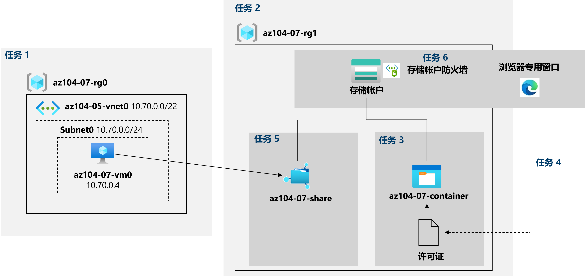

---
lab:
  title: 实验室 07：管理 Azure 存储
  module: Administer Azure Storage
---

# 实验室 07 - 管理 Azure 存储
# 学生实验室手册

## 实验室方案

你需要评估可否使用 Azure 存储来存储当前位于本地数据存储中的文件。 虽然不经常访问其中大部分文件，但也有一些例外。 你希望将访问频率较低的文件放在价格较低的存储层中，以最大程度地降低存储成本。 你还计划探索 Azure 存储提供的不同保护机制，包括网络访问、身份验证、授权和复制。 最后，你需要确定 Azure 文件存储服务有多适合用于托管本地文件共享。

**注意：** 我们提供 **[交互式实验室模拟](https://mslabs.cloudguides.com/guides/AZ-104%20Exam%20Guide%20-%20Microsoft%20Azure%20Administrator%20Exercise%2011)** ，让你能以自己的节奏点击浏览实验室。 你可能会发现交互式模拟与托管实验室之间存在细微差异，但演示的核心概念和思想是相同的。 

## 目标

在此实验中，将执行以下操作：

+ 任务 1：预配实验室环境
+ 任务 2：创建和配置 Azure 存储帐户
+ 任务 3：管理 Blob 存储
+ 任务 4：管理 Azure 存储的身份验证和授权
+ 任务 5：创建并配置 Azure 文件存储共享
+ 任务 6：管理 Azure 存储的网络访问

## 预计用时：40 分钟

## 体系结构关系图




### 说明

## 练习 1

## 任务 1：预配实验室环境

在此任务中，你将部署一个 Azure 虚拟机，稍后将在本实验室中用到。

1. 登录 **[Azure 门户](https://portal.azure.com)**。

1. 在 Azure 门户中，单击 Azure 门户右上方的图标，打开 Azure Cloud Shell。

1. 如果系统提示选择“Bash”或“PowerShell”，请选择“PowerShell”  。

    >**注意**：如果这是你第一次启动 Cloud Shell，并看到消息“未装载任何存储”，请选择你将在本实验室中使用的订阅，然后选择“创建存储”  。

1. 在 Cloud Shell 窗格的工具栏中，单击“上传/下载文件”图标，在下拉菜单中，单击“上传”，然后将文件 \\Allfiles\\Labs\\07\\az104-07-vm-template.json 和 \\Allfiles\\Labs\\07\\az104-07-vm-parameters.json 上传到 Cloud Shell 主目录中   。

1. 在 Cloud Shell 窗格中运行以下命令，以创建将托管虚拟机的资源组（将 '[Azure_region]' 占位符替换为你打算在其中部署 Azure 虚拟机的 Azure 区域的名称）

    >**注意**：若要列出 Azure 区域的名称，请运行 `(Get-AzLocation).Location`。注意
    >：应单独键入每个命令

    ```powershell
    $location = '[Azure_region]'
    ```
  
    ```powershell
     $rgName = 'az104-07-rg0'
    ```

    ```powershell
    New-AzResourceGroup -Name $rgName -Location $location
    ```
    
1. 在 Cloud Shell 窗格中运行以下命令，通过使用上传的模板和参数文件来部署虚拟机：

    >注意：系统会提示你提供管理员密码。

   ```powershell
   New-AzResourceGroupDeployment `
      -ResourceGroupName $rgName `
      -TemplateFile $HOME/az104-07-vm-template.json `
      -TemplateParameterFile $HOME/az104-07-vm-parameters.json `
      -AsJob
   ```

    >**注意**：请不要等待部署完成，而是继续执行下一个任务。

    >**注意**：如果遇到提示 VM 大小不可用的错误，请向讲师寻求帮助并尝试以下步骤。
    > 1. 单击 CloudShell 中的 `{}` 按钮，从左侧栏中选择“az104-07-vm-parameters.json”，并记下 `vmSize` 参数值。
    > 1. 检查部署“az104-04-rg1”资源组的位置。 你可以在 CloudShell 中运行 `az group show -n az104-04-rg1 --query location` 以获取它。
    > 1. 在 CloudShell 中运行 `az vm list-skus --location <Replace with your location> -o table --query "[? contains(name,'Standard_D2s')].name"`。
    > 1. 将 `vmSize` 参数的值替换为刚运行的命令返回的一个值。
    > 1. 现在再次运行 `New-AzResourceGroupDeployment` 命令以重新部署模板。 可以按几次向上按钮，这样就会显示最后执行的命令。

1. 关闭 Cloud Shell 窗格。

## 任务 2：创建和配置 Azure 存储帐户

在此任务中，你将创建和配置 Azure 存储帐户。

1. 在 Azure 门户中，搜索并选择“存储帐户”，然后单击“+ 创建” 。

1. 在“创建存储帐户”边栏选项卡的“基本信息”选项卡上，指定以下设置（其他设置保留默认值） ：

    | 设置 | 值 |
    | --- | --- |
    | 订阅 | 你在此实验室中使用的 Azure 订阅的名称 |
    | 资源组 | 新资源组名称 az104-07-rg1 |
    | 存储帐户名称 | 由字母和数字组成、长度介于 3 到 24 个字符之间的任意全局唯一名称 |
    | 区域 | 可以在其中创建 Azure 存储帐户的 Azure 区域的名称  |
    | 性能 | **标准** |
    | 冗余 | **异地冗余存储 (GRS)** |

1. 单击“下一步:高级 >”，在“创建存储帐户”边栏选项卡的“高级”选项卡上，查看可用选项，接受默认设置，然后单击“下一步:   网络 >”。

1. 在“创建存储帐户”边栏选项卡的“网络”选项卡上，查看可用选项，接受默认选项“启用来自所有网络的公共访问”，然后单击“下一步:    数据保护 >”。

1. 在“创建存储帐户”边栏选项卡的“数据保护”选项卡中，查看可用选项，接受默认设置，然后单击“查看 + 创建”，等待验证过程完成，然后单击“创建”   。

    >**注意**：请等待存储帐户创建完成。 这大约需要 2 分钟。

1. 在“部署”边栏选项卡上，单击“前往资源”，以显示“Azure 存储帐户”边栏选项卡。

1. 在“存储帐户”边栏选项卡的“数据管理”部分，单击“冗余”并记下辅助位置。 

1. 在“冗余”下拉列表中，选择“本地冗余存储(LRS)”并保存所做更改。 请注意，存储帐户此时只有主要位置。

1. 在“存储帐户”边栏选项卡的“设置”部分，选择“配置”。 将“Blob 访问层(默认)”设置为“冷”，然后保存所做更改。

    > **注意**：对于不经常访问的数据，冷访问层是最佳选择。

## 任务 3：管理 Blob 存储

在此任务中，你将创建 blob 容器并在其中上传 blob。

1. 在“存储帐户”边栏选项卡上的“数据存储”部分，单击“容器” 。

1. 单击“+ 容器”并使用以下设置创建容器：

    | 设置 | 值 |
    | --- | --- |
    | 名称 | az104-07-container  |
    | 公共访问级别 | **专用（不允许匿名访问）** |

1. 在容器列表中，单击 az104-07-container，然后单击“上传”。

1. 浏览到实验室计算机上的“\\Allfiles\\Labs\\07\\LICENSE”，然后单击“打开” 。

1. 在“上传 blob”边栏选项卡上，展开“高级”部分，并指定以下设置（其他设置则保留为默认值） ：

    | 设置 | 值 |
    | --- | --- |
    | Blob 类型 | **块 blob** |
    | 块大小 | **4 MB** |
    | 访问层 | **热访问层** |
    | 上传到文件夹 | **许可证** |

    > **注意**：可为每个 blob 设置访问层。

1. 单击“上载” 。

    > **注意**：请注意，上传时会自动创建一个名为 licenses 的子文件夹。

1. 返回到 az104-07-container 边栏选项卡，单击 licenses，然后单击 LICENSE。

1. 在 licenses/LICENSE 边栏选项卡上，查看可用选项。

    > **注意**：你可以选择执行以下操作：下载 blob；更改其访问层（当前设置为“热”）；获得租约，这会将其租赁状态更改为“已锁定”（当前设置为“已解锁”）并保护 blob 不被修改或删除；以及分配自定义元数据（通过指定任意键/值对）  。 也可以在 Azure 门户界面中直接“编辑”文件，无需先下载。 你还可以创建快照以及生成 SAS 令牌（将在下一个任务中探索此选项）。

## 任务 4：管理 Azure 存储的身份验证和授权

在此任务中，你将配置 Azure 存储的身份验证和授权。

1. 在“licenses/LICENSE”边栏选项卡的“概述”选项卡上，单击 URL 条目旁边的“复制到剪贴板”按钮   。

1. 使用 InPrivate 模式打开另一个浏览器窗口，并导航到上一步中复制的 URL。

1. 你应该可以看到一个 XML 格式的消息，显示“ResourceNotFound”或“PublicAccessNotPermitted”。

    > **注意**：这很正常，因为你创建的容器将公共访问级别设置成了“专用(禁止匿名访问)”。

1. 关闭 InPrivate 模式浏览器窗口，返回到显示 Azure 存储容器 licenses/LICENSE 边栏选项卡的浏览器窗口，然后切换到“生成 SAS”选项卡。

1. 在 licenses/LICENSE 边栏选项卡的“生成 SAS”选项卡上，指定以下设置（其他设置则保留为默认值）：

    | 设置 | 值 |
    | --- | --- |
    | 签名密钥 | 密钥 1 |
    | 权限 | **读取** |
    | 开始日期 | 昨天的日期 |
    | 开始时间 | 当前时间 |
    | 到期日期 | 明天的日期 |
    | 到期时间 | 当前时间 |
    | 允许的 IP 地址 | 留空 |
    

1. 单击“生成 SAS 令牌和 URL”。

1. 单击“Blob SAS URL”条目旁边的“复制到剪贴板”按钮。

1. 使用 InPrivate 模式打开另一个浏览器窗口，并导航到上一步中复制的 URL。

    > **备注**：下载文件并使用记事本将其打开，即可查看文件的内容。

    > **注意**：这很正常，因为你现在的访问基于新生成的 SAS 令牌进行授权。

    > **注意**：保存 blob SAS URL。 本实验室中稍后会用到它。

1. 关闭 InPrivate 模式浏览器窗口，返回到显示 Azure 存储容器 licenses/LICENSE 边栏选项卡的浏览器窗口，然后从中导航回 az104-07-container 边栏选项卡。

1. 单击“**身份验证方法**”标签旁边的“**切换到 Microsoft Entra 用户帐户**”链接。

    > **注意**：更改身份验证方法时，你会看到一个错误（错误为“*你没有使用 Microsoft Entra 的用户帐户列出数据的权限*”）。 这符合预期。  

    > **注意**：此时，你没有更改身份验证方法的权限。

1. 在 az104-07-container 边栏选项卡上，单击“访问控制(IAM)” 。

1. 在“检查访问权限”选项卡上，单击“添加角色分配” 。

1. 在“添加角色分配”选项卡上，指定以下设置：

    | 设置 | 值 |
    | --- | --- |
    | 角色 | **存储 Blob 数据所有者** |
    | 将访问权限分配到 | 用户、组或服务主体 |
    | 成员 | 你的用户帐户名称 |

1. 单击“**查看 + 分配**”，再单击“**查看 + 分配**”，并返回到 **az104-07-container** 容器的“**概述**”边栏选项卡，然后验证是否可将身份验证方法更改为（切换到 Microsoft Entra 用户帐户）。

    > **注意**：更改可能需要大约 5 分钟才生效。

## 任务 5：创建并配置 Azure 文件存储共享

在此任务中，你将创建和配置 Azure 文件存储共享。

> **注意**：开始本任务前，请确保你在本实验室第一个任务中预配的虚拟机正在运行。

1. 在 Azure 门户中，导航回到你在本实验室第一个任务中创建的存储帐户的边栏选项卡，然后在“数据存储”部分，单击“文件共享” 。

1. 单击“+ 文件共享”并在“基本信息”选项卡上将文件共享命名为“az104-07-share”  。 查看此选项卡上的其他设置。 

1. 移动到“备份”选项卡，确保未选中“启用备份”  。

1. 单击“查看并创建”，然后单击“创建” 。 等待文件共享完成部署。 

1. 单击新创建的文件共享，并记下“az104-07-share”边栏选项卡上提供的信息。

1. 单击“浏览”，注意新文件共享中没有文件或文件夹。 单击“连接”。

1. 在“连接”边栏选项卡上，确保选中“Windows”选项卡。 下面显示一个带有“显示脚本”标签的按钮。 单击此按钮，你会发现一个带有脚本的灰色文本框，将鼠标悬停在该框右下角的页面图标上，并单击“复制到剪贴板”。

1. 在 Azure 门户中，搜索并选择“虚拟机”，然后在虚拟机列表中，单击 az104-07-vm0。

1. 在 az104-07-vm0 边栏选项卡上的“操作”部分，单击“运行命令”。

1. 在“az104-07-vm0 - 运行命令”边栏选项卡上，单击 RunPowerShellScript。

1. 在“运行命令脚本”边栏选项卡上，将先前在此任务中复制的脚本粘贴到“PowerShell 脚本”窗格并单击“运行”。

1. 验证脚本是否成功完成。

1. 将“PowerShell 脚本”窗格中的内容替换为以下脚本，然后单击“运行”：

   ```powershell
   New-Item -Type Directory -Path 'Z:\az104-07-folder'

   New-Item -Type File -Path 'Z:\az104-07-folder\az-104-07-file.txt'
   ```

1. 验证脚本是否成功完成。

1. 导航回“az104-07-share \| 浏览”文件共享边栏选项卡，单击“刷新”，并验证 az104-07-folder 出现在文件夹列表中  。

1. 单击 az104-07-folder，并验证 az104-07-file.txt 出现在文件列表中。

## 任务 6：管理 Azure 存储的网络访问

在此任务中，你将配置 Azure 存储的网络访问。

1. 在 Azure 门户中，导航回到你在本实验室第一个任务中创建的存储帐户的边栏选项卡，然后在“安全 + 网络”部分，单击“网络”，然后单击“防火墙和虚拟网络”  。

1. 单击“已从所选虚拟网络和 IP 地址启用”选项，并查看启用此选项后可用的配置设置。

    > **注意**：你可以使用这些设置和服务终结点来配置虚拟网络指定子网上的 Azure 虚拟机与存储帐户之间的直接连接。

1. 单击复选框“添加客户端 IP 地址”，并保存更改。

1. 使用 InPrivate 模式打开另一个浏览器窗口，然后导航到你在上一个任务中生成的 blob SAS URL。

    > **注意**：如果未从任务 4 记录 SAS URL，则应生成具有相同配置的新 URL。 使用任务 4 的步骤 4-6 作为生成新 blob SAS URL 的指南。 

1. 系统随即显示“MIT 许可证(MIT)”页面的内容。

    > **注意**：这很正常，因为你从客户端 IP 地址进行连接。

1. 关闭 InPrivate 模式浏览器窗口，返回到显示 Azure 存储帐户的“网络”边栏选项卡的浏览器窗口。

1. 在 Azure 门户中，单击 Azure 门户右上方的图标，打开 Azure Cloud Shell。

1. 如果系统提示选择“Bash”或“PowerShell”，请选择“PowerShell”  。

1. 在 Cloud Shell 窗格中，运行以下命令，尝试从存储帐户的 az104-07-container 容器下载 LICENSE blob（将 `[blob SAS URL]` 占位符替换为你在上一个任务中生成的 blob SAS URL）：

   ```powershell
   Invoke-WebRequest -URI '[blob SAS URL]'
   ```
1. 验证下载尝试是否失败。

    > **注意**：你应收到消息“授权失败: 该请求无权执行此操作”。 这很正常，因为你连接的 IP 地址已分配给托管 Cloud Shell 实例的 Azure VM。

1. 关闭 Cloud Shell 窗格。

## 清理资源

>**注意**：记得删除所有不再使用的新建 Azure 资源。 删除未使用的资源可确保不会出现意外费用。

>**注意**：如果不能立即删除实验室资源，也不要担心。 有时资源具有依赖项，需要较长的时间才能删除。 这是监视资源使用情况的常见管理员任务，因此，只需定期查看门户中的资源即可查看清理方式。 你还可以尝试删除资源所在的资源组。 这是一个快速的管理员快捷方式。 如果你存在疑问，请与你的讲师沟通。

1. 在 Azure 门户的“Cloud Shell”窗格中打开“PowerShell”会话。

1. 运行以下命令，列出在本模块各实验室中创建的所有资源组：

   ```powershell
   Get-AzResourceGroup -Name 'az104-07*'
   ```

1. 通过运行以下命令，删除在此模块的实验室中创建的所有资源组：

   ```powershell
   Get-AzResourceGroup -Name 'az104-07*' | Remove-AzResourceGroup -Force -AsJob
   ```

    >**注意**：该命令以异步方式执行（由 -AsJob 参数决定），因此，虽然你可以随后立即在同一个 PowerShell 会话中运行另一个 PowerShell 命令，但需要几分钟才能实际删除资源组。

## 审阅

在此实验室中，你执行了以下操作：

- 预配实验室环境
- 创建和配置 Azure 存储帐户
- 管理 Blob 存储
- 管理 Azure 存储的身份验证和授权
- 创建和配置 Azure 文件存储共享
- 管理 Azure 存储的网络访问
