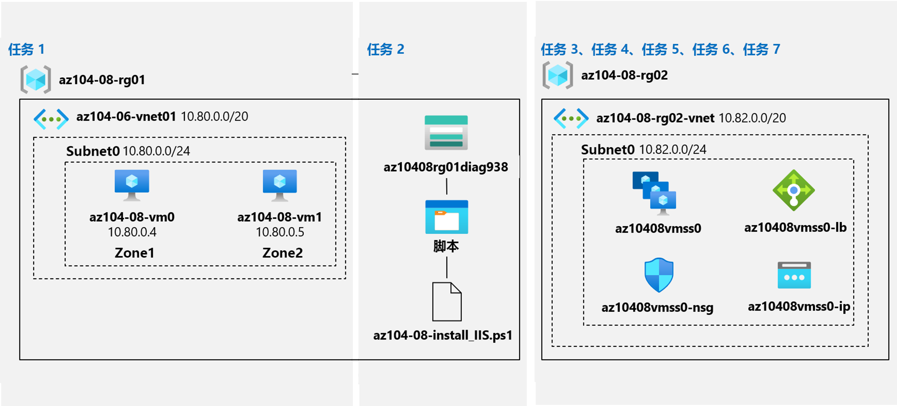

---
lab:
    title: '08 - 管理虚拟机'
    module: '模块 08 - 虚拟机'
---

# 实验室 08 - 管理虚拟机
# 学生实验室手册

## 实验室场景

你的任务是确定用于部署和配置 Azure 虚拟机的不同选项。首先，你需要确定在使用 Azure 虚拟机时可以采用的各种计算和存储复原与缩放选项。接下来，你需要研究使用 Azure 虚拟机规模集时可用的计算和存储复原与缩放选项。你还希望探索使用 Azure 虚拟机自定义脚本扩展自动配置虚拟机和虚拟机规模集的功能。

## 目标

在本实验室中，你将完成以下任务：

+ 任务 1：使用 Azure 门户和 Azure 资源管理器模板部署可复原区域的 Azure 虚拟机
+ 任务 2：使用虚拟机扩展配置 Azure 虚拟机
+ 任务 3：缩放 Azure 虚拟机的计算和存储
+ 任务 4：注册 Microsoft.Insights 和 Microsoft.AlertsManagement 资源提供程序
+ 任务 5：使用 Azure 门户部署可复原区域的 Azure 虚拟机规模集
+ 任务 6：使用虚拟机扩展配置 Azure 虚拟机规模集
+ 任务 7：缩放 Azure 虚拟机规模集的计算和存储（可选）

## 预计用时：50 分钟

## 体系结构图




## 说明

### 练习 1

#### 任务 1：使用 Azure 门户和 Azure 资源管理器模板部署可复原区域的 Azure 虚拟机

在此任务中，你将使用 Azure 门户和 Azure 资源管理器模板将 Azure 虚拟机部署到不同的可用性区域。

1. 登录到 [Azure 门户](http://portal.azure.com)。

1. 在 Azure 门户中，搜索并选择“**虚拟机**”，然后在“**虚拟机**”边栏选项卡上，依次单击“**+ 创建**”、“**+ 虚拟机**”。

1. 在“**创建虚拟机**”边栏选项卡的“**基本设置**”选项卡上，指定以下设置（其他设置保留默认值）：

    | 设置 | 值 |
    | --- | --- |
    | 订阅 | 将在本实验室中使用的 Azure 订阅的名称 |
    | 资源组 | 新资源组名称 **“az104-08-rg01”** |
    | 虚拟机名称 | **az104-08-vm0** |
    | 区域 | 选择其中一个支持可用性区域且可预配 Azure 虚拟机的区域 |
    | 可用性选项 | **可用性区域** |
    | 可用性区域 | **1** |
    | 映像 | **Windows Server 2019 Datacenter - Gen1/Gen2** |
    | Azure Spot 实例 | **否** |
    | 大小 | **Standard D2s v3** |
    | 用户名 | **Student** |
    | 密码 | **Pa55w.rd1234** |
    | 公共入站端口 | **无** |
    | 你是否要使用现有 Windows Server 许可证？ | **否** |

1. 单击“**下一步: 磁盘 >**”，在“**创建虚拟机**”边栏选项卡的“**磁盘**”选项卡上，指定以下设置（其他设置保留默认值）：

    | 设置 | 值 |
    | --- | --- |
    | 操作系统磁盘类型 | **高级 SSD** |
    | 启用超级磁盘兼容性 | **否** |

1. 单击 **“下一步:  联网 >”**，在 **“创建虚拟机”** 边栏选项卡的 **“网络”** 选项卡上，单击 **“虚拟网络”** 文本框下面的 **“新建”**。

1. 在“**创建虚拟网络**”边栏选项卡上，指定以下设置（其他设置保留默认值）：

    | 设置 | 值 |
    | --- | --- |
    | 名称 | **az104-08-rg01-vnet** |
    | 地址范围 | **10.80.0.0/20** |
    | 子网名称 | **subnet0** |
    | 子网范围 | **10.80.0.0/24** |

1. 单击“**确定**”，然后返回到“**创建虚拟机**”边栏选项卡的“**网络**”选项卡上，指定以下设置（其他设置保留默认值）：

    | 设置 | 值 |
    | --- | --- |
    | 子网 | **subnet0** |
    | 公共 IP | **默认值** |
    | NIC 网络安全组 | **基本** |
    | 公共入站端口 | **无** |
     | 加速网络 | **关闭**
    | 将此虚拟机置于现有负载均衡解决方案之后？ | **否** |

1. 单击“**下一步: 管理 >**”，在“**创建虚拟机**”边栏选项卡的“**管理**”选项卡上，指定以下设置（其他设置保留默认值）：

    | 设置 | 值 |
    | --- | --- |
    | 启动诊断 | **使用自定义存储帐户启用** |
    | 诊断存储帐户 | 接受默认值 |
    | 修补业务流程选项 | **手动更新** |  

    >**备注**： 如有必要，请在下拉列表中选择现有存储帐户。记录存储帐户的名称。你将在下一个任务中使用它。

1. 单击 **“下一步: 高级 >”**，在 **“创建虚拟机”** 边栏选项卡的 **“高级”** 选项卡上，查看可用设置（不做任何修改），然后单击 **“查看 + 创建”**。

1. 单击 **“查看 + 创建”** 边栏选项卡上的 **“创建”**。

1. 单击“部署”边栏选项卡上的 **“模板”**。

1. 查看代表正在进行的部署的模板，然后单击 **“部署”**。

    >**注意**： 将使用此选项部署具有匹配配置（可用性区域除外）的第二个虚拟机。

1. 在 **“自定义部署”** 边栏选项卡上，指定以下设置（其余设置保留为默认值）：

    | 设置 | 值 |
    | --- | --- |
    | 网络接口名称 | **az104-08-vm1-nic1** |
    | 公共 IP 地址名称 | **az104-08-vm1-ip** |
    | 虚拟机名称 | **az104-08-vm1** |
    | 虚拟机计算机名称 | **az104-08-vm1** |
    | 虚拟机 RG | **az104-08-rg01** |    
    | 管理员用户名 | **Student** |
    | 管理员密码 | **Pa55w.rd1234** |
    | 启用热补丁 | **false** |
    | 区域 | **2** |

    >**备注**： 需使用模板修改与所部署的不同资源之属性相对应的参数，包括虚拟机及其网络接口。

1. 单击 **“查看 + 创建”**，在 **“查看 + 创建”** 边栏选项卡上，单击 **“创建”**。

    >**备注**： 等待两个部署完成，然后继续进行下一个任务。该过程大约需要 5 分钟。

#### 任务 2：使用虚拟机扩展配置 Azure 虚拟机

在此任务中，将使用自定义脚本虚拟机扩展将 Windows Server Web 服务器角色安装在上一个任务中部署的两个 Azure 虚拟机上。

1. 在 Azure 门户中，搜索并选择 **“存储帐户”**，然后在 **“存储帐户”** 边栏选项卡上，单击代表在上一个任务中创建的诊断存储帐户的条目。

1. 在存储帐户边栏选项卡上的 **“数据存储”** 部分，依次单击 **“容器”** 和 **“+容器”**。

1. 在 **“新建容器”** 边栏选项卡上，指定以下设置（其他设置保留默认值），然后单击 **“创建”**：

    | 设置 | 值 |
    | --- | --- |
    | 名称 | **脚本** |
    | 公共访问级别 | **专用（不允许匿名访问**） |

1. 返回到显示容器列表的“存储帐户”边栏选项卡，单击 **“脚本”**。

1. 在 **“脚本”** 边栏选项卡上，单击 **“上传”**。

1. 在 **“上传 blob”** 边栏选项卡上，单击文件夹图标，在 **“打开”** 对话框中，导航到 **“\\Allfiles\\Labs\\08”** 文件夹，选择 **“az104-08-install_IIS.ps1”**，单击 **“打开”**，然后返回到 **“上传 blob”** 边栏选项卡，单击 **“上传”**。

1. 在 Azure 门户中，搜索并选择 **“虚拟机”**，然后在 **“虚拟机”** 边栏选项卡上，单击 **“az104-08-vm0”**。

1. 在 **az104-08-vm0** 虚拟机边栏选项卡的“**设置**”部分，单击“**扩展 + 应用程序**”，然后单击“**+ 添加**”。

1. 在“**安装扩展**”边栏选项卡上，单击“**自定义脚本扩展**”，然后单击“**下一步**”。

1. 在“**配置自定义脚本扩展**”边栏选项卡中，单击“**浏览**”。

1. 在 **“存储帐户”** 边栏选项卡上，单击 **az104-08-install_IIS.ps1** 脚本上传到的存储帐户的名称，在 **“容器”** 边栏选项卡上，单击 **“脚本”**，在 **“脚本”** 边栏选项卡上，单击 **“az104-08-install_IIS.ps1”**，然后单击 **“选择”**。

1. 返回“**安装扩展**”边栏选项卡，单击“**查看 + 创建**”，然后单击“**创建**”。

1. 在 Azure 门户中，搜索并选择 **“虚拟机”**，然后在 **“虚拟机”** 边栏选项卡上，单击 **“az104-08-vm1”**。

1. 在 **“az104-08-vm1”** 边栏选项卡的 **“自动化”** 部分，单击 **“导出模板”**。

1. 在 **“az104-08-vm1 - 导出模板”** 边栏选项卡上，单击 **“部署”**。

1. 在 **“自定义部署”** 边栏选项卡上，单击 **“编辑模板”**。

    >**备注**： 忽略此消息： **“资源组位于模板中一个或多个资源不支持的位置。 请选择其他资源组”**。 这是在预料之中的，在这种情况下可以忽略。

1. 在 **“编辑模板”** 边栏选项卡上显示模板内容的部分，从第 **20** 行开始（在 `"resources": [` 这一行的正下方）插入以下代码：

   >**备注**：如果使用逐行粘贴代码的工具，IntelliSense 可能会添加多余的括号，从而导致验证错误。建议先将代码粘贴到记事本，再将其粘贴到第 20 行。

   ```json
        {
            "type": "Microsoft.Compute/virtualMachines/extensions",
            "name": "az104-08-vm1/customScriptExtension",
            "apiVersion": "2018-06-01",
            "location": "[resourceGroup().location]",
            "dependsOn": [
                "az104-08-vm1"
            ],
            "properties": {
                "publisher": "Microsoft.Compute",
                "type": "CustomScriptExtension",
                "typeHandlerVersion": "1.7",
                "autoUpgradeMinorVersion": true,
                "settings": {
                    "commandToExecute": "powershell.exe Install-WindowsFeature -name Web-Server -IncludeManagementTools && powershell.exe remove-item 'C:\\inetpub\\wwwroot\\iisstart.htm' && powershell.exe Add-Content -Path 'C:\\inetpub\\wwwroot\\iisstart.htm' -Value $('Hello World from ' + $env:computername)"
              }
            }
        },

   ```

   >**备注**：模板此部分定义的 Azure 虚拟机自定义脚本扩展与之前通过 Azure PowerShell 部署到第一台虚拟机的自定义脚本扩展相同。

1. 单击 **“保存”**，返回 **“自定义模板”** 边栏选项卡，单击 **“查看 + 创建”**，然后在 **“查看 + 创建”** 边栏选项卡上，单击 **“创建”**

    >**备注**：请等待模板部署完成。可从 **az104-08-vm0** 和 **az104-08-vm1** 虚拟机的 **“扩展”** 边栏选项卡监控进度。所需时长应该不超过 3 分钟。

1. 要验证基于自定义脚本扩展的配置是否成功，请导航回 **“az104-08-vm1”** 边栏选项卡，单击 **“操作”** 部分的 **“运行命令”**，然后单击命令列表中的 **“RunPowerShellScript”**。

1. 在 **“运行命令脚本”** 边栏选项卡中键入以下内容，单击 **“运行”** 访问托管在 **az104-08-vm0**上的网站 ：

   ```powershell
   Invoke-WebRequest -URI http://10.80.0.4 -UseBasicParsing
   ```

    >**备注**：需要 **-UseBasicParsing** 参数来消除 Internet Explorer 上的依赖项，以完成 cmdlet 的执行

    >**注意**： 你还可连接到 **az104-08-vm0** 并运行 `Invoke-WebRequest -URI http://10.80.0.5 -UseBasicParsing` 以访问托管在 **az104-08-vm1** 上的网站。

#### 任务 3：缩放 Azure 虚拟机的计算和存储

在此任务中，你将通过更改 Azure 虚拟机的大小来缩放其计算，并通过附加和配置数据磁盘来缩放其存储。

1. 在 Azure 门户中，搜索并选择“**虚拟机**”，然后在“**虚拟机**”边栏选项卡上，单击“**az104-08-vm0**”。

1. 单击 **az104-08-vm0** 虚拟机边栏选项卡上的 **“大小”**，将虚拟机大小设置为 **“标准 DS1_v2”**，然后单击 **“调整大小”**

    >**注意**： 如果 **“DS1_v2 标准”** 不可用，请选择其他大小。

1. 单击 **“az104-08-vm0”** 虚拟机边栏选项卡上的 **“磁盘”**，单击 **“数据磁盘”** 下方的 **“+ 创建并附加新磁盘”**。

1. 使用以下设置创建托管磁盘（其余设置保留为默认值）：

    | 设置 | 值 |
    | --- | --- |
    | 磁盘名称 | **az104-08-vm0-datadisk-0** |
    | 存储类型 | **高级 SSD** |
    | 大小 (GiB)| **1024** |

1. 回到 **“az104-08-vm0 - 磁盘”** 边栏选项卡，在 **“数据磁盘”** 下方单击 **“+ 创建并附加新磁盘”**。

1. 使用以下设置创建托管磁盘（其他设置保留默认值），并保存更改：

    | 设置 | 值 |
    | --- | --- |
    | 磁盘名称 | **az104-08-vm0-datadisk-1** |
    | 存储类型 | **高级 SSD** |
    | 大小 (GiB)| **1024 GiB** |

1. 回到 **“az104-08-vm0 - 磁盘”** 边栏选项卡，单击 **“保存”**。

1. 在 **“az104-08-vm0”** 边栏选项卡的 **“操作”** 部分单击 **“运行命令”**，然后单击命令列表中的 **“RunPowerShellScript”**。

1. 在 **“运行命令脚本”** 边栏选项卡中键入以下命令，单击 **“运行”** 创建驱动器 Z:（由两个新附加的布局简单和预配固定的磁盘组成）：

   ```powershell
   New-StoragePool -FriendlyName storagepool1 -StorageSubsystemFriendlyName "Windows Storage*" -PhysicalDisks (Get-PhysicalDisk -CanPool $true)

   New-VirtualDisk -StoragePoolFriendlyName storagepool1 -FriendlyName virtualdisk1 -Size 2046GB -ResiliencySettingName Simple -ProvisioningType Fixed

   Initialize-Disk -VirtualDisk (Get-VirtualDisk -FriendlyName virtualdisk1)

   New-Partition -DiskNumber 4 -UseMaximumSize -DriveLetter Z
   ```

    > **备注**： 等待确认命令已成功完成。

1. 在 Azure 门户中，搜索并选择 **“虚拟机”**，然后在 **“虚拟机”** 边栏选项卡上，单击 **“az104-08-vm1”**。

1. 在 **“az104-08-vm1”** 边栏选项卡的 **“自动化”** 部分，单击 **“导出模板”**。

1. 在 **“az104-08-vm1 - 导出模板”** 边栏选项卡上，单击 **“部署”**。

1. 在 **“自定义部署”** 边栏选项卡上，单击 **“编辑模板”**。

    >**备注**： 忽略此消息： **“资源组位于模板中一个或多个资源不支持的位置。请选择其他资源组”**。这是在预料之中的，在这种情况下可以忽略。

1. 在“**编辑模板**”边栏选项卡上显示模板内容的部分，将第 **30** 行（`"vmSize": "Standard_D2s_v3"`) 替换为以下行：

   ```json
                    "vmSize": "Standard_DS1_v2"

   ```

    >**备注**：模板此部分定义的 Azure 虚拟机大小与通过 Azure 门户为第一台虚拟机指定的大小相同。

1. 在“**编辑模板**”边栏选项卡上显示模板内容的部分，将第 **50** 行（`"dataDisks": [ ]`) 替换为以下代码：

   ```json
                    "dataDisks": [
                      {
                        "lun": 0,
                        "name": "az104-08-vm1-datadisk0",
                        "diskSizeGB": "1024",
                        "caching": "ReadOnly",
                        "createOption": "Empty"
                      },
                      {
                        "lun": 1,
                        "name": "az104-08-vm1-datadisk1",
                        "diskSizeGB": "1024",
                        "caching": "ReadOnly",
                        "createOption": "Empty"
                      }
                    ]
   ```

    >**备注**：如果使用逐行粘贴代码的工具，IntelliSense 可能会添加多余的括号，从而导致验证错误。建议先将代码粘贴到记事本，再将其粘贴到第 49 行。

    >**注意**： 模板此部分创建两个托管磁盘并将其附加到 **az104-08-vm1**，类似于通过 Azure 门户对第一台虚拟机进行的存储配置。


1. 单击“**保存**”，返回“自定义模板”边栏选项卡，单击“**查看 + 创建**”，然后在“**查看 + 创建**”边栏选项卡上，单击“**创建**”。

    >**备注**：请等待模板部署完成。从 **az104-08-vm1** 虚拟机的“**磁盘**”边栏选项卡可以监控进度。所需时长应该不超过 3 分钟。

1. 回到 **“az104-08-vm1”** 边栏选项卡，单击 **“操作”** 部分的 **“运行命令”**， 然后单击命令列表中的 **“RunPowerShellScript”**。

1. 在“**运行命令脚本**”边栏选项卡中键入以下命令，单击“**运行**”创建驱动器 Z:（由两个新附加的布局简单和预配固定的磁盘组成）：

   ```powershell
   New-StoragePool -FriendlyName storagepool1 -StorageSubsystemFriendlyName "Windows Storage*" -PhysicalDisks (Get-PhysicalDisk -CanPool $true)

   New-VirtualDisk -StoragePoolFriendlyName storagepool1 -FriendlyName virtualdisk1 -Size 2046GB -ResiliencySettingName Simple -ProvisioningType Fixed

   Initialize-Disk -VirtualDisk (Get-VirtualDisk -FriendlyName virtualdisk1)

   New-Partition -DiskNumber 4 -UseMaximumSize -DriveLetter Z
   ```

    > **备注**： 等待确认命令已成功完成。

#### 任务 4：注册 Microsoft.Insights 和 Microsoft.AlertsManagement 资源提供程序

1. 在 Azure 门户中，单击 Azure 门户右上方的图标，打开 **Azure Cloud Shell**。

1. 提示选择 **“Bash”** 或 **“PowerShell”** 时，选择 **“PowerShell”**。

    >**备注**： 如果这是你第一次启动 **Cloud Shell**，并看到“**未装载任何存储**”消息，请选择在本实验室中使用的订阅，然后单击“**创建存储**”。

1. 在 Cloud Shell 窗格中，运行以下命令以注册 Microsoft.Insights 和 Microsoft.AlertsManagement 资源提供程序。

   ```powershell
   Register-AzResourceProvider -ProviderNamespace Microsoft.Insights

   Register-AzResourceProvider -ProviderNamespace Microsoft.AlertsManagement
   ```

#### 任务 5：使用 Azure 门户部署可复原区域的 Azure 虚拟机规模集

在此任务中，你将使用 Azure 门户跨可用性区域部署 Azure 虚拟机规模集。

1. 在 Azure 门户中搜索并选择 **“虚拟机规模集”**，然后在 **“虚拟机规模集”** 边栏选项卡上单击 **“+添加”** （或 **“+创建”**）。

1. 在 **“创建虚拟机规模集”** 边栏选项卡的 **“基本信息”** 选项卡上，指定以下设置（其他设置保留默认值），然后单击 **“下一步: 磁盘 >”**：

    | 设置 | 值 |
    | --- | --- |
    | 订阅 | 在本实验室中使用的 Azure 订阅的名称 |
    | 资源组 | 新资源组的名称 **“az104-08-rg02”** |
    | 虚拟机规模集名称 | **az10408vmss0** |
    | 区域 | 选择其中一个支持可用性区域且可预配 Azure 虚拟机的区域，该区域与之前在本实验室中部署虚拟机的区域不同 |
    | 可用性区域 | **区域 1、2、3** |
    | 映像 | **Windows Server 2019 Datacenter - Gen2** |
    | Azure Spot 实例 | **否** |
    | 大小 | **标准 D2s_v3** |
    | 用户名 | **Student** |
    | 密码 | **Pa55w.rd1234** |
    | 已有 Windows Server 许可证？ | **否** |

    >**备注**： 有关支持将 Windows 虚拟机部署到可用性区域的 Azure 区域列表，请参阅 [Azure 中的可用性区域是什么？](https://docs.microsoft.com/zh-cn/azure/availability-zones/az-overview)

1. 接受 **“创建虚拟机规模集”** 边栏选项卡 **“磁盘”** 选项卡上的默认值，然后单击 **“下一步: 网络 >”**。

1. 在 **“创建虚拟机规模集”** 边栏选项卡的 **“网络”** 选项卡，单击 **“虚拟网络”** 文本框下方的 **“创建虚拟网络”** 链接，使用以下设置创建新的虚拟网络（其他设置保留默认值）：

    | 设置 | 值 |
    | --- | --- |
    | 名称 | **az104-08-rg02-vnet** |
    | 地址范围 | **10.82.0.0/20** |
    | 子网名称 | **subnet0** |
    | 子网范围 | **10.82.0.0/24** |

    >**备注**： 创建新的虚拟网络并返回到 **“创建虚拟机规模集”** 边栏选项卡的 **“网络”** 选项卡后， **“虚拟网络”** 值将自动设置为 **“az104-08-rg02-vnet”**。

1. 回到 **“创建虚拟机规模集”** 边栏选项卡的 **“网络”** 选项卡，单击网络接口条目右侧的 **“编辑网络接口”** 图标。

1. 在 **“编辑网络接口”** 边栏选项卡上的 **“NIC 网络安全组”** 部分，单击 **“高级”**，然后单击 **“配置网络安全组”** 下拉列表下的 **“新建”**。

1. 在 **“创建网络安全组”** 边栏选项卡上，指定以下设置（其他设置保留默认值）：

    | 设置 | 值 |
    | --- | --- |
    | 名称 | **az10408vmss0-nsg** |

1. 单击“**添加入站规则**”，使用以下设置添加入站安全规则（其他设置保留默认值）：

    | 设置 | 值 |
    | --- | --- |
    | 源 | **任何** |
    | 源端口范围 | **\*** |
    | 目标 | **任何** |
    | 目标端口范围 | **80** |
    | 协议 | **TCP** |
    | 操作 | **允许** |
    | 优先级 | **1010** |
    | 名称 | **custom-allow-http** |

1. 单击“**添加**”，回到“**创建网络安全组**”边栏选项卡，单击“**确定**”。

1. 回到 **“编辑网络接口”** 边栏选项卡，单击 **“公用 IP 地址”** 部分的 **“已启用”**，然后单击 **“确认”**。

1. 返回到 **“创建虚拟机规模集”** 边栏选项卡的 **“网络”** 选项卡，在 **“负载均衡”** 部分下，确保选中 **“使用负载均衡器”** 条目，并指定以下**负载均衡设置**（其他设置保留默认值），然后单击 **“下一步: 缩放 >”**：

    | 设置 | 值 |
    | --- | --- |
    | 负载均衡选项 | **Azure 负载均衡器** |
    | 选择负载均衡器 | **（新）az10408vmss0-lb** |
    | 选择后端池 | **（新）bepool** |

1. 在 **“创建虚拟机规模集”** 边栏选项卡的 **“缩放”** 选项卡上，指定以下设置（其他设置保留默认值），然后单击 **“下一步: 管理 >”**：

    | 设置 | 值 |
    | --- | --- |
    | 初始实例计数 | **2** |
    | 缩放策略 | **手动** |

1. 在 **“创建虚拟机规模集”** 边栏选项卡的 **“管理”** 选项卡上，指定以下设置（其他设置保留默认值）：

    | 设置 | 值 |
    | --- | --- |
    | 启动诊断 | **使用自定义存储帐户启用** |
    | 诊断存储帐户 | 接受默认值 |

    >**备注**： 下一个任务会用到此存储帐户的名称。

   单击 **“下一步: 运行状况 >”**：

1. 在 **“创建虚拟机规模集”** 边栏选项卡的 **“运行状况”** 选项卡中查看默认设置，但不做任何修改，然后单击 **“下一步: 高级 >”**。

1. 在 **“创建虚拟机规模集”** 边栏选项卡的 **“高级”** 选项卡中，指定以下设置（其他设置保留默认值），然后单击 **“查看 + 创建”**。

    | 设置 | 值 |
    | --- | --- |
    | 传播算法 | **固定传播（不推荐用于区域）** |

    >**备注**： **“最大传播”** 设置当前不起作用。

1. 在 **“创建虚拟机规模集”** 边栏选项卡的 **“查看 + 创建”** 选项卡上确保验证通过，然后单击 **“创建”**。

    >**备注**：等待虚拟机规模集部署完成。该操作大约需要 5 分钟。

#### 任务 6：使用虚拟机扩展配置 Azure 虚拟机规模集

在此任务中，你将使用自定义脚本虚拟机扩展将 Windows Server Web 服务器角色安装在上一个任务中部署的 Azure 虚拟机规模集的实例上。

1. 在 Azure 门户中，搜索并选择 **“存储帐户”**，然后在 **“存储帐户”** 边栏选项卡上，单击代表在上一个任务中创建的诊断存储帐户的条目。

1. 在“存储帐户”边栏选项卡的“**数据存储**”部分，单击“**容器**”，然后单击“**+ 容器**”。

1. 在 **“新建容器”** 边栏选项卡上，指定以下设置（其他设置保留默认值），然后单击 **“创建”**：

    | 设置 | 值 |
    | --- | --- |
    | 名称 | **脚本** |
    | 公共访问级别 | **专用（不允许匿名访问**） |

1. 返回到显示容器列表的“存储帐户”边栏选项卡，单击 **“脚本”**。

1. 在 **“脚本”** 边栏选项卡上，单击 **“上传”**。

1. 在 **“上传 blob”** 边栏选项卡上，单击文件夹图标，在 **“打开”** 对话框中，导航到 **“\\Allfiles\\Labs\\08”** 文件夹，选择 **“az104-08-install_IIS.ps1”**，单击 **“打开”**，然后返回到 **“上传 blob”** 边栏选项卡，单击 **“上传”**。

1. 在 Azure 门户中导航回 **“虚拟机规模集”** 边栏选项卡，然后单击 **“az10408vmss0”**。

1. 在 **“az10408vmss0”** 边栏选项卡的 **“设置”** 部分，单击 **“扩展”**，然后单击 **“+ 添加”**。

1. 在“**新建资源**”边栏选项卡上，单击“**自定义脚本扩展**”，然后单击“**下一步**”。

1. 从“**安装扩展**”边栏选项卡，**浏览**并**选择**之前在本任务中上传至存储帐户**脚本**容器的“**az104-08-install_IIS.ps1**”脚本，然后单击“**创建**”。

    >**注意**： 等待扩展安装完成，再继续下一步。

1. 单击 **“az10408vmss0”** 边栏选项卡 **“设置”** 部分的 **“实例”**，选中虚拟机规模集两个实例旁边的复选框，单击 **“升级”**，然后在提示确认时，单击 **“是”**。

    >**注意**： 等待升级完成，再继续下一步。

1. 在 Azure 门户中，搜索并选择 **“负载均衡器”**，然后在负载均衡器列表中，单击 **“az10408vmss0”**。

1. 在“**az10408vmss0**”边栏选项卡上，记下分配给负载均衡器前端的“**公共 IP 地址**”的值，打开新的浏览器选项卡，然后导航到该 IP 地址。

    >**备注**： 验证浏览器页面是否显示 Azure 虚拟机扩展集 **az10408vmss0** 的一个实例的名称。

#### 任务 7：缩放 Azure 虚拟机规模集的计算和存储

在此任务中，你将更改虚拟机规模集实例的大小，配置其自动缩放设置，并为其附加磁盘。

1. 在 Azure 门户中搜索并选择 **“虚拟机规模集”**，然后选择 **“az10408vmss0”** 规模集

1. 在 **“az10408vmss0”** 边栏选项卡的 **“设置”** 部分，单击 **“大小”**。

1. 在可用大小列表中，选择 **“DS1_v2 标准”**，然后单击 **“调整大小”**。

1. 单击 **“设置”** 部分的 **“实例”**，选中虚拟机规模集的两个实例旁边的复选框，单击 **“升级”**，然后在提示确认时单击 **“是”**。

1. 在实例列表中，单击代表第一个实例的条目，然后注意它在规模集实例边栏选项卡上的**位置**（它应该是已部署 Azure 虚拟机规模集的目标 Azure 区域中的其中一个区域）。

1. 返回到 **“az10408vmss0 - 实例”** 边栏选项卡，单击代表第二个实例的条目，然后注意其在规模集实例边栏选项卡上的 **“位置”** （其应该是已部署 Azure 虚拟机规模集的目标 Azure 区域中的其他两个区域之一）。

1. 返回 **“az10408vmss0” - “实例”** 边栏选项卡，然后在 **“设置”** 部分单击 **“缩放”**。

1. 选择 **“az10408vmss0 - 缩放”** 边栏选项卡上的 **“自定义自动缩放”** 选项，使用以下设置配置自动缩放（其他设置保留默认值）：

    | 设置 | 值 |
    | --- |--- |
    | 缩放模式 | **根据指标进行缩放** |

1. 单击 **“+ 添加规则”** 链接，在 **“缩放规则”** 边栏选项卡上，指定以下设置（其他设置保留默认值）：

    | 设置 | 值 |
    | --- |--- |
    | 指标源 | **当前资源 (az10480vmss0)** |
    | 时间聚合 | **平均值** |
    | 指标命名空间 | **虚拟机主机** |
    | 指标名称 | **网络流入量总计** |
    | 运算符 | **大于** |
    | 触发缩放操作的指标阈值 | **10** |
    | 持续时间（以分钟为单位） | **1** |
    | 时间粒度统计信息 | **平均值** |
    | 操作 | **计数增加** |
    | 实例计数 | **1** |
    | 冷却（分钟） | **5** |

    >**备注**： 显然，这些值并不代表实际配置，因为它们的目的是在不延长等待时间的情况下尽快触发自动缩放。

1. 单击“**添加**”，回到“**az10408vmss0 - 缩放**”边栏选项卡，指定以下设置（其他设置保留默认值）：

    | 设置 | 值 |
    | --- |--- |
    | 实例限制最小值 | **1** |
    | 实例限制最大值 | **3** |
    | 实例限制默认值 | **1** |

1. 单击 **“保存”**。

1. 在 Azure 门户中，单击 Azure 门户右上方的图标，打开 **Azure Cloud Shell**。

1. 提示选择 **“Bash”** 或 **“PowerShell”** 时，选择 **“PowerShell”**。

1. 在“Cloud Shell”窗格中运行以下命令，以标识 Azure 虚拟机规模集 **az10408vmss0** 前面的负载均衡器的公共 IP 地址。

   ```powershell
   $rgName = 'az104-08-rg02'

   $lbpipName = 'az10408vmss0-ip'

   $pip = (Get-AzPublicIpAddress -ResourceGroupName $rgName -Name $lbpipName).IpAddress
   ```

1. 在 Cloud Shell 窗格中运行以下命令启动无限循环，该循环将 HTTP 请求发送至托管在 Azure 虚拟机规模集 **az10408vmss0** 实例上的网站。

   ```powershell
   while ($true) { Invoke-WebRequest -Uri "http://$pip" }
   ```

1. 最小化 Cloud Shell 窗格但勿关闭，切换回“**az10408vmss0 - 实例**”边栏选项卡，并监视实例数。

    >**备注**：可能需要等待几分钟，然后单击“**刷新**”。

1. 预配第三个实例后，导航至其边栏选项卡确定其**位置**（它应该与之前在此任务中标识的前两个区域不同）。

1. 关闭“Cloud Shell”窗格。

1. 在 **“az10408vmss0”** 边栏选项卡的 **“设置”** 部分，依次单击 **“磁盘”** 和 **“+ 创建并附加新磁盘”**，然后使用以下设置附加新的托管磁盘（其他设置保留默认值）：

    | 设置 | 值 |
    | --- | --- |
    | LUN | **0** |
    | 存储类型 | **标准 HDD** |
    | 大小 (GiB) | **32** |

1. 保存更改，单击“**az10408vmss0**”边栏选项卡“**设置**”部分的“**实例**”，选中虚拟机规模集实例旁边的复选框，单击“**升级**”，然后在提示确认时，单击“**是**”。

    >**备注**： 上一步中附加的磁盘是原始磁盘。在使用之前需要创建一个分区、创建文件系统并进行装载。为此，将使用 Azure 虚拟机自定义脚本扩展。首先，需要删除现有的自定义脚本扩展。

1. 在 **“az10408vmss0”** 边栏选项卡的 **“设置”** 部分，单击 **“扩展”**，单击 **“CustomScriptExtension”**，然后单击 **“卸载”**。

    >**备注**： 等待卸载完成。

1. 在 Azure 门户中，单击 Azure 门户右上方的图标，打开 **Azure Cloud Shell**。

1. 提示选择 **“Bash”** 或 **“PowerShell”** 时，选择 **“PowerShell”**。

1. 在“Cloud Shell”窗格的工具栏中单击 **“上传/下载文件”** 图标，在下拉菜单中单击 **“上传”**，然后将文件 **\\Allfiles\\Labs\\08\\az104-08-configure_VMSS_disks.ps1** 上传到 Cloud Shell 主目录中。

1. 在 Cloud Shell 窗格中运行下列命令以显示脚本内容：

   ```powershell
   Set-Location -Path $HOME

   Get-Content -Path ./az104-08-configure_VMSS_disks.ps1
   ```

    >**备注**： 该脚本将安装配置附加磁盘的自定义脚本扩展。

1. 在 Cloud Shell 窗格中，运行以下命令执行脚本并配置 Azure 虚拟机规模集的磁盘：

   ```powershell
   ./az104-08-configure_VMSS_disks.ps1
   ```

1. 关闭 Cloud Shell 窗格。

1. 单击 **“az10408vmss0”** 边栏选项卡 **“设置”** 部分的 **“实例”**，选中虚拟机规模集实例旁边的复选框，单击 **“升级”**，然后在提示确认时，单击 **“是”**。

#### 清理资源

   >**备注**： 请记得删除任何新创建且不会再使用的 Azure 资源。删除未使用的资源，确保不产生意外费用。

1. 在 Azure 门户中，在 **Cloud Shell** 窗格中打开“**PowerShell**”会话。

1. 通过运行以下命令删除 az104-08-configure_VMSS_disks.ps1：

   ```powershell
   rm ~\az104-08*
   ```

1. 运行以下命令，列出在本模块各实验室中创建的所有资源组：

   ```powershell
   Get-AzResourceGroup -Name 'az104-08*'
   ```

1. 运行以下命令，删除在本模块各个实验室中创建的所有资源组：

   ```powershell
   Get-AzResourceGroup -Name 'az104-08*' | Remove-AzResourceGroup -Force -AsJob
   ```

    >**备注**： 该命令异步执行（由 -AsJob 参数确定），因此尽管此后可以立即在同一 PowerShell 会话中运行另一个 PowerShell 命令，但实际上要花几分钟才能删除资源组。

#### 回顾

在本实验室中，你已：

+ 使用 Azure 门户和 Azure 资源管理器模板部署可复原区域的 Azure 虚拟机
+ 使用虚拟机扩展配置 Azure 虚拟机
+ 缩放 Azure 虚拟机的计算和存储
+ 使用 Azure 门户部署可复原区域的 Azure 虚拟机规模集
+ 使用虚拟机扩展配置 Azure 虚拟机规模集
+ 缩放 Azure 虚拟机规模集的计算和存储
