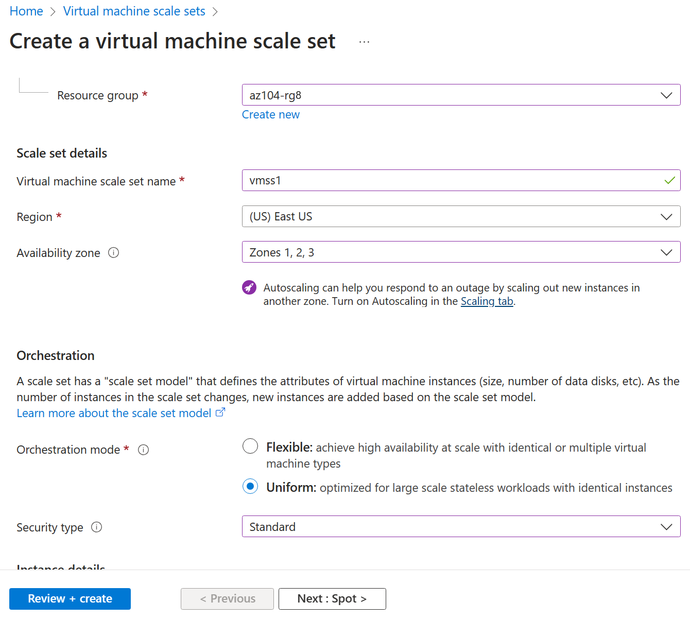

---
lab:
  title: 实验室 08：管理虚拟机
  module: Administer Virtual Machines
---

# 实验室 08 - 管理虚拟机

## 实验室简介

在本实验室中，你将创建虚拟机并将其与虚拟机规模集进行比较。 你将了解如何创建、配置单个虚拟机及重设其大小。 你将了解如何创建虚拟机规模集和配置自动缩放。

本实验室需要 Azure 订阅。 订阅类型可能会影响此实验室中功能的可用性。 可更改区域，但这些步骤是使用“美国东部”编写的****。

## 预计用时：50 分钟

## 实验室方案

你的组织想要探索部署和配置 Azure 虚拟机。 首先，使用手动缩放实现 Azure 虚拟机。 接下来，实现虚拟机规模集并探索自动缩放。

## 交互式实验室模拟

你可能会发现一些交互式实验室模拟对本主题很有用。 通过模拟，可按照自己的节奏点击浏览类似的场景。 交互式模拟与本实验室之间存在差异，但许多核心概念是相同的。 不需要 Azure 订阅。

+ [在门户中创建虚拟机](https://mslearn.cloudguides.com/en-us/guides/AZ-900%20Exam%20Guide%20-%20Azure%20Fundamentals%20Exercise%201)。 创建虚拟机，连接并安装 Web 服务器角色。

+ [使用模板部署虚拟机](https://mslearn.cloudguides.com/en-us/guides/AZ-900%20Exam%20Guide%20-%20Azure%20Fundamentals%20Exercise%209)。 了解快速入门库并找到虚拟机模板。 部署模板并验证部署。

+ [使用 PowerShell 创建虚拟机](https://mslearn.cloudguides.com/en-us/guides/AZ-900%20Exam%20Guide%20-%20Azure%20Fundamentals%20Exercise%2010)。 使用 Azure PowerShell 部署虚拟机。 查看 Azure 顾问建议。

+ [使用 CLI 创建虚拟机](https://mslearn.cloudguides.com/en-us/guides/AZ-900%20Exam%20Guide%20-%20Azure%20Fundamentals%20Exercise%2011)。 使用 CLI 部署虚拟机。 查看 Azure 顾问建议。

## 工作技能

+ 任务 1：使用 Azure 门户部署可复原区域的 Azure 虚拟机。
+ 任务 2：管理虚拟机的计算和存储缩放。
+ 任务 3：创建和配置 Azure 虚拟机规模集。
+ 任务 4：缩放 Azure 虚拟机规模集。
+ 任务 5：使用 Azure PowerShell 创建虚拟机（可选 1）。
+ 任务 6：使用 CLI 创建虚拟机（可选 2）。

## Azure 虚拟机体系结构示意图


## 任务 1：使用 Azure 门户部署可复原区域的 Azure 虚拟机

在此任务中，你将使用 Azure 门户将两个 Azure 虚拟机部署到不同的可用性区域。 可用性区域为虚拟机提供最高级别的运行时间 SLA，达 99.99%。 若要实现此 SLA，必须在不同的可用性区域之间至少部署两个虚拟机。

1. 登录到 Azure 门户 - `https://portal.azure.com`。

1. 在“虚拟机”边栏选项卡中，搜索并选择 `Virtual machines`，单击“+ 创建”，然后在“Azure 虚拟机”下拉列表中进行选择************。 注意你的其他选择。

1. 在“基本信息”选项卡的“可用性区域”下拉菜单中，选中“区域 2”旁边的复选标记************。 将同时选中“区域 1”和“区域 2”********。

    >**注意**：这将在所选区域中部署两个虚拟机，每个区域中一个虚拟机。 可以达到 99.99% 的运行时间 SLA，因为至少有两个 VM 分布在至少两个区域。 在可能只需要一个 VM 的方案中，最佳做法是仍将 VM 部署到另一个区域。

1. 在“基本信息”选项卡上，继续完成配置：

    | 设置 | 值 |
    | --- | --- |
    | 订阅 | Azure 订阅的名称 |
    | 资源组 |  az104-rg8****（如有必要，请单击“新建”****） |
    | 虚拟机名称 | `az104-vm1` 和 `az104-vm2`（选择这两个可用性区域后，选择 VM 名称字段下的“编辑名称”。****） |
    | 区域 | **美国东部** |
    | 可用性选项 | **可用性区域** |
    | 可用性区域 | 区域 1、2****（阅读有关使用虚拟机规模集的说明） |
    | 安全类型 | **标准** |
    | 图像 | Windows Server 2019 Datacenter - x64 Gen2**** |
    | Azure Spot 实例 | **unchecked** |
    | 大小 | Standard D2s v3 |
    | 用户名 | `localadmin` |
    | 密码 | 提供安全密码 |
    | 公共入站端口 | **无** |
    | 是否要使用现有的 Windows Server 许可证? | **未选中** |

    

1. 单击“下一步: **** 磁盘 >”，指定以下设置（其他设置保留默认值）：

    | 设置 | Value |
    | --- | --- |
    | OS 磁盘类型 | **高级·SSD** |
    | 使用 VM 删除 | 选中****（默认值） |
    | 启用超级磁盘兼容性 | **未选中** |

1. 单击“下一步: **** 网络 >”，采用默认值，但不提供负载均衡器。

    | 设置 | “值” |
    | --- | --- |
    | 删除 VM 时删除公共 IP 和 NIC | **已选中** |
    | 负载均衡选项 | **无** |


1. 单击“下一步: **** 管理 >”，指定以下设置（其他设置保留默认值）：

    | 设置 | 值 |
    | --- | --- |
    | 补丁业务流程选项 | 已编排 Azure**** |  

1. 单击“下一步: **** 监视 >”，指定以下设置（其他设置保留默认值）：

    | 设置 | 值 |
    | --- | --- |
    | 启动诊断 | **禁用** |

1. 单击“下一步: **** 高级 >”，采用默认值，然后单击“查看 + 创建”****。

1. 验证后，单击“创建”****。

    >**注意：** 请注意，虚拟机部署 NIC、磁盘和公共 IP 地址（如果已配置）是独立创建和管理的资源。

1. 等待部署完成，然后选择“转到资源”****。

   >**注意：** 请监视“通知”消息****。

## 任务 2：管理虚拟机的计算和存储缩放

在此任务中，你将通过将虚拟机大小调整为不同的 SKU 来缩放虚拟机。 Azure 在 VM 大小选择方面提供了灵活性，因此，如果 VM 需要分配更多（或更少）计算和内存，则可以在一段时间内调整 VM。 此概念扩展到磁盘，你可以修改磁盘的性能，或增加分配的容量。

1. 在“az104-vm1”虚拟机的“可用性 + 缩放”边栏选项卡中，选择“大小”************。

1. 将虚拟机大小设置为 **D2ds_v4**，然后单击“**重设大小**”。 出现提示时，请确认更改。

    >**备注**：如果 **257>D2ds_v4** 不可用，请选择其他尺寸。 重设大小也称为垂直纵向扩展或纵向缩减。

    

1. 在“设置”区域中选择“磁盘”********。

1. 在“数据磁盘”下，选择“+ 创建并附加新磁盘”。******** 配置设置（其他设置保留默认值）。

    | 设置 | 值 |
    | --- | --- |
    | 磁盘名称 | `vm1-disk1` |
    | 存储类型 | **标准 HDD** |
    | 大小 (GiB) | `32` |

1. 单击“应用”。

1. 创建磁盘后，单击“拆离”（如有必要，请滚动到右侧查看拆离图标），然后单击“应用”********。

    >**注意**：执行拆离操作会从 VM 中删除磁盘，但会将该磁盘保留在存储中供以后使用。

1. 搜索并选择 `Disks`。 从磁盘列表中选择“vm1-disk1”对象****。

    >**注意：**“概述”边栏选项卡还提供磁盘的性能和使用情况信息****。

1. 在“设置”**** 边栏选项卡中，选择“大小 + 性能”****。

1. 将存储类型设置为“标准 SSD”，然后单击“保存”********。

1. 导航回“az104-vm1”虚拟机并选择“磁盘”********。

1. 在“数据磁盘”部分，选择“附加现有磁盘”。********

1. 在”磁盘名称”下拉列表中，选择”VM1-DISK1”。******** 

1. 验证磁盘现在是“标准 SSD”****。

1. 选择“**应用**”以保存所做的更改。 

    >**注意：** 你现在已经创建了虚拟机、缩放了 SKU 和数据磁盘大小。 在下一个任务中，将使用虚拟机规模集自动执行缩放过程。

## Azure 虚拟机规模集体系结构示意图


## 任务 3：创建和配置 Azure 虚拟机规模集

在此任务中，你将跨可用性区域部署 Azure 虚拟机规模集。 VM 规模集通过配置允许规模集水平缩放、横向缩减或横向扩展的指标或条件，减少自动化的管理开销。

1. 在 Azure 门户中，搜索并选择 `Virtual machine scale sets`，在“虚拟机规模集”边栏选项卡上，单击“+ 创建”********。

1. 在“创建虚拟机规模集”边栏选项卡的“基本信息”选项卡上，指定以下设置（其他设置保留默认值），然后单击“下一步: ************ 现成虚拟机 >”：

    | 设置 | 值 |
    | --- | --- |
    | 订阅 | Azure 订阅的名称  |
    | 资源组 | az104-rg8****  |
    | 虚拟机规模集名称 | `vmss1` |
    | 区域 | （美国）美国东部 |
    | 可用性区域 | 区域 1、2、3 |
    | 业务流程模式 | **Uniform** |
    | 安全类型 | **标准** |
    | 缩放选项 | **查看并采用默认值**。 我们将在下一个任务中对此进行更改。 |
    | 映像 | Windows Server 2019 Datacenter - x64 Gen2**** |
    | 使用 Azure Spot 折扣运行 | **未选中** |
    | 大小 | 标准 D2s_v3 |
    | 用户名 | `localadmin` |
    | 密码 | 提供安全密码  |
    | 已有 Windows Server 许可证? | **未选中** |

    >**注意**：有关支持将 Windows 虚拟机部署到可用性区域的 Azure 区域列表，请参阅 [Azure 中的可用性区域是什么？](https://docs.microsoft.com/en-us/azure/availability-zones/az-overview)

    

1. 在“现成虚拟机”**** 选项卡上，接受默认值并选择“下一步:**** 磁盘 >”。

1. 在“磁盘”**** 选项卡上，接受默认值并单击“下一步: **** 网络 >”。

1. 在“**网络**”页上，选择“**编辑虚拟网络**”链接。 进行一些更改。 完成后，选择“确定”。

    | 设置 | 值 |
    | --- | --- |
    | 名称 | `vmss-vnet` |
    | 地址范围 | `10.82.0.0/20`（删除现有地址范围） |
    | 子网名称 | `subnet0` |
    | 子网范围 | `10.82.0.0/24` |

1. 在“网络”选项卡中，单击网络接口条目右侧的“编辑网络接口”图标********。

1. 在“NIC 网络安全组”部分，选择“高级”，然后单击“配置网络安全组”下拉列表下的“新建”****************。

1. 在“创建网络安全组”边栏选项卡上，指定以下设置（其他设置保留默认值）：

    | 设置 | 值 |
    | --- | --- |
    | 名称 | vmss1-nsg**** |

1. 单击“添加入站规则”，使用以下设置添加入站安全规则（其他设置保留默认值）：

    | 设置 | 值 |
    | --- | --- |
    | 源 | **任意** |
    | 源端口范围 | * |
    | 目标 | **任意** |
    | 服务 | **HTTP** |
    | 操作 | **允许** |
    | 优先级 | 1010 |
    | 名称 | `allow-http` |

1. 单击“添加”，回到“创建网络安全组”边栏选项卡，单击“确定”  。

1. 在“编辑网络接口”边栏选项卡中，单击“公共 IP 地址”部分的“已启用”，然后单击“确认”****************。

1. 在“网络”选项卡的“负载均衡”部分下，指定以下设置（将其他设置保留为默认值）********。

    | 设置 | 值 |
    | --- | --- |
    | 负载均衡选项 | Azure 负载均衡器 |
    | 选择负载均衡器 | **创建负载均衡器** |

1. 在“创建负载均衡器”页上指定负载均衡器名称并采用默认值。 完成后单击“创建”，然后单击“下一步:******** 管理 >”。

    | 设置 | 值 |
    | --- | --- |
    | 负载均衡器名称 | `vmss-lb` |

    >**注意：** 暂停一分钟，查看已完成的操作。 目前，你已配置虚拟机规模集的磁盘和网络。 在网络配置中，你已创建网络安全组和允许的 HTTP。 你还根据公共 IP 地址创建了负载均衡器。

1. 在“管理”选项卡上，指定以下设置（其他设置保留默认值）****：

    | 设置 | 值 |
    | --- | --- |
    | 启动诊断 | **禁用** |

1. 单击“下一步: **** 运行状况 >”。

1. 在“运行状况”**** 选项卡中，查看默认设置（不做任何修改），然后单击“下一步: **** 高级 &gt;”。

1. 在“高级”选项卡上，单击“查看 + 创建”********。

1. 在“查看 + 创建”选项卡上，确保通过验证并单击“创建”********。

    >**注意**：请等待虚拟机规模集部署完成。 此过程大约需要 5 分钟。 在等待的同时请阅读[文档](https://learn.microsoft.com/azure/virtual-machine-scale-sets/overview)。

## 任务 4：缩放 Azure 虚拟机规模集

在此任务中，你将使用自定义缩放规则缩放虚拟机规模集。

1. 选择“转到资源”或搜索并选择“vmss1”规模集********。

1. 从左侧菜单中选择“**可用性 + 缩放**”，然后选择“**缩放**”。

    >你知道吗？**** 你可以“手动缩放”或“自定义自动缩放”********。 在具有少量 VM 实例的规模集中，增加或减少实例计数（手动缩放）可能是最佳选择。 在具有大量 VM 实例的规模集中，根据指标进行缩放（自定义自动缩放）可能更合适。

**横向扩展规则**

1. 选择“自定义自动缩放”。 然后将“缩放模式”更改为“根据指标进行缩放”********。 然后选择“添加规则”****。

1. 让我们创建一条自动增加 VM 实例数的规则。 当平均 CPU 负载在 10 分钟内大于 70% 时，此规则会横向扩展。 触发规则时，VM 实例数将增加 50%。

    | 设置 | 值 |
    | --- | --- |
    | 指标源 | 当前资源池 (vmss1)**** |
    | 指标命名空间 | **虚拟主机** |
    | 指标名称 | CPU 百分比（查看其他选择）**** |
    | 运算符 | 大于 |
    | 触发缩放操作的指标阈值 | **70** |
    | 持续时间(分钟) | **10** |
    | 时间粒度统计信息 | **平均值** |
    | 操作 | 增加百分比（查看其他选择）**** |
    | 冷却(分钟) | **5** |
    | 百分比 | **50** |

    

1. 务必保存你的更改。

**横向缩减规则**

1. 在夜晚或周末，需求可能会减少，因此必须制定一条横向缩减规则。

1. 让我们创建一条规则来减少规模集中的 VM 实例数。 当平均 CPU 负载在 10 分钟内下降到 30% 以下时，实例数应减少。 触发规则后，VM 实例数减少 20%。

1. 选择“添加规则”，调整设置，然后选择“添加”********。

    | 设置 | “值” |
    | --- | --- |
    | 运算符 | **小于** |
    | 阈值 | **30** |
    | 操作 | 减少百分比（查看其他选择）**** |
    | 百分比 | **50** |

1. 务必保存你的更改。

**设置实例限制**

1. 应用自动缩放规则时，实例限制可确保实例数不会横向扩展到超过最大值，也不会横向缩减到少于实例数最小值。

1. 实例限制显示在“扩展”页上的规则后面********。

    | 设置 | “值” |
    | --- | --- |
    | 最小值 | **2** |
    | 最大 | **10** |
    | 默认 | **2** |

1. 请务必“保存”更改****

1. 在“vmss1”页上，选择“实例”********。 这是监视虚拟机实例数的位置。

    >**注意：** 如果有兴趣使用 Azure PowerShell 创建虚拟机，请尝试任务 5。 如果有兴趣使用 CLI 创建虚拟机，请尝试任务 6。

## 任务 5：使用 Azure PowerShell 创建虚拟机（选项 1）

1. 使用右上角的图标启动 Cloud Shell 会话****。 或者，直接导航到 `https://shell.azure.com`。

1. 请务必选择“PowerShell”****。 如有必要，请配置 shell 存储。

1. 运行以下命令来创建虚拟机。 出现提示时，请提供 VM 的用户名和密码。 在等待期间，请阅读 [New-AzVM](https://learn.microsoft.com/powershell/module/az.compute/new-azvm?view=azps-11.1.0) 命令参考，了解与创建虚拟机相关的所有参数。

    ```powershell
    New-AzVm `
    -ResourceGroupName 'az104-rg8' `
    -Name 'myPSVM' `
    -Location 'East US' `
    -Image 'Win2019Datacenter' `
    -Zone '1' `
    -Size 'Standard_D2s_v3' `
    -Credential (Get-Credential)
    ```

1. 命令完成后，使用“Get-AzVM”列出资源组中的虚拟机****。

    ```powershell
    Get-AzVM `
    -ResourceGroupName 'az104-rg8' `
    -Status
    ```

1. 验证新虚拟机是否已列出，并且“状态”是否为“正在运行”********。

1. 使用“Stop-AzVM”解除分配虚拟机****。 键入“是”以确认****。

    ```powershell
    Stop-AzVM `
    -ResourceGroupName 'az104-rg8' `
    -Name 'myPSVM' 
    ```

1. 将“Get-AzVM”与“-Status”参数配合使用，以验证虚拟机是否“已解除分配”************。

    >你知道吗？**** 使用 Azure 停止虚拟机时，状态将为“已解除分配”**。 这意味着发布任何非静态公共 IP，并停止为 VM 的计算成本付费。

## 任务 6：使用 CLI 创建虚拟机（选项 2）

1. 使用右上角的图标启动 Cloud Shell 会话****。 或者，直接导航到 `https://shell.azure.com`。

1. 请务必选择“Bash”****。 如有必要，请配置 shell 存储。

1. 运行以下命令来创建虚拟机。 出现提示时，请提供 VM 的用户名和密码。 在等待期间，请阅读 [az vm create](https://learn.microsoft.com/cli/azure/vm?view=azure-cli-latest#az-vm-create) 命令参考，了解与创建虚拟机相关的所有参数。

    ```sh
    az vm create --name myCLIVM --resource-group az104-rg8 --image Ubuntu2204 --admin-username localadmin --generate-ssh-keys
    ```

1. 命令完成后，使用“az vm show”验证是否已创建虚拟机****。

    ```sh
    az vm show --name  myCLIVM --resource-group az104-rg8 --show-details
    ```

1. 验证“powerState”是否为“VM 正在运行”********。

1. 使用“az vm deallocate”解除分配虚拟机****。 键入“是”以确认****。

    ```sh
    az vm deallocate --resource-group az104-rg8 --name myCLIVM
    ```

1. 使用“az vm show”确保“powerState”为“VM 已解除分配”************。

    >你知道吗？**** 使用 Azure 停止虚拟机时，状态将为“已解除分配”**。 这意味着发布任何非静态公共 IP，并停止为 VM 的计算成本付费。

## 清理资源

如果使用自己的订阅，需要一点时间删除实验室资源****。 这将确保资源得到释放，并将成本降至最低。 删除实验室资源的最简单方法是删除实验室资源组。 

+ 在 Azure 门户中，选择资源组，选择“删除资源组”，输入资源组名称，然后单击“删除”************。
+ `Remove-AzResourceGroup -Name resourceGroupName`（使用 Azure PowerShell）。
+ `az group delete --name resourceGroupName`（使用 CLI）。

## 使用 Copilot 扩展学习
Copilot 可帮助你了解如何使用 Azure 脚本工具。 Copilot 还可以帮助了解实验室中未涵盖的领域或需要更多信息的领域。 打开 Edge 浏览器并选择“Copilot”（右上角）或导航到*copilot.microsoft.com*。 花几分钟时间尝试这些提示。

+ 提供创建 Linux 虚拟机的步骤和 Azure CLI 命令。 
+ 查看缩放虚拟机并提高性能的方式。
+ 介绍 Azure 存储生命周期管理策略以及如何优化成本。

## 通过自定进度的培训了解详细信息

+ [在 Azure 中创建 Windows 虚拟机](https://learn.microsoft.com/training/modules/create-windows-virtual-machine-in-azure/)。 使用 Azure 门户创建 Windows 虚拟机。 使用远程桌面连接到正在运行的 Windows 虚拟机
+ [使用虚拟机规模集生成可缩放的应用程序](https://learn.microsoft.com/training/modules/build-app-with-scale-sets/)。 使应用程序能自动适应负载变更，同时通过虚拟机规模集最大程度降低成本。
+ [使用 Azure Bastion 通过 Azure 门户连接到虚拟机](https://learn.microsoft.com/en-us/training/modules/connect-vm-with-azure-bastion/)。 部署 Azure Bastion 以直接在 Azure 门户中安全地连接到 Azure 虚拟机，从而有效替换现有的 jumpbox 解决方案；使用诊断日志监视远程会话，以及通过断开用户会话来管理远程会话。

## 关键结论

恭喜你完成本实验室的内容。 下面是本实验室的主要内容。

+ Azure 虚拟机是按需、可缩放的计算资源。
+ Azure 虚拟机提供垂直和水平缩放选项。
+ 配置 Azure 虚拟机包括选择操作系统、大小、存储和网络设置。
+ 使用 Azure 虚拟机规模集可以创建并管理一组负载均衡的 VM。
+ 虚拟机规模集中的虚拟机是根据同一映像和配置创建的。
+ 在虚拟机规模集中，可以根据需求或定义的计划自动增减 VM 实例的数目。
