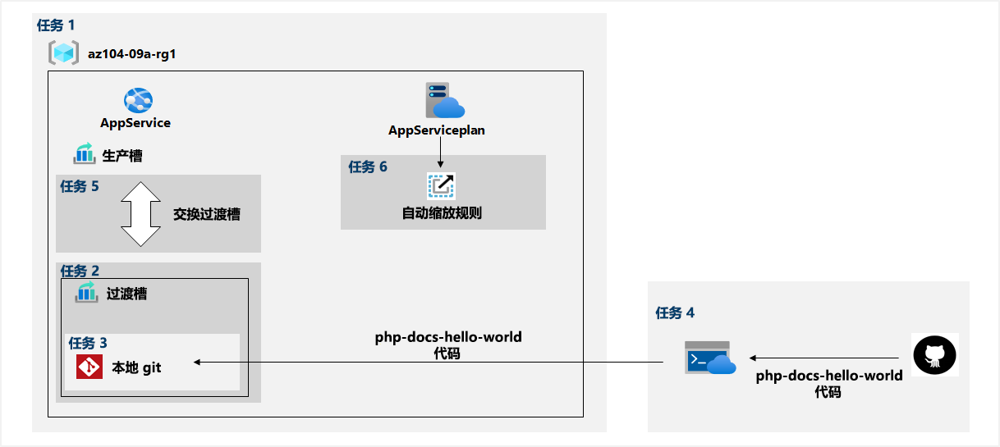

---
lab:
  title: 实验室 09a：实现 Web 应用
  module: Administer PaaS Compute Options
---

# 实验室 09a - 实现 Web 应用
# 学生实验室手册

## 实验室方案

你需要评估可否使用 Azure Web 应用来托管 Contoso 的网站，这些网站当前托管在公司的本地数据中心。 网站通过 PHP 运行时堆栈在 Windows 服务器上运行。 你还需要确定如何利用 Azure Web 应用部署槽位来实施 DevOps 实践。

                **注意：** 我们提供 **[交互式实验室模拟](https://mslabs.cloudguides.com/guides/AZ-104%20Exam%20Guide%20-%20Microsoft%20Azure%20Administrator%20Exercise%2013)** ，让你能以自己的节奏点击浏览实验室。 你可能会发现交互式模拟与托管实验室之间存在细微差异，但演示的核心概念和思想是相同的。 

## 目标

在此实验中，将执行以下操作：

+ 任务 1：创建 Azure Web 应用
+ 任务 2：创建过渡部署槽位
+ 任务 3：配置 Web 应用部署设置
+ 任务 4：将代码部署到暂存部署槽位
+ 任务 5：交换暂存槽位
+ 任务 6：配置并测试 Azure Web 应用的自动缩放

## 预计用时：30 分钟

## 体系结构关系图



### 说明

## 练习 1

## 任务 1：创建 Azure Web 应用

在此任务中，你将创建 Azure Web 应用。

1. 登录到 [**Azure 门户**](http://portal.azure.com)。

1. 在 Azure 门户中，搜索并选择“应用程序服务”，然后在“应用程序服务”边栏选项卡上，单击“+ 创建”  。

1. 在“创建 Web 应用”边栏选项卡的“基本信息”选项卡中，指定以下设置（其他设置保留默认值） ：

    | 设置 | 值 |
    | --- | ---|
    | 订阅 | 你在此实验室中使用的 Azure 订阅的名称 |
    | 资源组 | 新资源组名称 az104-09a-rg1 |
    | Web 应用名称 | 任何全局唯一名称 |
    | 发布 | **代码** |
    | 运行时堆栈 | **PHP 8.0** |
    | 操作系统 | **Linux** |
    | 区域 | 可以在其中预配 Azure Web 应用的 Azure 区域的名称 |
    | 应用服务计划 | 接受默认配置 |

1. 单击“查看 + 创建”。 在“创建 Web 应用”边栏选项卡的“查看 + 创建”选项卡上，确保验证通过，然后单击“创建”  。

    >**注意**：请等到 Web 应用创建完成，再继续执行下一个任务。 此操作大约需要 1 分钟。

1. 在“部署”边栏选项卡上，单击“前往资源”。

## 任务 2：创建过渡部署槽位

在此任务中，你将创建暂存部署槽位。

1. 在新部署 Web 应用的边栏选项卡上单击“URL”链接，在新的浏览器选项卡中显示默认网页。

1. 关闭新的浏览器选项卡，然后返回 Azure 门户，在“Web 应用”边栏选项卡的“部署”部分，单击“部署槽位”。

    >**注意**：此时，Web 应用具有标记为“生产”的单个部署槽位。

1. 单击“+ 添加槽位”，并添加具有以下设置的新槽位：

    | 设置 | 值 |
    | --- | ---|
    | 名称 | **staging** |
    | 克隆设置来源 | 请勿克隆设置|

1. 返回 Web 应用的“部署槽位”边栏选项卡，单击表示新创建的暂存槽位的条目。

    >**注意**：这将打开显示过渡槽属性的边栏选项卡。

1. 查看过渡槽边栏选项卡，注意其 URL 与分配给生产槽的 URL 不同。

## 任务 3：配置 Web 应用部署设置

在此任务中，你将配置 Web 应用部署设置。

1. 在暂存部署槽位边栏选项卡的“部署”部分，单击“部署中心”，然后选择“设置”选项卡  。

    >**注意：** 确保处于暂存槽位（而不是生产槽位）边栏选项卡上。
    
1. 在“设置”选项卡的“源”下拉列表中，选择“本地 Git”，然后单击“保存”按钮   

1. 在“部署中心”边栏选项卡上，将“Git 克隆 Url”条目复制到记事本 。

    >**注意：** 本实验室的下一个任务将需要“Git 克隆 URL”值。

1. 在“部署中心”边栏选项卡上，选择“本地 Git/FTPS 凭据”选项卡，在“用户范围”部分，指定以下设置，然后单击“保存”   。

    | 设置 | 值 |
    | --- | ---|
    | 用户名 | 任何全局唯一名称（不得包含 `@` 字符） |
    | 密码 | 满足复杂性要求的任何密码|

    >**注意：** 你将在此实验室的下一个任务中用到这些凭据。

## 任务 4：将代码部署到暂存部署槽位

在此任务中，你会将代码部署到暂存部署槽位。

1. 在 Azure 门户中，单击 Azure 门户右上方的图标，打开 Azure Cloud Shell。

1. 如果系统提示选择“Bash”或“PowerShell”，请选择“PowerShell”  。

    >**注意**：如果这是你第一次启动 Cloud Shell，并看到消息“未装载任何存储”，请选择你将在本实验室中使用的订阅，然后选择“创建存储”  。

1. 在 Cloud Shell 窗格中运行以下命令，以克隆包含 Web 应用代码的远程存储库。

   ```powershell
   git clone https://github.com/Azure-Samples/php-docs-hello-world
   ```

1. 在 Cloud Shell 窗格中运行以下命令，以将当前位置设置为包含示例 Web 应用代码的本地存储库的新创建克隆。

   ```powershell
   Set-Location -Path $HOME/php-docs-hello-world/
   ```

1. 在 Cloud Shell 窗格中运行以下命令，以添加远程 git（确保将 `[deployment_user_name]` 和 `[git_clone_url]` 占位符分别替换为部署凭据用户名的值和 Git 克隆 URL，二者均由你在上一个任务中确定） ：

   ```powershell
   git remote add [deployment_user_name] [git_clone_url]
   ```

    >**注意**：`git remote add` 后面的值不必与部署凭据用户名相同，但必须是惟一的

1. 在 Cloud Shell 窗格中运行以下命令，将示例 Web 应用代码从本地存储库推送到 Azure Web 应用暂存部署槽位（确保将 `[deployment_user_name]` 占位符替换为你在上一个任务中确定的部署凭据用户名的值）：

   ```powershell
   git push [deployment_user_name] master
   ```

1. 如果提示进行身份验证，请键入 `[deployment_user_name]` 和相应的密码（你在上一个任务中已设置）。

1. 关闭 Cloud Shell 窗格。

1. 在暂存槽位边栏选项卡上，单击“概述”，再单击 URL 链接，在新的浏览器选项卡中显示默认网页 。

1. 验证浏览器页是否显示“Hello World!” 消息并关闭新标签页。

## 任务 5：交换暂存槽位

在此任务中，你会将过渡槽与生产槽交换

1. 导航回到显示 Web 应用生产槽的边栏选项卡。

1. 在“部署”部分中，单击“部署槽位”，然后单击“交换”工具栏图标  。

1. 在“交换”边栏选项卡上，查看默认设置，然后单击“交换”。

1. 在 Web 应用的生产槽位边栏选项卡上单击“概述”，然后单击 URL 链接，在新的浏览器选项卡中显示网站主页 。

1. 验证默认网页是否已替换为“Hello World!” 页面。

## 任务 6：配置并测试 Azure Web 应用的自动缩放

在此任务中，你将配置和测试 Azure Web 应用的自动缩放。

1. 在显示 Web 应用生产槽位的边栏选项卡上，单击“设置”部分的“横向扩展(应用服务计划)” 。

1. 从“缩放”部分选择“基于规则”选项，然后单击“管理基于规则的缩放”链接  。

1. 单击“自定义自动缩放”。

    >**注意**：你还可以选择手动缩放 Web 应用。

1. 选择“根据指标进行缩放”并单击“+ 添加规则 ”

1. 在“缩放规则”边栏选项卡上，指定以下设置（其他设置则保留为默认值）：

    | 设置 | 值 |
    | --- |--- |
    | 指标源 | **当前资源** |
    | 指标命名空间 | 标准指标 |
    | 指标名称 | **CPU 百分比** |
    | 运算符 | 大于 |
    | 触发缩放操作的指标阈值 | **10** |
    | 持续时间(分钟) | **1** |
    | 时间粒度统计信息 | **最高** |
    | 时间聚合 | **最高** |
    | Operation | **计数增量** |
    | 实例计数 | **1** |
    | 冷却(分钟) | **5** |

    >注意：这些值并不代表实际配置，因为它们的目的是在不延长等待时间的情况下尽快触发自动缩放。

1. 单击“添加”，然后回到应用服务计划缩放边栏选项卡，指定以下设置（其他设置保留默认值）：

    | 设置 | 值 |
    | --- |--- |
    | 实例限制最小值 | **1** |
    | 实例限制最大值 | **2** |
    | 实例限制默认值 | **1** |

1. 单击“保存”  。

    >**注意**：如果遇到错误，指出未注册“microsoft.insights”资源提供程序，请在 cloudshell 中运行 `az provider register --namespace 'Microsoft.Insights'`，然后重试保存自动缩放规则。

1. 在 Azure 门户中，单击 Azure 门户右上方的图标，打开 Azure Cloud Shell。

1. 如果系统提示选择“Bash”或“PowerShell”，请选择“PowerShell”  。

1. 在 Cloud Shell 窗格中运行以下命令，以确定 Azure Web 应用的 URL。

   ```powershell
   $rgName = 'az104-09a-rg1'

   $webapp = Get-AzWebApp -ResourceGroupName $rgName
   ```

1. 在“Cloud Shell”窗格中运行以下命令，以启动将 HTTP 请求发送到 Web 应用的无限循环：

   ```powershell
   while ($true) { Invoke-WebRequest -Uri $webapp.DefaultHostName }
   ```

1. 最小化 Cloud Shell 窗格但勿关闭，并在 Web 应用边栏选项卡上的“设置”部分，单击“横向扩展(应用服务计划)”。

1. 选择“自动缩放设置”，选择“运行历史记录”选项卡，并检查“观察到的资源实例计数”  。

1. 监视几分钟的利用率和实例数。 

    >**注意**：可能需要刷新页面。

1. 一旦注意到实例数增加到 2，就重新打开 Cloud Shell 窗格并按 Ctrl+C 终止脚本。

1. 关闭 Cloud Shell 窗格。

## 清理资源

>**注意**：记得删除所有不再使用的新建 Azure 资源。 删除未使用的资源可确保不会出现意外费用。

>**注意**：如果不能立即删除实验室资源，也不要担心。 有时资源具有依赖项，需要较长的时间才能删除。 这是监视资源使用情况的常见管理员任务，因此，只需定期查看门户中的资源即可查看清理方式。 

1. 在 Azure 门户的“Cloud Shell”窗格中打开“PowerShell”会话。

1. 运行以下命令，列出在本模块各实验室中创建的所有资源组：

   ```powershell
   Get-AzResourceGroup -Name 'az104-09a*'
   ```

1. 通过运行以下命令，删除在此模块的实验室中创建的所有资源组：

   ```powershell
   Get-AzResourceGroup -Name 'az104-09a*' | Remove-AzResourceGroup -Force -AsJob
   ```

    >**注意**：该命令以异步方式执行（由 -AsJob 参数决定），因此，虽然你可以随后立即在同一个 PowerShell 会话中运行另一个 PowerShell 命令，但需要几分钟才能实际删除资源组。

## 审阅

在此实验室中，你执行了以下操作：

+ 创建 Azure Web 应用
+ 创建暂存部署槽位
+ 配置 Web 应用部署设置
+ 将代码部署到了暂存部署槽位
+ 交换过渡槽
+ 配置并测试 Azure Web 应用的自动缩放
