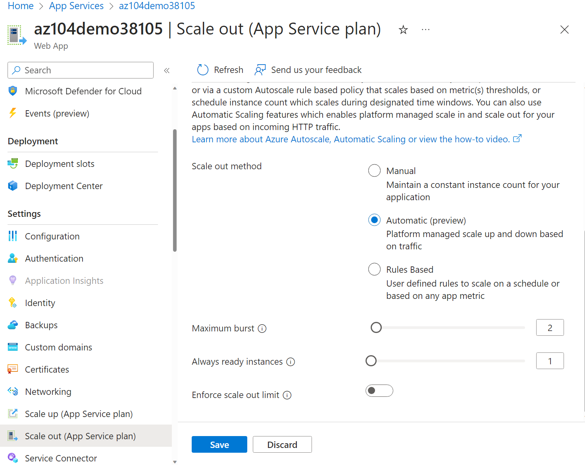

---
lab:
  title: 实验室 09a：实现 Web 应用
  module: Administer PaaS Compute Options
---

# 实验室 09a - 实现 Web 应用

## 实验室简介

在本实验室中，了解 Azure Web 应用。 了解如何配置 Web 应用以在外部 GitHub 存储库中显示 Hello World 应用程序。 了解如何创建过渡槽并与生产槽交换。 还将了解用于适应需求变化的自动缩放。

本实验室需要 Azure 订阅。 订阅类型可能会影响此实验室中功能的可用性。 可更改区域，但这些步骤是使用“美国东部”编写的。

## 预计用时：20 分钟

## 实验室方案

组织对托管公司网站的 Azure Web 应用感兴趣。 这些网站当前托管在一个本地数据中心。 这些网站使用 PHP 运行时堆栈在 Windows 服务器上运行。 硬件的生命周期已接近尾声，很快就需要更换。 组织希望通过使用 Azure 托管网站来避免新的硬件成本。 

## 交互式实验室模拟

你可能会发现一些交互式实验室模拟对本主题很有用。 通过模拟，可按照自己的节奏点击浏览类似的场景。 交互式模拟与本实验室之间存在差异，但许多核心概念是相同的。 不需要 Azure 订阅。

+ [创建 Web 应用](https://mslearn.cloudguides.com/en-us/guides/AZ-900%20Exam%20Guide%20-%20Azure%20Fundamentals%20Exercise%202)。 创建运行 Docker 容器的 Web 应用。
    
+ [实现 Azure Web 应用](https://mslabs.cloudguides.com/guides/AZ-104%20Exam%20Guide%20-%20Microsoft%20Azure%20Administrator%20Exercise%2013)。 创建 Azure Web 应用、管理部署并缩放应用。 

## 体系结构关系图

## 工作技能

+ 任务 1：创建并配置 Azure Web 应用。
+ 任务 2：创建并配置部署槽位。
+ 任务 3：配置 Web 应用部署设置。
+ 任务 4：交换部署槽。
+ 任务 5：配置并测试 Azure Web 应用的自动缩放。

## 任务 1：创建和配置 Azure Web 应用

在此任务中，创建 Azure Web 应用。 Azure 应用服务是适用于 Web、移动和其他基于 Web 的应用程序的平台即服务 (PAAS) 解决方案。 Azure Web 应用是托管大多数运行时环境（如 PHP、Java 和 .NET）的 Azure 应用服务的一部分。 选择的应用服务计划决定了 Web 应用计算、存储和功能。 

1. 登录 **Azure 门户** - `https://portal.azure.com`。

1. 搜索并选择 `App services`。

1. 选择“+ 创建”，从下拉菜单中选择“Web 应用”********。 注意其他选择。 

1. 在“创建 Web 应用”边栏选项卡的“基本信息”选项卡中，指定以下设置（其他设置保留默认值） ：

    | 设置 | 值 |
    | --- | ---|
    | 订阅 | 你的 Azure 订阅 |
    | 资源组 | `az104-rg9`（如有必要，选择“新建”****） |
    | Web 应用名称 | 任何全局唯一名称 |
    | 发布 | **代码** |
    | 运行时堆栈 | PHP 8.2**** |
    | 操作系统 | **Linux** |
    | 区域 | **美国东部** |
    | 定价计划 | **高级版 V3 P1V3** |
    | 区域冗余 | 接受默认值 |

 1. 单击“查看 + 创建”，然后单击“创建”********。

    >**注意**：等到 Web 应用创建完成，再继续执行下一个任务。 此操作大约需要 1 分钟。
    
    >**备注**：如果部署失败，请更改为另一个区域，然后重试。 这是由于不同区域中的配额所致。  

1. 部署完成后，选择“转到资源”****。

## 任务 2：创建并配置部署槽位

在此任务中，你将创建暂存部署槽位。 通过部署槽位，可在向公众（或最终用户）提供应用之前执行测试。 执行测试后，可将槽从开发或过渡交换到生产。 许多组织使用槽来执行预生产测试。 此外，许多组织为每个应用程序运行多个槽（例如开发、QA、测试和生产）。

1. 在新部署的 Web 应用的边栏选项卡上单击“默认域”链接，在新的浏览器选项卡中显示默认网页****。

1. 关闭新的浏览器选项卡，然后返回 Azure 门户，在“Web 应用”边栏选项卡的“部署”部分，单击“部署槽位”********。

1. 单击“添加槽位”，并添加具有以下设置的新槽位****：

    | 设置 | 值 |
    | --- | ---|
    | 名称 | `staging` |
    | 克隆设置来源 | 请勿克隆设置|

1. 选择“**添加**”以创建槽位。

1. 刷新页面以查看“生产”和“暂存”槽位。 

1. 选择表示新建的暂存槽的条目。

    >**注意**：这将打开显示过渡槽属性的边栏选项卡。

1. 查看过渡槽边栏选项卡，注意其 URL 与分配给生产槽的 URL 不同。

## 任务 3：配置 Web 应用部署设置

在此任务中，配置 Web 应用部署设置。 部署设置允许持续部署。 这确保应用服务具有最新版本的应用程序。

1. 在过渡槽中，选择“部署中心”，然后选择“设置”********。

    >**注意：** 确保处于过渡槽（而不是生产槽）边栏选项卡上。
    
1. 在“源”**** 下拉列表中，选择“外部 Git”****。 注意其他选择。 

1. 在存储库字段中，输入 `https://github.com/Azure-Samples/php-docs-hello-world`

1. 在分支字段中，输入 `master`。

1. 选择“保存”。

1. 在过渡槽中，选择“概述”****。

1. 选择“默认域”链接，然后在新选项卡中打开该 URL****。 

1. 验证过渡槽是否显示“Hello World”****。 

>**注意：** 部署可能需要几分钟时间。 务必刷新应用程序页****。

## 任务 4：交换部署槽位

在此任务中，将过渡槽与生产槽交换。 通过交换槽，可使用在过渡槽中测试的代码，并将其移动到生产。 如果需要移动为槽自定义的其他应用程序设置，Azure 门户也会提示你。 交换槽是应用程序团队和应用程序支持团队（尤其是那些部署常规应用更新和 bug 修复的团队）的常见任务。

1. 导航“部署槽位”边栏选项卡，然后选择“交换”********。

1. 查看默认设置，并单击“开始交换”****。 等待交换已完成的通知。

1. 返回到门户主页。 应该同时具有生产 Web 应用和暂存槽。

1. 搜索 `App Services`，然后选择应用服务 Web 应用。 将返回到生产部署槽。

1. 选择应用服务 Web 应用，然后在 Web 应用的“**概述**”边栏选项卡上，选择“**默认域**”链接以显示网站主页。

1. 验证生产网页现在是否显示 **Hello World！** 页面。

    >**注意：** 复制下一个任务中负载测试所需的默认域 URL****。 

## 任务 5：配置并测试 Azure Web 应用的自动缩放

在此任务中，配置 Azure Web 应用的自动缩放。 通过自动缩放，可在流向 Web 应用的流量增加时保持 Web 应用的最佳性能。 若要确定应用何时应缩放，可监视 CPU 使用率、内存或带宽等指标。

1. 在“设置”部分中，选择“横向扩展(应用服务计划)”。********

    >**注意：** 确保使用的是生产槽而非过渡槽。  

1. 在“缩放”部分中，选择“自动”********。 注意“基于规则”选项****。 可为不同的应用指标配置基于规则的缩放。 

1. 在“最大突发数”字段中，选择“2”********。

    

1. 选择“保存”。

1. 选择“诊断并解决问题”（左窗格）****。

1. 在“对应用进行负载测试”框中，选择“创建负载测试”********。

    + 选择“+ 创建”并为负载测试命名********。  名称必须唯一。
    + 选择“查看 + 创建”，然后选择“创建” 。

1. 等待负载测试创建，然后选择“转到资源”****。

1. 在“**概述**” | “**通过添加 HTTP 请求创建**”中，选择“**创建**”。

1. 在“**测试计划**”选项卡上，单击“**添加请求**”。 在“**URL 字段**”中，粘贴你的 **默认域** URL。 确保格式正确，并以 https:// 开头****。 选择“添加”，保存所做更改。 

1. 依次选择“审阅 + 创建”和“创建”。

    >**注意：** 创建测试可能需要几分钟。 监视通知。

1. 导航到测试（已在主页上列出）。 

1. 刷新并查看实时指标，包括**虚拟用户数**、**响应时间**和**每秒请求数**。

1. 选择“停止”以完成测试运行****。 不需等待测试完成。 

## 清理资源

如果使用自己的订阅，需要一点时间删除实验室资源****。 这将确保资源得到释放，并将成本降至最低。 删除实验室资源的最简单方法是删除实验室资源组。 

+ 在 Azure 门户中，选择资源组，选择“删除资源组”，输入资源组名称，然后单击“删除”************。
+ `Remove-AzResourceGroup -Name resourceGroupName`（使用 Azure PowerShell）。
+ `az group delete --name resourceGroupName`（使用 CLI）。

## 使用 Copilot 扩展学习
Copilot 可帮助你了解如何使用 Azure 脚本工具。 Copilot 还可以帮助了解实验室中未涵盖的领域或需要更多信息的领域。 打开 Edge 浏览器并选择“Copilot”（右上角）或导航到*copilot.microsoft.com*。 花几分钟时间尝试这些提示。

+ 总结创建和配置 Azure Web 应用的步骤。
+ 可以采用哪些方式缩放 Azure Web 应用？

## 通过自定进度的培训了解详细信息

+ [使用应用服务部署槽位过渡 Web 应用部署以便进行测试和回滚](https://learn.microsoft.com/training/modules/stage-deploy-app-service-deployment-slots/)。 使用部署槽位在 Azure 应用服务中简化部署和回滚 Web 应用。
+ [通过应用服务进行纵向扩展和横向扩展来缩放应用服务 Web 应用以有效满足需求](https://learn.microsoft.com/training/modules/app-service-scale-up-scale-out/)。通过增量增加可用资源来响应活动增加阶段，然后在活动减少时减少这些资源以降低成本。

## 关键结论

恭喜你完成本实验室的内容。 下面是本实验室的主要内容。 

+ 通过 Azure 应用服务，可快速生成、部署和缩放 Web 应用。
+ 应用服务包括对许多开发人员环境（包括 ASP.NET、Java、PHP 和 Python）的支持。
+ 通过部署槽位，可创建单独的环境以部署和测试 Web 应用。
+ 可手动或自动缩放 Web 应用以处理其他需求。
+ 提供了各种诊断和测试工具。 
