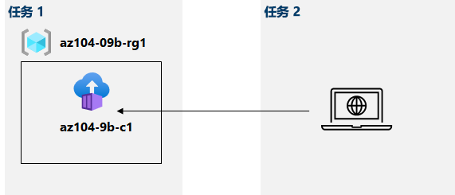

---
lab:
    title: '09b - 实现 Azure 容器实例'
    module: '模块 09 - 无服务器计算'
---

# 实验室 09b - 实现 Azure 容器实例
# 学生实验室手册

## 实验室场景

Contoso 希望为其虚拟化工作负荷找到一个新平台。你找到了大量可用于实现该目标的容器映像。由于你想要最大程度地减少容器管理，因此计划评估 Azure 容器实例在 Docker 映像部署中的使用。

## 目标

在本实验室中，你将：

- 任务 1： 使用 Azure 容器实例部署 Docker 容器映像
- 任务 2：查看 Azure 容器实例的功能

## 预计用时：20 分钟

## 体系结构图



## 说明

### 练习 1

#### 任务 1： 使用 Azure 容器实例部署 Docker 容器映像

在此任务中，你将为 Web 应用程序创建一个新的容器实例。

1. 登录到 [Azure 门户](https://portal.azure.com)。

1. 在 Azure 门户中，搜索查找“**容器实例**”，然后在“**容器实例**”边栏选项卡中，单击“**+ 创建**”。

1. 在 **“创建容器实例”** 边栏选项卡的 **“基本信息”** 选项卡中，请指定以下设置（其他设置保留默认值）：

    | 设置 | 值 |
    | ---- | ---- |
    | 订阅 | 在本实验室中使用的 Azure 订阅的名称 |
    | 资源组 | 新资源组的名称 **az104-09b-rg1** |
    | 容器名称 | **az104-9b-c1** |
    | 区域 | 可预配 Azure 容器实例的区域的名称 |
    | 映像源 | **快速入门映像** |
    | 映像 | **mcr.microsoft.com/azuredocs/aci-helloworld:latest (Linux)** |

1. 单击 **“下一步: 网络 >”**，同时在 **“创建容器实例”** 边栏选项卡的 **“网络”** 选项卡，指定以下设置（其他设置保留默认值）：

    | 设置 | 值 |
    | --- | --- |
    | DNS 名称标签 | 任何全局唯一的有效 DNS 主机名 |

    >**备注**： 可以在 dns-name-label.region.azurecontainer.io. 公开访问你的容器。如果你收到了 **“DNS 名称标签不可用”** 的错误消息，请指定其他值。

1. 单击 **“下一步: 高级 >”**，查看 **“创建容器实例”** 边栏选项卡中的 **“高级”** 选项卡上的设置，但不要做任何更改，单击 **“查看 + 创建”**，确保验证通过并单击 **“创建”**。

    >**备注**：等待部署完成。该操作需约 3 分钟。

    >**备注**：在等待期间，你可能有兴趣查看[示例应用程序背后的代码](https://github.com/Azure-Samples/aci-helloworld)。若要查看，请浏览 \\app 文件夹。

#### 任务 2：查看 Azure 容器实例的功能

在此任务中，你将查看容器实例的部署。

1. 在部署边栏选项卡中，单击 **“前往资源”** 链接。

1. 在容器实例 **“概述”** 边栏选项卡中，验证 **“状态”** 是否报告为 **“正在运行”**。

1. 复制容器实例的值 **“FQDN”**，打开一个新的浏览器标签页，然后导航到相应的 URL。

1. 验证 **“欢迎使用 Azure 容器实例”** 的页面是否显示。

1. 关闭新的浏览器标签页，返回到 Azure 门户，在“容器实例”边栏选项卡的 **“设置”** 部分，单击 **“容器”**，然后单击 **“日志”**。

1. 验证你是否看到代表通过在浏览器中显示应用程序生成的 HTTP GET 请求的日志条目。

#### 清理资源

   >**备注**：请记得删除任何新创建而不会再使用的 Azure 资源。删除未使用的资源，确保不产生意外费用。

1. 在 Azure 门户中，在 **Cloud Shell** 窗格中打开 **“PowerShell”** 会话。

1. 运行以下命令，列出在本模块各实验室中创建的所有资源组：

   ```powershell
   Get-AzResourceGroup -Name 'az104-09b*'
   ```

1. 运行以下命令，删除在本模块各个实验室中创建的所有资源组：

   ```powershell
   Get-AzResourceGroup -Name 'az104-09b*' | Remove-AzResourceGroup -Force -AsJob
   ```

    >**备注**：该命令以异步方式执行（由 -AsJob 参数决定），因此，虽然你随后可在同一 PowerShell 会话中立即运行另一个 PowerShell 命令，但实际上要花几分钟才能删除资源组。

#### 回顾

在本实验室中，你已：

- 使用 Azure 容器实例部署 Docker 映像
- 查看 Azure 容器实例的功能
