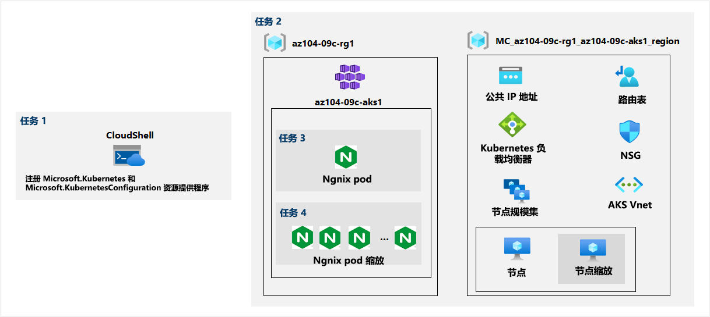

---
lab:
  title: 实验室 09c：实现 Azure Kubernetes 服务
  module: Administer PaaS Compute Options
---

# 实验室 09c - 实现 Azure Kubernetes 服务
# 学生实验室手册

## 实验室方案

Contoso 具有许多不适合使用 Azure 容器实例运行的多层应用程序。 为确定它们是否可作为容器化工作负载运行，你希望评估可否使用 Kubernetes 作为容器业务流程协调程序。 为了进一步减少管理开销，你希望测试 Azure Kubernetes 服务，包括该服务的简化部署体验和缩放功能。

**注意：** 我们提供 **[交互式实验室模拟](https://mslabs.cloudguides.com/guides/AZ-104%20Exam%20Guide%20-%20Microsoft%20Azure%20Administrator%20Exercise%2015)** ，让你能以自己的节奏点击浏览实验室。 你可能会发现交互式模拟与托管实验室之间存在细微差异，但演示的核心概念和思想是相同的。 

## 目标

在此实验中，将执行以下操作：

+ 任务 1：注册 Microsoft.Kubernetes 和 Microsoft.KubernetesConfiguration 资源提供程序。
+ 任务 2：部署 Azure Kubernetes 服务群集
+ 任务 3：将 Pod 部署到 Azure Kubernetes 服务群集
+ 任务 4：缩放 Azure Kubernetes 服务群集中的容器化工作负载

## 预计用时：40 分钟

## 体系结构关系图



### 说明

## 练习 1

## 任务 1：注册 Microsoft.Kubernetes 和 Microsoft.KubernetesConfiguration 资源提供程序。

在此任务中，将注册部署 Azure Kubernetes 服务群集所需的资源提供程序。

1. 登录到 [Azure 门户](https://portal.azure.com)。

1. 在 Azure 门户中，单击 Azure 门户右上方的图标，打开 Azure Cloud Shell。

1. 如果系统提示选择“Bash”或“PowerShell”，请选择“PowerShell”  。

    >**注意**：如果这是你第一次启动 Cloud Shell，并看到消息“未装载任何存储”，请选择你将在本实验室中使用的订阅，然后选择“创建存储”  。

1. 在 Cloud Shell 窗格中运行以下命令，注册 Microsoft.Kubernetes 和 Microsoft.KubernetesConfiguration 资源提供程序。

   ```powershell
   Register-AzResourceProvider -ProviderNamespace Microsoft.Kubernetes

   Register-AzResourceProvider -ProviderNamespace Microsoft.KubernetesConfiguration
   ```

1. 关闭 Cloud Shell 窗格。

## 任务 2：部署 Azure Kubernetes 服务群集

在此任务中，你将使用 Azure 门户部署 Azure Kubernetes 服务群集。

1. 在 Azure 门户中，搜索查找“Kubernetes 服务”，然后在“Kubernetes 服务”边栏选项卡上单击“+ 创建”，然后单击“+ 创建 Kubernetes 群集”   。

1. 在“创建 Kubernetes 群集”边栏选项卡的“基本设置”选项卡上，指定以下设置（其他设置保留默认值） ：

    | 设置 | 值 |
    | ---- | ---- |
    | 订阅 | 你在此实验室中使用的 Azure 订阅的名称 |
    | 资源组 | 新资源组名称 az104-09c-rg1 |
    | 群集预设配置 | 开发/测试 ($) |
    | Kubernetes 群集名称 | az104-9c-aks1 |
    | 区域 | 可在其中预配 Kubernetes 群集的区域名称 |
    | 可用性区域 | 无（取消选中所有框） |
    | Kubernetes 版本 | 接受默认值 |
    | API 服务器可用性 | 接受默认值 |
    | 节点大小 | 接受默认值 |
    | 缩放方法 | **手动** |
    | 节点计数 | **1** |

1. 单击“下一步:节点池 >”，然后在“创建 Kubernetes 群集”边栏选项卡的“节点池”选项卡上，指定以下设置（将其他设置保留为默认值）：

    | 设置 | 值 |
    | ---- | ---- |
    | 启用虚拟节点 | 禁用（默认值） |

1. 单击“下一步:访问 >”，然后在“创建 Kubernetes 群集”边栏选项卡的“访问”选项卡上，将设置保留为默认值：

    | 设置 | 值 |
    | ---- | ---- |
    | 资源标识 | **系统分配的托管标识** |
    | 身份验证方法 | **使用 Kubernetes RBAC 本地帐户** |

1. 单击“下一步:网络 >”，然后在“创建 Kubernetes 集群”边栏选项卡的“联网”选项卡上，指定以下设置（其他设置保留默认值） ：

    | 设置 | 值 |
    | ---- | ---- |
    | 网络配置 | **kubenet** |
    | DNS 名称前缀 | **任何有效且全局唯一的 DNS 前缀** |

1. 单击“下一步: 集成 >”，在“创建 Kubernetes 群集”边栏选项卡的“集成”选项卡上，指定以下设置（其他设置保留默认值）  ：

    | 设置 | 值 |
    | ---- | ---- |
    | 容器监视 | **Disable** |
    | 启用建议的警报规则 | **取消选中** |
    
1.  单击“查看 + 创建”，确保通过验证，然后单击“创建” 。

    >**注意**：在生产方案中，你需要启用监视。 在这种情况下，由于实验室未涵盖监视，因此禁用监视。

    >**注意**：等待部署完成。 这需要约 10 分钟。

## 任务 3：将 Pod 部署到 Azure Kubernetes 服务群集

在此任务中，将 Pod 部署到 Azure Kubernetes 服务群集中。

1. 在部署边栏选项卡中，单击“前往资源”链接。

1. 在 az104-9c-aks1 Kubernetes 服务边栏选项卡的“设置”部分，单击“节点池”。

1. 在“az104-9c-aks1” - “节点池”边栏选项卡中，请验证群集是否包含具有一个节点的单个池。

1. 在 Azure 门户中，单击 Azure 门户右上方的图标，打开 Azure Cloud Shell。

1. 将“Azure Cloud Shell”切换到“Bash”（黑色背景） 。

1. 在 Cloud Shell 窗格中，运行以下命令以检索用于访问 AKS 群集的凭据：

    ```sh
    RESOURCE_GROUP='az104-09c-rg1'

    AKS_CLUSTER='az104-9c-aks1'

    az aks get-credentials --resource-group $RESOURCE_GROUP --name $AKS_CLUSTER
    ```

1. 在 Cloud Shell 窗格中运行以下命令，以验证与 AKS 群集的连接：

    ```sh
    kubectl get nodes
    ```

1. 在 Cloud Shell 窗格中，查看输出并验证群集包含的一个节点此时是否正在报告“就绪”状态 。

1. 在 Cloud Shell 窗格中运行以下命令，以从 Docker Hub 部署 nginx 映像：

    ```sh
    kubectl create deployment nginx-deployment --image=nginx
    ```

    > **注意**：键入部署名称 (nginx-deployment) 时，请确保使用小写字母

1. 在 Cloud Shell 窗格中运行以下命令，以验证是否已创建 Kubernetes Pod：

    ```sh
    kubectl get pods
    ```

1. 在 Cloud Shell 窗格中运行以下命令，以确定部署状态：

    ```sh
    kubectl get deployment
    ```

1. 在 Cloud Shell 窗格中运行以下命令，以使 Pod 可从 Internet 访问：

    ```sh
    kubectl expose deployment nginx-deployment --port=80 --type=LoadBalancer
    ```

1. 在 Cloud Shell 窗格中运行以下命令，以确定是否已预配公共 IP 地址：

    ```sh
    kubectl get service
    ```

1. 重新运行该命令，直到“nginx-deployment”条目的“EXTERNAL-IP”列中的值从“\<pending\>”更改为公共 IP 地址  。 记录 nginx-deployment 条目的 EXTERNAL-IP 列中的公共 IP 地址。

1. 打开浏览器窗口，然后导航到你在上一步中获取的 IP 地址。 验证浏览器页面是否显示“欢迎使用 nginx!” 消息作为响应。

## 任务 4：缩放 Azure Kubernetes 服务群集中的容器化工作负载

在此任务中，你将水平缩放 Pod 的数量和群集节点的数量。

1. 在 Cloud Shell 窗格中运行以下命令，以通过将 Pod 数增加到 2 来扩展部署：

    ```sh
    kubectl scale --replicas=2 deployment/nginx-deployment
    ```

1. 在 Cloud Shell 窗格中运行以下命令，以验证部署的扩展结果：

    ```sh
    kubectl get pods
    ```

    > **注意**：请查看命令的输出并验证 Pod 的数量是否增加到 2。

1. 在“Clud Shell”窗格中，运行以下命令以通过将节点数增加到 2 来横向扩展群集：

    ```sh
    RESOURCE_GROUP='az104-09c-rg1'

    AKS_CLUSTER='az104-9c-aks1'

    az aks scale --resource-group $RESOURCE_GROUP --name $AKS_CLUSTER --node-count 2
    ```

    > **注意**：请等待附加节点预配完成。 这可能需要大约 3 分钟的时间。 如果失败，请重新运行 `az aks scale` 命令。

1. 在 Cloud Shell 窗格中运行以下命令，以验证群集的缩放结果：

    ```sh
    kubectl get nodes
    ```

    > **注意**：请查看命令的输出并验证节点数量是否增加到 2。

1. 在 Cloud Shell 窗格中运行以下命令，以扩展部署：

    ```sh
    kubectl scale --replicas=10 deployment/nginx-deployment
    ```

1. 在 Cloud Shell 窗格中运行以下命令，以验证部署的扩展结果：

    ```sh
    kubectl get pods
    ```

    > **注意**：请查看命令的输出并验证 pod 的数量是否增加到 10。

1. 在“Cloud Shell”窗格中，运行以下命令以查看群集节点之间的 Pod 分布：

    ```sh
    kubectl get pod -o=custom-columns=NODE:.spec.nodeName,POD:.metadata.name
    ```

    > **注意**：请查看命令的输出并验证 Pod 是否分布在两个节点上。

1. 在 Cloud Shell 窗格中运行以下命令，以删除部署：

    ```sh
    kubectl delete deployment nginx-deployment
    ```

1. 关闭 Cloud Shell 窗格。

## 清理资源

>**注意**：记得删除所有不再使用的新建 Azure 资源。 删除未使用的资源可确保不会出现意外费用。

>**注意**：如果不能立即删除实验室资源，也不要担心。 有时资源具有依赖项，需要较长的时间才能删除。 这是监视资源使用情况的常见管理员任务，因此，只需定期查看门户中的资源即可查看清理方式。 

1. 在 Azure 门户中，在 Cloud Shell 窗格中打开 Bash Shell 会话 。

1. 运行以下命令，列出在本模块各实验室中创建的所有资源组：

   ```sh
   az group list --query "[?starts_with(name,'az104-09c')].name" --output tsv
   ```

1. 通过运行以下命令，删除在此模块的实验室中创建的所有资源组：

   ```sh
   az group list --query "[?starts_with(name,'az104-09c')].[name]" --output tsv | xargs -L1 bash -c 'az group delete --name $0 --no-wait --yes'
   ```

    >**注意**：该命令以异步方式执行（由 --nowait 参数确定），因此，尽管可立即在同一 Bash 会话中运行另一个 Azure CLI 命令，但实际上要花几分钟才能删除资源组。

## 审阅

在此实验室中，你执行了以下操作：

+ 部署 Azure Kubernetes 服务群集
+ 将 Pod 部署到 Azure Kubernetes 服务群集
+ 缩放 Azure Kubernetes 服务群集中的容器化工作负载
