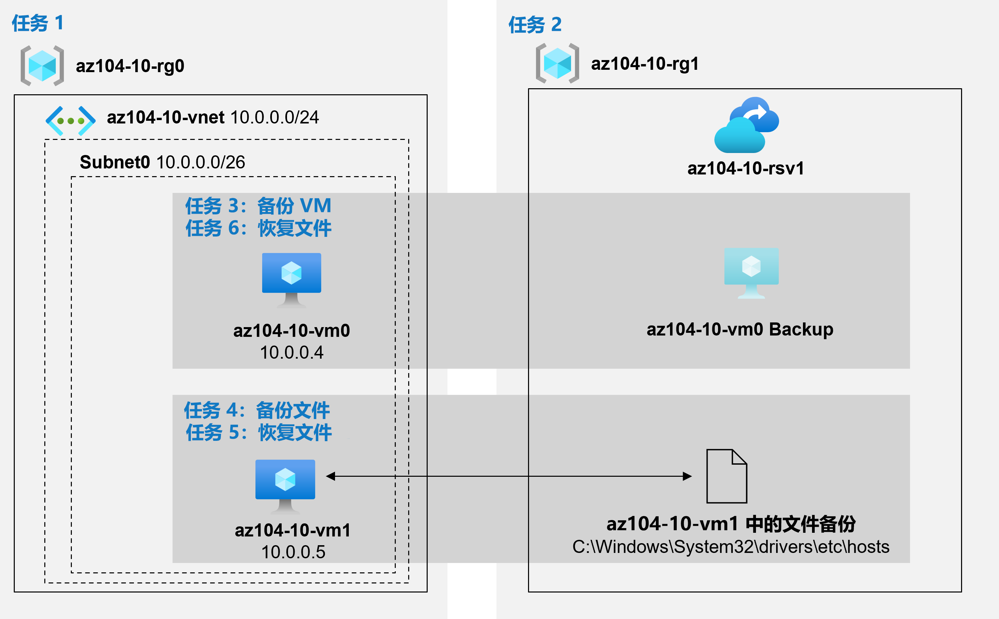

---
lab:
  title: 10 - 实现数据保护
  module: Administer Data Protection
---

# 实验室 10 - 备份虚拟机
# 学生实验室手册

## 实验室方案

你的任务是对使用 Azure 恢复服务来备份和还原 Azure 虚拟机和本地计算机上托管的文件这一过程进行评估。 此外，你还想确定保护恢复服务保管库中所存储数据的方法，以防意外或恶意行为造成的数据丢失。

                **注意：** 我们提供 **[交互式实验室模拟](https://mslabs.cloudguides.com/guides/AZ-104%20Exam%20Guide%20-%20Microsoft%20Azure%20Administrator%20Exercise%2016)** ，让你能以自己的节奏点击浏览实验室。 你可能会发现交互式模拟与托管实验室之间存在细微差异，但演示的核心概念和思想是相同的。 

## 目标

在此实验中，将执行以下操作：

+ 任务 1：预配实验室环境
+ 任务 2：创建恢复服务保管库
+ 任务 3：实现 Azure 虚拟机级备份
+ 任务 4：实现文件和文件夹备份
+ 任务 5：通过使用 Azure 恢复服务代理执行文件恢复
+ 任务 6：通过使用 Azure 虚拟机快照执行文件恢复（可选）
+ 任务 7：查看 Azure 恢复服务软删除功能（可选）

## 预计用时：50 分钟

## 体系结构关系图



### 说明

## 练习 1

## 任务 1：预配实验室环境

在此任务中，你将部署两台虚拟机用于测试不同的备份方案。

1. 登录 [Azure 门户](https://portal.azure.com)。

1. 在 Azure 门户中，单击 Azure 门户右上方的图标，打开 Azure Cloud Shell。

1. 如果系统提示选择“Bash”或“PowerShell”，请选择“PowerShell”  。

    >**注意**：如果这是你第一次启动 Cloud Shell，并看到消息“未装载任何存储”，请选择你将在本实验室中使用的订阅，然后选择“创建存储”  。

1. 在 Cloud Shell 窗格的工具栏中，单击“上传/下载文件”图标，在下拉菜单中，单击“上传”，然后将文件 \\Allfiles\\Labs\\10\\az104-10-vms-edge-template.json 和 \\Allfiles\\Labs\\10\\az104-10-vms-edge-parameters.json 上传到 Cloud Shell 主目录中   。

1. 在 Cloud Shell 窗格中，运行以下命令以创建托管虚拟机的资源组（将 `[Azure_region]` 占位符替换为你打算在其中部署 Azure 虚拟机的 Azure 区域的名称）。 分别键入每个命令行，并分别执行它们：

   ```powershell
   $location = '[Azure_region]'
    ```
    
   ```powershell
   $rgName = 'az104-10-rg0'
    ```
    
   ```powershell
   New-AzResourceGroup -Name $rgName -Location $location
   ```

1. 在“Cloud Shell”窗格中运行以下命令，以创建第一个虚拟网络，并使用上传的模板和参数文件将虚拟机部署到其中：
    >注意：系统会提示你提供管理员密码。
    
   ```powershell
   New-AzResourceGroupDeployment `
      -ResourceGroupName $rgName `
      -TemplateFile $HOME/az104-10-vms-edge-template.json `
      -TemplateParameterFile $HOME/az104-10-vms-edge-parameters.json `
      -AsJob
   ```

1. 最小化 Cloud Shell（但不要将其关闭）。

    >注意：请不要等待部署完成，而是继续执行下一个任务。 部署大约需要 5 分钟的时间完成。

## 任务 2：创建恢复服务保管库

在此任务中，你将创建恢复服务保管库。

1. 在 Azure 门户中，搜索并选择“恢复服务保管库”，然后在“恢复服务保管库”边栏选项卡上，单击“+ 创建”  。

1. 在“创建恢复服务保管库”边栏选项卡上，指定以下设置：

    | 设置 | 值 |
    | --- | --- |
    | 订阅 | 你在此实验室中使用的 Azure 订阅的名称 |
    | 资源组 | 新资源组名称 az104-10-rg1 |
    | 保管库名称 | az104-10-rsv1 |
    | Region | 在上一个任务中部署两台虚拟机的区域的名称 |

    >注意：请确保指定在上一个任务中向其中部署了虚拟机的同一区域。

1. 单击“查看 + 创建”，确保通过验证并单击“创建” 。

    >**注意**：等待部署完成。 部署应可在 1 分钟内完成。

1. 部署完成后，单击“前往资源”。

1. 在 az104-10-rsv1 恢复服务保管库边栏选项上的“设置”部分，单击“属性”。

1. 在“az104-10-rsv1 - 属性”边栏选项卡中，在“备份配置”标签下单击“更新”链接。

1. 在“备份配置”边栏选项卡上，请注意，可以将“存储复制类型”设置为“本地冗余”或“异地冗余”。 保留“异地冗余”默认设置，关闭边栏选项卡。

    >**注意**：只有不存在现有备份项目时才能配置此设置。

1. 返回“az104-10-rsv1 - 属性”边栏选项卡，在“安全设置”标签下单击“更新”链接。

1. 在“安全设置”边栏选项卡上，请注意，“软删除(对于在 Azure 中运行的工作负载)”为“已启用”  。

1. 关闭“安全设置”边栏选项卡，然后返回“az104-10-rsv1”恢复服务保管库”边栏选项卡，单击“概述”  。

## 任务 3：实现 Azure 虚拟机级备份

在此任务中，你将实现 Azure 虚拟机级备份。

   >**注意**：开始本任务之前，请确保在本实验室第一个任务中开始的部署已顺利完成。

1. 在“az104-10-rsv1”恢复服务保管库边栏选项卡上，依次单击“概述”和“+ 备份”  。

1. 在“备份目标”边栏选项卡上，指定以下设置：

    | 设置 | 值 |
    | --- | --- |
    | 你的工作负载在哪里运行? | **Azure** |
    | 想要备份什么？ | **虚拟机** |

1. 在“备份目标”边栏选项卡上，单击“备份”。

1. 在“备份策略”上，查看“DefaultPolicy”设置并选择“创建新策略”。

1. 使用以下设置定义新备份策略（其他设置保留默认值）：

    | 设置 | 值 |
    | ---- | ---- |
    | 策略名称 | az104-10-backup-policy |
    | 频率 | **每日** |
    | 时间 | 凌晨 12:00 |
    | 时区 | 当地时区的名称 |
    | 即时恢复快照保留时间 | 2 天 |

1. 单击“确定”以创建策略，然后在“虚拟机”部分选择“添加”。

1. 在“选择虚拟机”边栏选项卡上，选择“az-104-10-vm0”，单击“确定”，然后返回“备份”边栏选项卡，单击“启用备份”。

    >**注意**：等待启用备份。 这大约需要 2 分钟。

1. 导航回“az104-10-rsv1”恢复服务保管库边栏选项卡，然后在“受保护项目”部分，单击“备份项目”，再单击“Azure 虚拟机”条目   。

1. 在“备份项目(Azure 虚拟机)”边栏选项卡上，选择 az104-10-vm0 相对应的“查看详细信息”链接，查看“备份预检查”和“上次备份状态”条目的值    。

1. 在“az104-10-vm0”备份项目边栏选项卡上，单击“立即备份”，接受“保留备份截止日期”下拉列表中的默认值，然后单击“确定”。

    >**注意**：不要等待备份完成，而是继续执行下一个任务。

## 任务 4：实现文件和文件夹备份

在此任务中，你将使用 Azure 恢复服务实现文件和文件夹备份。

1. 在 Azure 门户中，搜索并选择“虚拟机”，并且在“虚拟机”边栏选项卡上，单击“az104-10-vm1”。

1. 在“az104-10-vm1”边栏选项卡上，单击“连接”，然后在下拉菜单中，单击“RDP”，再在“与 RDP 连接”边栏选项卡上，单击“下载 RDP 文件”并按照提示启动远程桌面会话。

    >**注意**：此步骤是指在 Windows 计算机中通过远程桌面进行连接。 在 Mac 上，可以使用 Mac App Store 中的远程桌面客户端，而在 Linux 计算机上，可以使用开源 RDP 客户端软件。

    >**注意**：连接到目标虚拟机时，可以忽略任何警告提示。

1. 出现提示时，请使用用户名“Student”和密码从参数文件登录。

    >**注意：** 由于 Azure 门户不再支持 IE11，所以必须使用 Microsoft Edge 浏览器来完成此项任务。

1. 在 az104-10-vm1 Azure 虚拟机的远程桌面会话中，启动 Edge 浏览器，浏览到 [Azure 门户](https://portal.azure.com)，然后使用凭据登录。

1. 在 Azure 门户中，搜索并选择“恢复服务保管库”，然后在“恢复服务保管库”中单击“az104-10-rsv1”  。

1. 在“az104-10-rsv1”恢复服务保管库边栏选项卡上，单击“+ 备份”。

1. 在“备份目标”边栏选项卡上，指定以下设置：

    | 设置 | 值 |
    | --- | --- |
    | 你的工作负载在哪里运行? | **本地** |
    | 想要备份什么？ | **文件和文件夹** |

    >**注意**：即使在此任务中使用的虚拟机在 Azure 中运行，也可以利用它来评估适用于任何运行 Windows Server 操作系统的本地计算机的备份功能。

1. 在“备份目标”边栏选项卡上，单击“准备基础结构”。

1. 在“准备基础结构”边栏选项卡上，单击“下载 Windows Server 或 Windows 客户端的代理”链接。

1. 出现提示时，单击“运行”以默认设置开始安装 MARSAgentInstaller.exe。

    >**注意**：在“Microsoft Azure 恢复服务代理安装向导”的“Microsoft Update 选择加入”页面 ，选择“我不想使用 Microsoft Update”安装选项。

1. 在“Microsoft Azure 恢复服务代理安装向导”的“安装”页面，单击“继续注册”。 这将启动“注册服务器向导”。

1. 切换到显示 Azure 门户的 Web 浏览器窗口，在“准备基础结构”边栏选项卡上，选中“已下载或使用最新的恢复服务器代理”复选框，然后单击“下载”  。

1. 提示打开还是保存保管库凭据文件时，请单击“保存”。 这会将保管库凭据文件保存到本地的“下载”文件夹。

1. 切换回“注册服务器向导”窗口，在“保管库标识”页面上，单击“浏览”  。

1. 在“选择保管库凭据”对话框中，浏览到“资料下载”文件夹，单击所下载的保管库凭据文件，然后单击“打开”。

1. 返回“保管库标识”页面，单击“下一步”。

1. 在“注册服务器向导”的“加密设置”页面上，单击“生成密码”  。

1. 在“注册服务器向导”的“加密设置”页上，单击“输入用于保存密码的位置”旁边的“浏览”按钮   。

1. 在“浏览文件夹”对话框中，选择“文档”文件夹，然后单击“确定”。

1. 单击“完成”，查看“Microsoft Azure 备份”警告并单击“是”，然后等待注册完成。

    >**注意**：在生产环境中，应该将密码文件存储在除备份服务器之外的安全位置。

1. 在“注册服务器向导”的“服务器注册”页面上，查看有关密码文件位置的警告，确保选中“启动 Microsoft Azure 恢复服务代理”复选框，然后单击“关闭”   。 这将自动打开 Microsoft Azure 备份控制台。

1. 在“Microsoft Azure 备份”控制台的“操作”窗格中，单击“计划备份”。

1. 在“计划备份向导”的“入门”页面上，单击“下一步”  。

1. 在“选择要备份的项”页上，单击“添加项”。 

1. 在“选择项目”对话框中，展开 C:\\Windows\\System32\\drivers\\etc\\，选择“hosts”，然后单击“确定”   ：

1. 在“选择备份项目”页面上，单击“下一步”。

1. 在“指定备份计划”页面上，确保选择“天”选项，然后在“在以下时间(每天最多三个时间)”方框下的第一个下拉列表框中，选择“凌晨 4:30”，然后单击“下一步”    。

1. 在“选择保留策略”页面上，接受默认设置，然后单击“下一步”。

1. 在“选择初始备份类型”页面上，接受默认设置，然后单击“下一步”。

1. 在“确认”**** 页面上，单击“完成”****。 创建备份计划后，单击“关闭”。

1. 在“Microsoft Azure 备份”控制台的“操作”窗格中，单击“立即备份”。

    >**注意**：创建计划的备份后，可以使用按需运行备份的选项。

1. 在“立即备份”向导的“选择备份项目”页面上，确保选中“文件和文件夹”选项并单击“下一步”。

1. 在“保留备份截止日期”页面上，接受默认设置，然后单击“下一步”。

1. 在“确认”页面上，单击“备份”。

1. 备份完成后，单击“关闭”，然后关闭“Microsoft Azure 备份”。

1. 切换到显示 Azure 门户的 Web 浏览器窗口，导航回“恢复服务保管库”边栏选项卡，在“受保护项目”部分，单击“备份项目”  。

1. 在“az104-10-rsv1 - 备份项目”边栏选项卡上，单击“Azure 备份代理”。

1. 在“备份项目(Azure 备份代理)”边栏选项卡上，验证是否存在引用 az104-10-vm1 的 C:\\ 驱动器的条目  。

## 任务 5：通过使用 Azure 恢复服务代理来执行文件恢复（可选）

在此任务中，你将使用 Azure 恢复服务代理执行文件还原。

1. 在与 az104-10-vm1 的远程桌面会话中，打开文件资源管理器，导航到 C:\\Windows\\System32\\drivers\\etc\\ 文件夹并删除 hosts 文件  。

1. 打开 Microsoft Azure 备份，然后在“操作”窗格中单击“恢复数据” 。 这将启动“恢复数据向导”。

1. 在恢复数据向导的“入门”页面上，确保选中“此服务器 (az104-10-vm1.)”选项并单击“下一步”   。

1. 在“选择恢复模式”页面上，确保选中“单个文件和文件夹”选项并单击“下一步”。

1. 在“选择卷和日期”页的“选择卷”下拉列表中，选择“C:\\”，接受可用备份的默认选择，然后单击“装载”   。

    >**注意**：等待装载操作完成。 这可能需要大约 2 分钟。

1. 在“浏览和恢复文件”页面上，记下恢复卷的驱动器号，并查看有关使用 robocopy 的提示。

1. 单击“开始”，展开“Windows 系统”文件夹，然后单击“命令提示符”。

1. 在命令提示符下，运行以下命令以复制还原“hosts”文件到原始位置（用先前确定的恢复卷的驱动器号替换 `[recovery_volume]`）：

   ```sh
   robocopy [recovery_volume]:\Windows\System32\drivers\etc C:\Windows\system32\drivers\etc hosts /r:1 /w:1
   ```

1. 切换回“恢复数据向导”，然后在“浏览和恢复文件”中，单击“卸载”并在提示确认时，单击“是”。

1. 终止远程桌面会话。

## 任务 6：通过使用 Azure 虚拟机快照执行文件恢复（可选）

在此任务中，你将从基于 Azure 虚拟机级快照的备份中还原文件。

1. 切换到在实验室计算机上运行并显示 Azure 门户的浏览器窗口。

1. 在 Azure 门户中，搜索并选择“虚拟机”，并且在“虚拟机”边栏选项卡中，单击“az104-10-vm0”  。

1. 在“az104-10-vm0”边栏选项卡上单击“连接”，在下拉列表中单击“RDP”，在“使用 RDP 连接”边栏选项卡上单击“下载 RDP 文件”，并按照提示启动远程桌面会话    。

    >**注意**：此步骤是指在 Windows 计算机中通过远程桌面进行连接。 在 Mac 上，可以使用 Mac App Store 中的远程桌面客户端，而在 Linux 计算机上，可以使用开源 RDP 客户端软件。

    >**注意**：连接到目标虚拟机时，可以忽略任何警告提示。

1. 出现提示时，请使用用户名“Student”和密码从参数文件登录。

   >**注意：** 由于 Azure 门户不再支持 IE11，所以必须使用 Microsoft Edge 浏览器来完成此项任务。

1. 在 az104-10-vm0 的远程桌面会话中，单击“开始”，展开“Windows 系统”文件夹，然后单击“命令提示符”   。

1. 在命令提示符下运行以下命令，以删除 hosts 文件：

   ```sh
   del C:\Windows\system32\drivers\etc\hosts
   ```

   >**注意**：在此任务的稍后部分，你将从基于 Azure 虚拟机级快照的备份中还原此文件。

1. 在“az104-10-vm0”Azure 虚拟机的远程桌面会话中，启动 Edge 浏览器，浏览到 [Azure 门户](https://portal.azure.com)，然后使用凭据登录。

1. 在 Azure 门户中，搜索并选择“恢复服务保管库”，然后在“恢复服务保管库”中单击“az104-10-rsv1”  。

1. 在“az104-10-rsv1”恢复服务保管库边栏选项卡的“受保护项目”部分，单击“备份项目”。

1. 在“az104-10-rsv1 - 备份项目”边栏选项卡上，单击“Azure 虚拟机”。

1. 在“备份项目(Azure 虚拟机)”边栏选项卡上，选择 az104-10-vm0 相对应的“查看详细信息”  。

1. 在“az104-10-vm0”备份项目边栏选项卡上，单击“文件恢复”。

    >**注意**：可以选择在备份开始后不久根据应用程序一致性快照运行恢复。

1. 在“文件恢复”边栏选项卡上，接受默认恢复点，然后单击“下载可执行文件”。

    >**注意**：该脚本从所选恢复点将磁盘装载为运行脚本的操作系统中的本地驱动器。

1. 单击“下载”，在提示运行还是保存 IaaSVMILRExeForWindows.exe 时，单击“保存”。

1. 返回“文件资源管理器”窗口，双击新下载的文件。

1. 当提示从门户提供密码时，请从“文件恢复”边栏选项卡上的“用于运行脚本的密码”文本框中复制密码，并将其粘贴在命令提示符下，然后按 Enter 键  。

    >**注意**：这将打开一个 Windows PowerShell 窗口，其中显示了装载进度。

    >**注意**：如果此时收到错误消息，请刷新 Web 浏览器窗口并重复最后三个步骤。

1. 等待装载过程完成，查看 Windows PowerShell 窗口中的信息性消息，记下分配给托管“Windows”的卷的驱动器号，然后启动“文件资源管理器”。

1. 在文件资源管理器中，导航到你在上一步中确定的承载操作系统卷快照的驱动器号，并查看其内容。

1. 切换到“命令提示符”窗口。

1. 在命令提示符下，运行以下命令以复制还原“hosts”文件到原始位置（用先前确定的操作系统卷的驱动器号替换 `[os_volume]`）：

   ```sh
   robocopy [os_volume]:\Windows\System32\drivers\etc C:\Windows\system32\drivers\etc hosts /r:1 /w:1
   ```

1. 切换回 Azure 门户中的“文件恢复”边栏选项卡，然后单击“卸载磁盘”。

1. 终止远程桌面会话。

## 任务 7：查看 Azure 恢复服务软删除功能

1. 在实验室计算机的 Azure 门户中，搜索并选择“恢复服务保管库”，然后在“恢复服务保管库”中，单击“az104-10-rsv1”。

1. 在“az104-10-rsv1”恢复服务保管库边栏选项卡的“受保护项目”部分，单击“备份项目”。

1. 在“az104-10-rsv1 - 备份项目”边栏选项卡上，单击“Azure 备份代理”。

1. 在“备份项目(Azure 备份代理)”边栏选项卡上，单击代表 az104-10-vm1 备份的条目 。

1. 在“az104-10-vm1. 上的 C:\\” 边栏选项卡上，选择 az104-10-vm1. 相对应的“查看详细信息”  .

1. 在“详细信息”边栏选项卡上，单击“az104-10-vm1”。

1. 在“az104-10-vm1. ”受保护服务器边栏选项卡上，单击“删除”。

1. 在“删除”边栏选项卡上，指定以下设置。

    | 设置 | 值 |
    | --- | --- |
    | 键入服务器名称 | az104-10-vm1. |
    | 原因 | 回收开发/测试服务器 |
    | 注释 | az104 10 实验室 |

    >**注意**：确保在键入服务器名称时包含末尾句点

1. 选中“有与此服务器关联的 1 个备份项目的备份数据。**我了解单击“确认”将永久删除所有云备份数据。此操作无法撤消。** 此订阅的管理员可能会收到数据删除通知的警告”标签旁边的复选框，然后单击“删除”。

    >**注意**：这将会失败，因为必须禁用软删除功能。

1. 导航回“az104-10-rsv1 - 备份项目”边栏选项卡并单击“Azure 虚拟机”。

1. 在“az104-10-rsv1 - 备份项目”边栏选项卡上，单击“Azure 虚拟机”。

1. 在“备份项目(Azure 虚拟机)”边栏选项卡上，选择 az104-10-vm0 相对应的“查看详细信息”  。

1. 在“az104-10-vm0”备份项边栏选项卡上，单击“停止备份”。

1. 在“停止备份”边栏选项卡上，选择“删除备份数据”，指定以下设置，然后单击“停止备份”：

    | 设置 | 值 |
    | --- | --- |
    | 键入备份项目名称 | az104-10-vm0 |
    | 原因 | **其他** |
    | 注释 | az104 10 实验室 |

1. 导航回“az104-10-rsv1 - 备份项目”边栏选项卡并单击“刷新”。

    >**注意**：“Azure 虚拟机”条目仍列出 1 个备份项目。

1. 单击“Azure 虚拟机”条目，然后在“备份项目(Azure 虚拟机)”边栏选项卡上，单击“az104-10-vm0”条目  。

1. 在“az104-10-vm0”备份项目边栏选项卡上，请注意，可以选择“取消删除”已删除的备份。

    >**注意**：此功能由软删除功能提供，默认为 Azure 虚拟机备份启用。

1. 导航回“az104-10-rsv1”恢复服务保管库边栏选项卡，在“设置”部分单击“属性”  。

1. 在“az104-10-rsv1 - 属性”边栏选项卡上，在“安全设置”标签下单击“更新”链接。

1. 在“安全设置”边栏选项卡上，禁用“软删除(对于在 Azure 中运行的工作负载)”，同时禁用“安全功能(对于在本地运行的工作负载)”，然后单击“保存”   。

    >**注意**：这不会影响已处于软删除状态的项目。

1. 关闭“安全设置”边栏选项卡，然后返回“az104-10-rsv1”恢复服务保管库”边栏选项卡，单击“概述”  。

1. 导航回“az104-10-vm0”备份项目边栏选项卡并单击“取消删除”。

1. 在“取消删除 az104-10-vm0”边栏选项卡上，单击“取消删除”。

1. 等待取消删除操作完成，刷新 Web 浏览器页面（如有需要），导航回“az104-10-vm0”备份项目边栏选项卡，然后单击“删除备份数据” 。

1. 在“删除备份数据”边栏选项卡上，指定以下设置并单击“删除”：

    | 设置 | 值 |
    | --- | --- |
    | 键入备份项目名称 | az104-10-vm0 |
    | 原因 | **其他** |
    | 注释 | az104 10 实验室 |

1. 重复此任务开头的步骤，以删除 az104-10-vm1 的备份项目。

## 清理资源

>**注意**：记得删除所有不再使用的新建 Azure 资源。 删除未使用的资源可确保不会出现意外费用。

>**注意**：如果不能立即删除实验室资源，也不要担心。 有时资源具有依赖项，需要更长的时间才能删除。 这是监视资源使用情况的常见管理员任务，因此，只需定期查看门户中的资源即可查看清理方式。 

1. 在 Azure 门户的“Cloud Shell”窗格中打开“PowerShell”会话。

1. 运行以下命令，列出在本模块各实验室中创建的所有资源组：

   ```powershell
   Get-AzResourceGroup -Name 'az104-10*'
   ```

1. 通过运行以下命令，删除在此模块的实验室中创建的所有资源组：

   ```powershell
   Get-AzResourceGroup -Name 'az104-10*' | Remove-AzResourceGroup -Force -AsJob
   ```

   >**注意**：可以视需要考虑删除自动生成的带有前缀“AzureBackupRG_”的资源组（该资源组的存在不会产生额外费用）。

    >**注意**：该命令以异步方式执行（由 -AsJob 参数决定），因此，虽然你可以随后立即在同一个 PowerShell 会话中运行另一个 PowerShell 命令，但需要几分钟才能实际删除资源组。

## 审阅

在此实验室中，你执行了以下操作：

+ 预配实验室环境
+ 创建恢复服务保管库
+ 实现 Azure 虚拟机级备份
+ 实现文件和文件夹备份
+ 通过使用 Azure 恢复服务代理执行了文件恢复
+ 通过使用 Azure 虚拟机快照执行了文件恢复
+ 查看了 Azure 恢复服务软删除功能
