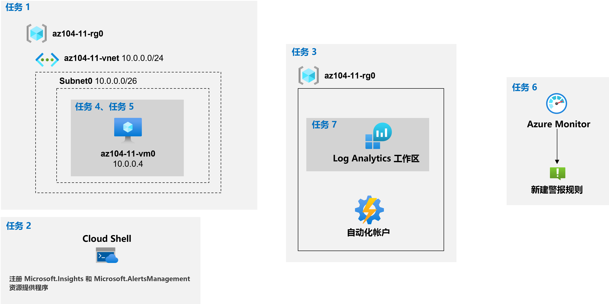

---
lab:
  title: 11 - 实现监视
  module: Administer Monitoring
---

# <a name="lab-11---implement-monitoring"></a>实验室 11 - 实现监视
# <a name="student-lab-manual"></a>学生实验室手册

## <a name="lab-scenario"></a>实验室方案

你需要评估 Azure 功能，以深入了解 Azure 资源的性能和配置，尤其要关注 Azure 虚拟机。 若要实现此目的，你打算检查 Azure Monitor 的功能，包括 Log Analytics。

                **注意：** 我们提供 **[交互式实验室模拟](https://mslabs.cloudguides.com/guides/AZ-104%20Exam%20Guide%20-%20Microsoft%20Azure%20Administrator%20Exercise%2017)** ，让你能以自己的节奏点击浏览实验室。 你可能会发现交互式模拟与托管实验室之间存在细微差异，但演示的核心概念和思想是相同的。 

## <a name="objectives"></a>目标

在此实验中，将执行以下操作：

+ 任务 1：预配实验室环境
+ 任务 2：注册 Microsoft.Insights 和 Microsoft.AlertsManagement 资源提供程序
+ 任务 3：创建和配置 Azure Log Analytics 工作区和基于 Azure 自动化的解决方案
+ 任务 4：查看 Azure 虚拟机的默认监视设置
+ 任务 5：配置 Azure 虚拟机诊断设置
+ 任务 6：审阅 Azure Monitor 功能
+ 任务 7：查看 Azure Log Analytics 功能

## <a name="estimated-timing-45-minutes"></a>预计用时：45 分钟

## <a name="architecture-diagram"></a>体系结构关系图



## <a name="instructions"></a>说明

### <a name="exercise-1"></a>练习 1

#### <a name="task-1-provision-the-lab-environment"></a>任务 1：预配实验室环境

在此任务中，你将部署用于测试监视方案的虚拟机。

1. 登录到 [Azure 门户](https://portal.azure.com)。

1. 在 Azure 门户中，单击 Azure 门户右上方的图标，打开 Azure Cloud Shell。

1. 如果系统提示选择“Bash”或“PowerShell”，请选择“PowerShell”  。

    >**注意**：如果这是你第一次启动 Cloud Shell，并看到消息“未装载任何存储”，请选择你将在本实验室中使用的订阅，然后选择“创建存储”  。

1. 在 Cloud Shell 窗格的工具栏中，单击“上传/下载文件”图标，在下拉菜单中，单击“上传”，然后将文件 \\Allfiles\\Labs\\11\\az104-11-vm-template.json 和 \\Allfiles\\Labs\\11\\az104-11-vm-parameters.json 上传到 Cloud Shell 主目录中   。

1. 编辑刚刚上传的参数文件并更改密码。 如果需要在 Shell 中编辑文件的帮助，请向讲师寻求帮助。 最佳做法是，机密（如密码）应存储在 Key Vault 中，这样更安全。 

1. 在 Cloud Shell 窗格中，运行以下命令以创建托管虚拟机的资源组（将 `[Azure_region]` 占位符替换为你打算在其中部署 Azure 虚拟机的 Azure 区域的名称）：

    >**注意**：[确保在引用的工作区映射文档](https://docs.microsoft.com/en-us/azure/automation/how-to/region-mappings)中，选择列为 **“Log Analytics 工作区区域”** 的一个区域

   ```powershell
   $location = '[Azure_region]'

   $rgName = 'az104-11-rg0'

   New-AzResourceGroup -Name $rgName -Location $location
   ```

1. 在“Cloud Shell”窗格中运行以下命令，以创建第一个虚拟网络，并使用上传的模板和参数文件将虚拟机部署到其中：

   ```powershell
   New-AzResourceGroupDeployment `
      -ResourceGroupName $rgName `
      -TemplateFile $HOME/az104-11-vm-template.json `
      -TemplateParameterFile $HOME/az104-11-vm-parameters.json `
      -AsJob
   ```

    >注意：请不要等待部署完成，而是继续执行下一个任务。 部署大约需要 3 分钟的时间完成。

#### <a name="task-2-register-the-microsoftinsights-and-microsoftalertsmanagement-resource-providers"></a>任务 2：注册 Microsoft.Insights 和 Microsoft.AlertsManagement 资源提供程序。

1. 在 Cloud Shell 窗格中，运行以下命令以注册 Microsoft.Insights 和 Microsoft.AlertsManagement 资源提供程序。

   ```powershell
   Register-AzResourceProvider -ProviderNamespace Microsoft.Insights

   Register-AzResourceProvider -ProviderNamespace Microsoft.AlertsManagement
   ```

1. 最小化 Cloud Shell 窗格（但不要将其关闭）。

#### <a name="task-3-create-and-configure-an-azure-log-analytics-workspace-and-azure-automation-based-solutions"></a>任务 3：创建和配置 Azure Log Analytics 工作区和基于 Azure 自动化的解决方案

在此任务中，你将创建和配置 Azure Log Analytics 工作区和基于 Azure 自动化的解决方案

1. 在 Azure 门户中，搜索并选择“Log Analytics 工作区”，然后在“Log Analytics 工作区”边栏选项卡上，选择“+ 创建”  。

1. 在“创建 Log Analytics 工作区”边栏选项卡的“基本设置”选项卡中，输入以下设置，单击“查看 + 创建”，然后单击“创建”   ：

    | 设置 | 值 |
    | --- | --- |
    | 订阅 | 你在此实验室中使用的 Azure 订阅的名称 |
    | 资源组 | 新资源组名称 az104-11-rg1 |
    | Log Analytics 工作区 | 任何唯一名称 |
    | 区域 | 在上一个任务中将虚拟机部署到的 Azure 区域的名称 |

    >注意：请确保指定在上一个任务中向其中部署了虚拟机的同一区域。

    >注意：请等待部署完成。 部署大约需要 1 分钟的时间完成。

1. 在 Azure 门户中，搜索并选择“自动化帐户”，然后在“自动化帐户”边栏选项卡上，选择“+ 创建”  。

1. 在“创建自动化帐户”边栏选项卡上，指定以下设置，然后在验证时单击“查看 + 创建”，再单击“创建”  ：

    | 设置 | 值 |
    | --- | --- |
    | 自动化帐户名称 | 任何唯一名称 |
    | 订阅 | 你在此实验室中使用的 Azure 订阅的名称 |
    | 资源组 | az104-11-rg1 |
    | 区域 | 根据[工作区映射文档](https://docs.microsoft.com/en-us/azure/automation/how-to/region-mappings)确定的 Azure 区域的名称 |

    >**注意**：务必根据[工作区映射文档](https://docs.microsoft.com/en-us/azure/automation/how-to/region-mappings)指定 Azure 区域

    >备注：请等待部署完成。 部署可能需要大约 3 分钟。

1. 单击“转到资源”。

1. 在“自动化帐户”边栏选项卡上，单击“配置管理”部分中的“清单”。

1. 在“清单”窗格中的“Log Analytics 工作区”下拉列表中，选择你之前在此任务中创建的 Log Analytics 工作区，然后单击“启用”。

    >备注：请等待相应 Log Analytics 解决方案的安装完成。 这可能需要大约 3 分钟。

    >备注：这还会自动安装“更改跟踪”解决方案 。

1. 在“自动化帐户”边栏选项卡上的“更新管理”部分，单击“更新管理”，然后单击“启用”。

    >备注：请等待安装完成。 这可能需要大约 5 分钟。

#### <a name="task-4-review-default-monitoring-settings-of-azure-virtual-machines"></a>任务 4：查看 Azure 虚拟机的默认监视设置

在此任务中将查看 Azure 虚拟机的默认监视设置

1. 在 Azure 门户中，搜索并选择“虚拟机”，然后在“虚拟机”边栏选项卡上，单击“az104-11-vm0”。

1. 在“az104-11-vm0”边栏选项卡上，单击“监视”部分中的“指标”。

1. 在“az104-11-vm0 \| 指标”边栏选项卡中，请注意，在默认图表中唯一可用的“指标命名空间”是“虚拟机主机”  。

    >**注意**：这很正常，因为尚未配置来宾级诊断设置。 但是，你确实可以选择直接从“指标命名空间”下拉列表中启用来宾内存指标。 稍后将在本练习中启用它。

1. 在“指标”下拉列表中，查看可用指标的列表。

    >注意：此列表包含可从虚拟机主机收集的一系列 CPU、磁盘和网络相关指标，无需访问来宾级指标。

1. 在“指标”下拉列表中，选择“CPU 百分比”，在“聚合”下拉列表中，选择“平均”，然后查看生成的图表。

#### <a name="task-5-configure-azure-virtual-machine-diagnostic-settings"></a>任务 5：配置 Azure 虚拟机诊断设置

在此任务中，将配置 Azure 虚拟机诊断设置。

1. 在“az104-11-vm0”边栏选项卡上，单击“监视”部分的“诊断设置”。

1. 在“az104-11-vm0 \| 诊断设置”边栏选项卡的“概述”选项卡中，单击“启用来宾级别的监视”  。

    >注意：请等待操作生效。 这可能需要大约 3 分钟。

1. 切换到“az104-11-vm0 \| 诊断设置”边栏选项卡上的“性能计数器”选项卡并查看可用的计数器 。

    >注意：默认情况下，CPU、内存、磁盘和网络计数器均已启用。 可以切换到“自定义”视图以获取更详细的列表。

1. 切换到“az104-11-vm0 \| 诊断设置”边栏选项卡的“日志”选项卡，并查看可用的事件日志集合选项 。

    >注意：默认情况下，日志集合包含应用程序日志和系统日志中的严重、错误和警告条目，以及安全日志中的审核失败条目。 在这里，你还可以切换到“自定义”视图以了解更详细的配置设置。

1. 在“az104-11-vm0”边栏选项卡上的“监视”部分，单击“Log Analytics 代理”，然后单击“启用”。   

1. 在“az104-11-vm0 - 日志”边栏选项卡上，确保在“选择 Log Analytics 工作区”下拉列表中选择了你之前在本实验室中创建的 Log Analytics 工作区，然后单击“启用”。

    >**注意**：请勿等待操作完成，而是继续执行下一步。 该操作可能需要 5 分钟左右。

1. 在“az104-11-vm0 \| 日志”边栏选项卡的“监视”部分中，单击“指标”  。

1. 在“az104-11-vm0 \| 指标”边栏选项卡的默认图表上，可以看到此时“指标命名空间”下拉列表中除了包含“虚拟机主机”条目外，还包含了“来宾(经典)”条目   。

    >**注意**：这很正常，因为你启用了来宾级诊断设置。 你还可以选择“启用新的来宾内存指标”。

1. 在“指标命名空间”下拉列表中，选择“来宾(经典)”条目。

1. 在“指标”下拉列表中，查看可用指标的列表。

    >注意：此列表包括仅依赖于主机级监视时不可用的其他来宾级指标。

1. 在“指标”下拉列表中，选择“内存\\可用字节”，在“聚合”下拉列表中，选择“最大”，然后查看生成的图表   。

#### <a name="task-6-review-azure-monitor-functionality"></a>任务 6：审阅 Azure Monitor 功能

1. 在 Azure 门户中，搜索并选择“监视”，并在“监视 \| 概述”边栏选项卡中单击“指标”  。

1. 在“选择范围”边栏选项卡的“浏览”选项卡上，导航到“az104-11-rg0”资源组，将其展开，选中该资源组内“az104-11-vm0”虚拟机条目旁边的复选框，然后单击“应用”。

    >**注意**：这为你提供了与“az104-11-vm0 - 指标”边栏选项卡相同的视图和选项。

1. 在“指标”下拉列表中，选择“CPU 百分比”，在“聚合”下拉列表中，选择“平均”，然后查看生成的图表。

1. 在“监视 \| 指标”边栏选项卡上，在“az104-11-vm0 的平均 CPU 百分比”窗格中单击“新建预警规则”  。

    >注意：来宾（经典）指标命名空间中的指标不支持从指标创建警报规则。 这可以通过使用 Azure 资源管理器模板来完成，如[使用 Windows 虚拟机的资源管理器模板将来宾 OS 指标发送到 Azure Monitor 指标存储](https://docs.microsoft.com/en-us/azure/azure-monitor/platform/collect-custom-metrics-guestos-resource-manager-vm)文档所述

1. 在“创建警报规则”边栏选项卡的“条件”部分，单击现有条件条目。

1. 在“配置信号逻辑”边栏选项卡的信号列表中的“警报逻辑”部分，指定以下设置（将其他设置保留为默认值），然后单击“完成”：

    | 设置 | 值 |
    | --- | --- |
    | 阈值 | **静态** |
    | 运算符 | 大于 |
    | 聚合类型 | **平均值** |
    | 阈值 | **2** |
    | 聚合粒度（期限） | **1 分钟** |
    | 评估频率 | **每 1 分钟** |

1. 单击“下一步:操作 >”，在“创建预警规则”边栏选项卡的“操作组”部分，单击“+ 创建操作组”按钮  。

1. 在“创建操作组”边栏选项卡的“基本信息”选项卡上，指定以下设置（其他设置保留默认值）并选择“下一步:   通知 >”：

    | 设置 | 值 |
    | --- | --- |
    | 订阅 | 你在此实验室中使用的 Azure 订阅的名称 |
    | 资源组 | az104-11-rg1 |
    | 操作组名称 | az104-11-ag1 |
    | 显示名称 | az104-11-ag1 |

1. 在“创建操作组”边栏选项卡的“通知”选项卡上，在“通知类型”下拉列表中，选择“电子邮件/短信/推送/语音”   。 在“名称”文本框中，输入“管理员邮箱” 。 单击”编辑细节”（铅笔）图标。

1. 在“电子邮件/短信/推送/语音”边栏选项卡上选中“电子邮件”复选框，在“电子邮件”文本框中键入你的电子邮件地址，将其他设置保留默认值，单击“确定”，然后返回到“创建操作组”边栏选项卡的“通知”选项卡，选择“下一步:       操作 >”。

1. 在“创建操作组”边栏选项卡的“操作”选项卡上，查看“操作类型”下拉列表中显示的项而不进行任何更改，然后选择“查看 + 创建”   。

1. 在“创建操作组”边栏选项卡的“查看 + 创建”选项卡中，选择“创建”。

1. 返回到“创建预警规则”边栏选项卡，单击“下一步:  详细信息 >”，在“预警规则详细信息”部分中，指定以下设置（其他设置保留默认值）：

    | 设置 | 值 |
    | --- | --- |
    | 预警规则名称 | **CPU 百分比高于测试阈值** |
    | 预警规则说明 | **CPU 百分比高于测试阈值** |
    | 严重性 | **Sev 3** |
    | 创建时启用 | **是** |

1. 单击“查看 + 创建”，然后在“查看 + 创建”选项卡上，单击“创建”  。

    >注意：指标警报规则可能需要 10 分钟才能激活。

1. 在 Azure 门户中，搜索并选择“虚拟机”，然后在“虚拟机”边栏选项卡上，单击“az104-11-vm0”。

1. 在“az104-11-vm0”边栏选项卡上单击“连接”，在下拉菜单中单击“RDP”，在“使用 RDP 连接”边栏选项卡上单击“下载 RDP 文件”，并按照提示启动远程桌面会话    。

    >**注意**：此步骤是指在 Windows 计算机中通过远程桌面进行连接。 在 Mac 上，可以使用 Mac App Store 中的远程桌面客户端，而在 Linux 计算机上，可以使用开源 RDP 客户端软件。

    >**注意**：连接到目标虚拟机时，可以忽略任何警告提示。

1. 出现提示时，请使用用户名“Student”和密码从参数文件登录。

1. 在远程桌面会话中，单击“启动”，展开“Windows 系统”文件夹，然后单击“命令提示符”。

1. 在命令提示符中，运行以下命令以触发 az104-11-vm0 Azure VM 的 CPU 利用率提高：

   ```sh
   for /l %a in (0,0,1) do echo a
   ```

    >**注意**：这将启动无限循环，从而使 CPU 利用率超过新创建的警报规则的阈值。

1. 在实验室计算机上，使远程桌面会话保持打开状态，然后切换回显示 Azure 门户的浏览器窗口。

1. 在 Azure 门户中，导航回到“监视器”边栏选项卡，并单击“警报”。

1. 记下“严重性级别 3”警报的数量，然后单击“严重性级别 3”行 。

    >**注意**：可能需要等待几分钟，然后单击“刷新”。

1. 在“所有警报”边栏选项卡上，查看生成的警报。

#### <a name="task-7-review-azure-log-analytics-functionality"></a>任务 7：查看 Azure Log Analytics 功能

1. 在 Azure 门户中，导航回到“监视器”边栏选项卡，单击“日志”。

    >**注意**：如果这是你第一次访问 Log Analytics，则需要单击“开始使用”。

1. 如有必要，请单击“选择范围”，在“选择范围”边栏选项卡上选择“最近”选项卡，然后选择“az104-11-vm0”并单击“应用”。    

1. 在查询窗口中，粘贴以下查询并单击“运行”，然后查看生成的图表：

   ```sh
   // Virtual Machine available memory
   // Chart the VM's available memory over the last hour.
   InsightsMetrics
   | where TimeGenerated > ago(1h)
   | where Name == "AvailableMB"
   | project TimeGenerated, Name, Val
   | render timechart
   ```

    > **注意**：查询不应包含任何错误（由右侧滚动条上的红色块指示）。 如果无法直接从说明中粘贴没有错误的查询，请将查询代码粘贴到文本编辑器（如记事本）中，然后从那里将其复制并粘贴到查询窗口中。


1. 单击工具栏中的“查询”，在“查询”窗格中找到“跟踪 VM 可用性”磁贴，双击该磁贴以填充查询窗口，单击该磁贴中的“运行”命令按钮，然后查看结果   。

1. 在“新建查询 1”选项卡上，选择“表”标头，并查看“虚拟机”部分中的表列表  。

    >注意：多个表的名称与之前在此实验室中安装的解决方案相对应。

1. 将鼠标悬停在“VMComputer”条目上，然后单击“查看预览数据”图标 。

1. 如有任何可用数据，请在“更新”窗格中单击“在编辑器中使用” 。

    >注意：可能需要等待几分钟，更新数据才可用。

#### <a name="clean-up-resources"></a>清理资源

>**注意**：记得删除所有不再使用的新建 Azure 资源。 删除未使用的资源可确保不会出现意外费用。

>**注意**：如果不能立即删除实验室资源，也不要担心。 有时资源具有依赖项，需要更长的时间才能删除。 这是监视资源使用情况的常见管理员任务，因此，只需定期查看门户中的资源即可查看清理方式。 

1. 在 Azure 门户的“Cloud Shell”窗格中打开“PowerShell”会话。

1. 运行以下命令，列出在本模块各实验室中创建的所有资源组：

   ```powershell
   Get-AzResourceGroup -Name 'az104-11*'
   ```

1. 通过运行以下命令，删除在此模块的实验室中创建的所有资源组：

   ```powershell
   Get-AzResourceGroup -Name 'az104-11*' | Remove-AzResourceGroup -Force -AsJob
   ```

    >**注意**：该命令以异步方式执行（由 -AsJob 参数决定），因此，虽然你可以随后立即在同一个 PowerShell 会话中运行另一个 PowerShell 命令，但需要几分钟才能实际删除资源组。

#### <a name="review"></a>审阅

在此实验室中，你执行了以下操作：

+ 预配实验室环境
+ 创建和配置 Azure Log Analytics 工作区和基于 Azure 自动化的解决方案
+ 查看 Azure 虚拟机的默认监视设置
+ 配置 Azure 虚拟机诊断设置
+ 查看 Azure Monitor 功能
+ 查看 Azure Log Analytics 功能
