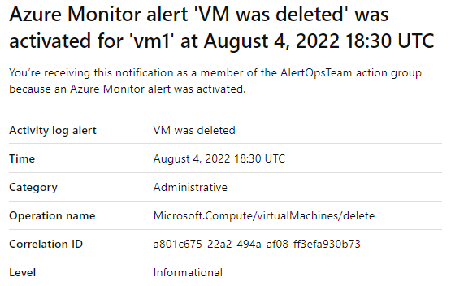

---
lab:
  title: 实验室 11：实现监视
  module: Administer Monitoring
---

# 实验室 11 - 实现监视

## 实验室简介

在本实验室中，你将了解 Azure Monitor。 你将了解如何创建警报并将其发送到操作组。 你将触发并测试警报，并检查活动日志。  

本实验室需要 Azure 订阅。 订阅类型可能会影响此实验室中功能的可用性。 你可更改区域，但这些步骤是使用“**美国东部**”编写的。

## 预计用时：40 分钟

## 实验室方案

该组织已将其基础结构迁移到 Azure。 在任何重大基础结构发生更改时通知管理员，这一点很重要。 你需要检查 Azure Monitor 的功能，包括 Log Analytics。

## 交互式实验室模拟

你可能会发现有一个交互式实验室模拟对本主题很有用。 通过模拟，可按照自己的节奏点击浏览类似的场景。 交互式模拟与本实验室之间存在差异，但许多核心概念是相同的。 不需要 Azure 订阅。

+ [实现监视](https://mslabs.cloudguides.com/guides/AZ-104%20Exam%20Guide%20-%20Microsoft%20Azure%20Administrator%20Exercise%2017)。 创建 Log Analytics 工作区和基于 Azure 自动化的解决方案。 查看虚拟机的监视和诊断设置。 查看 Azure Monitor 和 Log 日志分析功能。 

## 体系结构关系图


## 工作技能

+ 任务 1：使用模板预配基础结构。
+ 任务 2：创建警报。
+ 任务 3：配置操作组通知。
+ 任务 4：触发警报并确认它是否正常工作。
+ 任务 5：创建警报处理规则。
+ 任务 6：使用 Azure Monitor 日志查询。

## 任务 1：使用模板预配基础结构

在此任务中，你将部署用于测试监视方案的虚拟机。

1. 将 **\\Allfiles\\Lab11\\az104-11-vm-template.json** 实验室文件下载到计算机。

1. 登录 **Azure 门户** - `https://portal.azure.com`。

1. 在 Azure 门户中，搜索并选择 `Deploy a custom template`。

1. 在“自定义部署”页面上，选择“**在编辑器中生成自己的模板**”。

1. 在“编辑模板”页上，选择“**加载文件**”。

1. 找到并选择 **\\Allfiles\\Lab11\\az104-11-vm-template.json** 文件，然后选择“**打开**”。

1. 选择“保存”。

1. 使用以下信息完成自定义部署字段，并将所有其他字段保留其默认值：

    | 设置       | 值         | 
    | ---           | ---           |
    | 订阅  | Azure 订阅 |
    | 资源组| `az104-rg11`（如有必要，请选择“新建”****）
    | 区域        | **美国东部**   |
    | 用户名      | `localadmin`   |
    | 密码      | 提供复杂的密码 |
    
1. 依次选择**查看 + 创建**、**创建**

1. 等待部署完成，然后点击“**转到资源组**”。

1. 查看部署的资源。 应该有一个包含一个虚拟机的虚拟网络。

**为虚拟机配置 Azure Monitor（将在上一个任务中使用）**

1. 在 Azure 门户中，搜索并选择“**监视**”。

1. 花一分钟时间查看所有可用的见解、检测、会审和诊断工具。

1. 在 **VM Insights** 框中选择“**查看**”，然后选择“**配置见解**”。

1. 在虚拟机旁边选择 **“启用”**，然后在“Azure Monitor - Insights 入门”边栏选项卡中选择 **“启用”**。

1. 获取订阅和数据收集规则的默认值，然后选择“**配置**”。 

1. 虚拟机代理需要几分钟时间完成安装和配置，然后继续执行下一步。 
   
## 任务 2：创建警报

在此任务中，你将创建删除虚拟机时适用的警报。 

1. 继续在“**监视**”页面上，选择“**警报**”。 

1. 选择“**创建 +**”，然后选择“**警报规则**”。 

1. 选择订阅的框，然后选择“**应用**”。 此警报将应用于订阅中的任何虚拟机。 或者，也可以指定一台特定计算机。 

1. 选择“**条件**”选项卡，然后选择“**查看所有信号**”链接。

1. 搜索并选择“**删除虚拟机**”。 请注意其他内置信号。 选择**应用**

1. 在“**警报逻辑**”区域（向下滚动），查看“**事件级别**”选择。 保留默认值“**所有选定的**”。

1. 查看“**状态**”选择。 保留默认值“**所有选定的**”。

1. 使“**创建预警规则**”窗格保持打开状态，以在下一任务中使用。

## 任务 3：配置操作组通知

在此任务中，如果触发警报，系统会向运营团队发送电子邮件通知。 

1. 继续处理警报。 选择“**使用操作组**”，然后在“**选择操作组**”边栏选项卡中选择“**创建操作组**”。

    >**你知道吗？** 最多可以将五个操作组添加到警报规则。 操作组是并发执行的，不按特定顺序执行。 多个警报规则可以使用相同的操作组。 

1. 在“基本信息”选项卡上，为每个设置输入以下值。

    | 设置 | 值 |
    |---------|---------|
    | **项目详细信息** |
    | 订阅 | 用户的订阅 |
    | 资源组 | **az104-rg11** |
    | 区域 | 全局（默认） |
    | **实例详细信息** |
    | 操作组名称 | `Alert the operations team`（在资源组中必须唯一） |
    | 显示名称 | `AlertOpsTeam` |

1. 选择“下一页:**通知**”，并为每个设置输入以下值。

    | 设置 | 值 |
    |---------|---------|
    | 通知类型 | 选择“电子邮件/短信/推送/语音” |
    | 名称 | `VM was deleted` |

1. 选择“电子邮件”，然后在“电子邮件”框中，输入你的电子邮件地址，接着选择“确定”。 

    >**注意：** 你应该会收到一封电子邮件通知，指出你已被添加到操作组。 虽然可能会有几分钟的延迟，但这无疑表示已部署该规则。

1. 选择“审阅 + 创建”，然后选择“创建” 。
   
1. 创建操作组后，移动到“**下一步：详细信息**”选项卡，为每个设置输入以下值。

    | 设置 | 值 |
    |---------|---------|
    | 警报规则名称 | `VM was deleted` |
    | 预警规则说明 | `A VM in your resource group was deleted` |

1. 选择“查看 + 创建”以验证输入，然后选择“创建”。

## 任务 4：触发警报并确认它是否正常工作。

在此任务中，你将触发警报并确认是否已发送通知。 

>**注意：** 如果在规则部署之前删除虚拟机，则可能不会触发警报规则。 

1. 在门户中，搜索并选择**虚拟机**。

1. 勾选 **az104-vm0** 虚拟机对应的框。

1. 从菜单栏中选择“删除”。

1. 选中“**应用强制删除**”框。 选中底部的框，确认希望删除资源，然后选择“**删除**”。 

1. 在标题栏中，选择“**通知**”图标并等待 **vm0** 成功删除。

1. 你应该会收到一封电子邮件通知，“**重要通知：Azure Monitor VM 已删除警报已激活...**”如果没有收到，请打开电子邮件程序并查找来自 azure-noreply@microsoft.com 的电子邮件。

    
   
1. 在 Azure 门户资源菜单上，选择“监视器”，然后在左侧菜单中选择“警报”。

1. 删除 **vm0**，你应该会收到三个详细警报。

   >**注意：** 发送警报电子邮件和在门户中更新警报可能需要几分钟时间。 如果不想等待，请继续执行下一个任务，然后返回。 

1. 选择其中一个警报的名称（例如“VM 已删除”）。 此时会显示“警报详细信息”窗格，其中显示了有关事件的更多详细信息。

## 任务 5：配置警报处理规则

在此任务中，你将创建一个警报规则，以在维护期间禁止通知。 

1. 继续在“**警报**”边栏选项卡中，选择“**警报处理规则**”，然后选择“**+ 创建**”。 
   
1. 选择“**订阅**”，然后选择“**应用**”。
   
1. 选择“下一步: 规则设置”，然后选择“取消通知”。
   
1. 选择“下一步: 正在计划”。
   
1. 默认情况下，除非禁用规则或配置计划，否则规则会一直有效。 你将定义一个规则，用于在夜间维护期间禁止通知。
输入这些设置以计划警报处理规则：

    | 设置 | 值 |
    |---------|---------|
    | 应用规则 | 在特定时间 |
    | 开始 | 输入当天晚上 10 点的日期。 |
    | End | 输入明天早上 7 点的日期。 |
    | 时区 | 选择本地时区。 |

    

1. 选择“下一步: 详细信息”，然后输入以下设置：

    | 设置 | 值 |
    |---------|---------|
    | 资源组 | **az104-rg11** |
    | 规则名称 | `Planned Maintenance` |
    | 说明 | `Suppress notifications during planned maintenance.` |

1. 选择“查看 + 创建”以验证输入，然后选择“创建”。

## 任务 6：使用 Azure Monitor 日志查询

在此任务中，你将使用 Azure Monitor 查询从虚拟机捕获的数据。

1. 在 Azure 门户中，搜索并选择 `Monitor`，然后单击“**日志**”。

1. 如有必要，请关闭初始屏幕。 

1. 如有必要，请选择“**订阅**”范围。 选择“应用”。 

1. 在“**查询**”选项卡中，选择“**虚拟机**”（左窗格）。 可能需要重新打开边栏选项卡。

    

1. 查看可用的查询。 **运行**（将鼠标悬停在查询上）**计数检测信号** 查询。

1. 你应该会收到虚拟机运行时的检测信号计数。

1. 在屏幕右侧选择“**简单模式**”旁的下拉列表，选择 “**KQL 模式**”。 查看查询。 此查询使用*检测信号*表。

1. 将查询替换为此查询，然后单击“**运行**”。 查看生成的图表。 

   ```
    InsightsMetrics
    | where TimeGenerated > ago(1h)
    | where Name == "UtilizationPercentage"
    | summarize avg(Val) by bin(TimeGenerated, 5m), Computer //split up by computer
    | render timechart
   ```

    >**注意：** 如果查询未正确粘贴，请尝试粘贴到记事本，再复制并粘贴到查询字段。

1. 在有时间时，查看并运行其他查询。 

    >**你知道吗？**：如果要练习其他查询，需要 [Log Analytics 演示环境](https://learn.microsoft.com/azure/azure-monitor/logs/log-analytics-tutorial#open-log-analytics)。
    
    >**你知道吗？**：找到喜欢的查询后，可以从该查询创建警报。 

## 清理资源

如果使用自己的订阅，需要一点时间删除实验室资源****。 这将确保资源得到释放，并将成本降至最低。 删除实验室资源的最简单方法是删除实验室资源组。 

+ 在 Azure 门户中，选择资源组，选择“删除资源组”，输入资源组名称，然后单击“删除”************。
+ `Remove-AzResourceGroup -Name resourceGroupName`（使用 Azure PowerShell）。
+ `az group delete --name resourceGroupName`（使用 CLI）。

## 使用 Copilot 扩展学习
Copilot 可帮助你了解如何使用 Azure 脚本工具。 Copilot 还可以帮助了解实验室中未涵盖的领域或需要更多信息的领域。 打开 Edge 浏览器并选择“Copilot”（右上角）或导航到*copilot.microsoft.com*。 花几分钟时间尝试这些提示。

+ 当虚拟机关闭时，Azure 中发出警报的基本配置步骤是什么？
+ 如何在触发 Azure 警报时收到通知？
+ 构造 Azure Monitor 查询以提供虚拟机 CPU 性能信息。

## 通过自定进度的培训了解详细信息

+ [通过 Azure 上的警报改进事件响应](https://learn.microsoft.com/en-us/training/modules/incident-response-with-alerting-on-azure/)。 通过 Azure Monitor 的警报功能响应基础结构中的事件和活动。
+ [使用 Azure Monitor 监视 Azure 虚拟机](https://learn.microsoft.com/en-us/training/modules/monitor-azure-vm-using-diagnostic-data/)。 使用 Azure Monitor 收集和分析 VM 主机以及客户端指标和日志来监视 Azure VM。

## 关键结论

恭喜你完成本实验室的内容。 下面是本实验室的主要内容。 

+ 当基础结构或应用程序可能存在问题时，警报会主动通知你，这有助于你在用户注意到问题之前检测和解决问题。
+ 可以针对 Azure Monitor 数据平台中的任何指标或日志数据源发出警报。
+ 警报规则会监视你的数据并捕获指示指定资源上发生情况的信号。
+ 如果满足警报规则的条件，则会触发警报。 可以触发多个操作（电子邮件、短信、推送、语音）。
+ 操作组包括应收到警报通知的个人。
